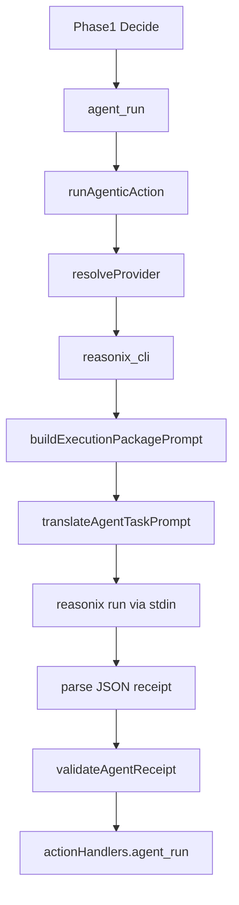

# Reasonix Agent Provider：把 DeepSeek 原生编码代理接进执行闭环

> 日期：2026-06-01  
> 项目：js-evolution-agent  
> 类型：调研分析 / 架构设计 / 功能实现  
> 来源：Cursor Agent 对话

---

## 目录

1. [背景与动机](#1-背景与动机)
2. [分析过程](#2-分析过程)
3. [方案设计](#3-方案设计)
4. [实现要点](#4-实现要点)
5. [验证与测试](#5-验证与测试)
6. [后续演化](#6-后续演化)

---

## 1. 背景与动机

这次工作的起点，是一个看起来很自然的问题：既然系统已经能用 Cursor 和 Claude Code 做执行 agent，能不能把 DeepSeek-Reasonix 也接进来？

Reasonix 的价值不只是“又一个命令行 coding agent”。它的核心定位是 DeepSeek-native：围绕 DeepSeek 的 prefix cache、低成本长会话和工具执行循环设计。前一轮工作已经把本系统的 prompt 稳定性变成可观测不变量，这一轮则进一步追问：

真正的问题不是“能不能调用 Reasonix”。

真正的问题是：能不能让 Reasonix 像 `cursor_sdk`、`claude_code_sdk` 一样，进入 `agent_run` 的执行闭环，同时不破坏现有的权限、执行根、审批和 receipt 验证协议。

这决定了接入方式不能是随手加一个新 action type。否则 Decide 会开始理解“Reasonix 专用动作菜单”，系统边界会变得更散。正确的入口应该是 provider。

## 2. 分析过程

调研先从 Reasonix 仓库与文档开始。

它当前 `main-v2` 是 Go 单二进制，主要入口是：

```bash
reasonix run "implement the TODOs"
echo "explain this code" | reasonix run
```

配置上，Reasonix 使用 `reasonix.toml`、环境变量中的 API key、MCP 插件和内置工具。权限模型包含 `[permissions]` 和 `[sandbox]`，但有一个关键约束：`reasonix run` 是非交互模式，`ask` 在没有 approver 时会解析为 allow；同时 Windows 下 `bash` 没有强 OS 沙箱保证。

随后检查本系统执行 agent 的现有结构，重点落在：

| 文件 | 发现 |
| --- | --- |
| [`src/actions/agent-adapter.mjs`](../../src/actions/agent-adapter.mjs) | `agent_run` 已经通过 `runAgenticAction()` 分发到 `llm_only`、`claude_code_sdk`、`cursor_sdk`。这是 Reasonix 最自然的接入点。 |
| [`src/actions/agent-run-spec.mjs`](../../src/actions/agent-run-spec.mjs) | `permission_profile` 已经统一成 `read_only`、`workspace_write`、`remote_write_review`，可以直接复用。 |
| [`src/actions/agent-run-observer.mjs`](../../src/actions/agent-run-observer.mjs) | Cursor / Claude 的事件都会写入 agent-run JSONL，Reasonix 也应进入同一观测面。 |
| [`src/actions/handlers.mjs`](../../src/actions/handlers.mjs) | `actionHandlers.agent_run` 已经负责 receipt 归一化、approval、verify 入口和 action receipt 记录，不需要新增 action handler。 |

关键判断是：Reasonix 第一版应该当作 CLI provider，而不是 SDK provider。

原因很直接。Reasonix 目前公开稳定的是 CLI；没有本系统可直接消费的 JS SDK 或结构化 tool event stream。CLI 接入观测粒度低一些，但可以最快打通闭环。等闭环稳定后，再考虑长会话、MCP 和缓存指标。

## 3. 方案设计

最终方案是新增 `reasonix_cli` provider，与 `cursor_sdk`、`claude_code_sdk` 平级。

数据流保持不变：



### 关键决策

| 决策 | 选择 | 理由 |
| --- | --- | --- |
| 接入层级 | 新增 provider `reasonix_cli` | 保持 Decide 只产出 `agent_run`，不引入 Reasonix 专用 action 菜单。 |
| 执行方式 | `child_process.spawn()` 调 `reasonix run` | Reasonix 当前稳定入口是 CLI，subprocess 最贴近实际使用。 |
| 输入方式 | prompt 通过 stdin 输入 | 避免 Windows 命令行长度和 quoting 问题。 |
| provider 选择 | `JEA_AGENT_PROVIDER=reasonix_cli` 或 action override | provider 是宿主执行配置，不放回模型生成的 `run_spec`。 |
| 权限策略 | host prompt constraints + 临时 Reasonix config metadata | Reasonix 当前 `run` 不支持 `--config`，所以不能假装 CLI 参数能强制加载配置。 |
| 观测策略 | 标记 `capability_gap: tool_trace` | CLI stdout 无法提供 Cursor / Claude SDK 那种结构化 tool lifecycle。 |
| bash 默认值 | 默认禁用 | Windows 下 Reasonix bash sandbox 不是强保证，必须保守。 |

这里有一个重要修正：计划里原本提到可把临时 config 通过 `--config` 传给 `reasonix run`。实现前核对 Reasonix `main-v2` 源码后发现，当前 `run` 只支持 `--model`、`--max-steps`、`--show-thinking`，没有 `--config`。因此实现没有传 unsupported flag，避免真实 Reasonix 一启动就失败。

## 4. 实现要点

### 项目结构

```text
js-evolution-agent/
├── src/
│   ├── actions/
│   │   ├── agent-adapter.mjs
│   │   └── agent-run-observer.mjs
│   └── intelligence/
│       └── conversation-context.mjs
├── test/
│   ├── actions.test.mjs
│   └── agent-run-observer.test.mjs
└── .env.example
```

### 关键模块

| 文件 | 职责 |
| --- | --- |
| [`src/actions/agent-adapter.mjs`](../../src/actions/agent-adapter.mjs) | 新增 `reasonix_cli` provider，构造 Reasonix options，生成 host constraints prompt，运行 CLI subprocess，解析 stdout receipt，执行 verification loop。 |
| [`src/actions/agent-run-observer.mjs`](../../src/actions/agent-run-observer.mjs) | 新增 `REASONIX_PROVIDER` 和 `[agent:reasonix]` 日志 tag。 |
| [`src/intelligence/conversation-context.mjs`](../../src/intelligence/conversation-context.mjs) | 在语义验证输出 schema 的 provider 枚举中加入 `reasonix_cli`。 |
| [`test/actions.test.mjs`](../../test/actions.test.mjs) | 使用 fake Reasonix CLI 覆盖默认 provider、别名、embedded JSON receipt、缺 binary defer、权限配置生成。 |
| [`test/agent-run-observer.test.mjs`](../../test/agent-run-observer.test.mjs) | 覆盖 Reasonix provider 的日志 tag。 |
| [`.env.example`](../../.env.example) | 增加 `reasonix_cli` provider 配置说明和相关环境变量。 |

### 环境变量

本次新增或文档化的 Reasonix 配置项：

```bash
JEA_AGENT_PROVIDER=reasonix_cli
REASONIX_BIN=reasonix
JEA_REASONIX_BIN_ARGS=
JEA_REASONIX_MODEL=deepseek-flash
JEA_REASONIX_MAX_STEPS=25
JEA_REASONIX_TIMEOUT_MS=1800000
JEA_REASONIX_CONFIG=
JEA_REASONIX_ALLOW_BASH=0
```

其中 `JEA_REASONIX_CONFIG` 当前不会变成 `reasonix run --config`，因为上游 CLI 暂不支持这个 flag。它只作为子进程环境变量 `REASONIX_CONFIG` 和 host metadata 保留，给 wrapper 或未来 Reasonix 版本使用。

## 5. 验证与测试

本次验证分三层。

第一层是 IDE 诊断：

```text
ReadLints: no linter errors found
```

第二层是定向测试：

```bash
npm test -- test/actions.test.mjs test/agent-run-observer.test.mjs
```

结果：

```text
Test Files  2 passed (2)
Tests       113 passed (113)
```

第三层是全量测试：

```bash
npm test
```

结果：

```text
Test Files  27 passed (27)
Tests       489 passed (489)
```

测试覆盖的重点包括：

- `reasonix`、`deepseek_reasonix` 能归一到 `reasonix_cli`。
- `JEA_AGENT_PROVIDER=reasonix_cli` 可以作为默认 provider。
- fake CLI stdout 中的严格 JSON 和 embedded JSON 都能归一化为 receipt。
- receipt 缺字段时会触发 verification prompt。
- binary 不存在时返回 deferred 和 `provider_failure`，不误判为业务成功。
- `read_only` / `workspace_write` 会生成不同的 Reasonix 权限配置 metadata。
- agent-run JSONL 日志中会出现 `[agent:reasonix]` 和 `capability_gap: tool_trace`。

## 6. 后续演化

这次完成的是“能安全进入执行闭环”的第一版。后续还有三件事值得继续做。

第一，跟进 Reasonix config 加载能力。如果上游后续支持 `reasonix run --config` 或明确支持 `REASONIX_CONFIG`，可以把当前生成的临时 `reasonix.toml` 从 metadata 升级为真正的硬约束输入。

第二，研究长会话或 resume。Reasonix 的价值很大一部分来自 prefix-cache 稳定性和长会话复用。如果 CLI 或 serve 模式能暴露稳定 session，可以让同一 execution root 复用 Reasonix 上下文，而不是每个 verification turn 都开新进程。

第三，再接 MCP。第一版故意不接 MCP，是为了避免工具面突然扩大。后续可以让 subject policy 或 `subjects.json` 声明允许暴露给 Reasonix 的 MCP server，并按 `permission_profile` 生成受控 `.mcp.json`。

---

## 附：本轮对话问题—思考—方案—执行对照

| 阶段 | 内容 |
| --- | --- |
| 问题 | 用户希望分析 DeepSeek-Reasonix，并把它像 Cursor、Claude Code 一样接成本系统的执行 agent。 |
| 思考 | 核心约束不是“调用 CLI”，而是不能破坏 `agent_run`、execution root、approval、receipt 和 provider 选择边界。 |
| 方案 | 新增 `reasonix_cli` provider，第一版走 CLI subprocess，stdin 传 prompt，stdout 解析 receipt，日志标记 capability gap。 |
| 执行 | 修改 `agent-adapter.mjs`、`agent-run-observer.mjs`、`conversation-context.mjs`、测试和 `.env.example`，并通过定向与全量测试。 |
