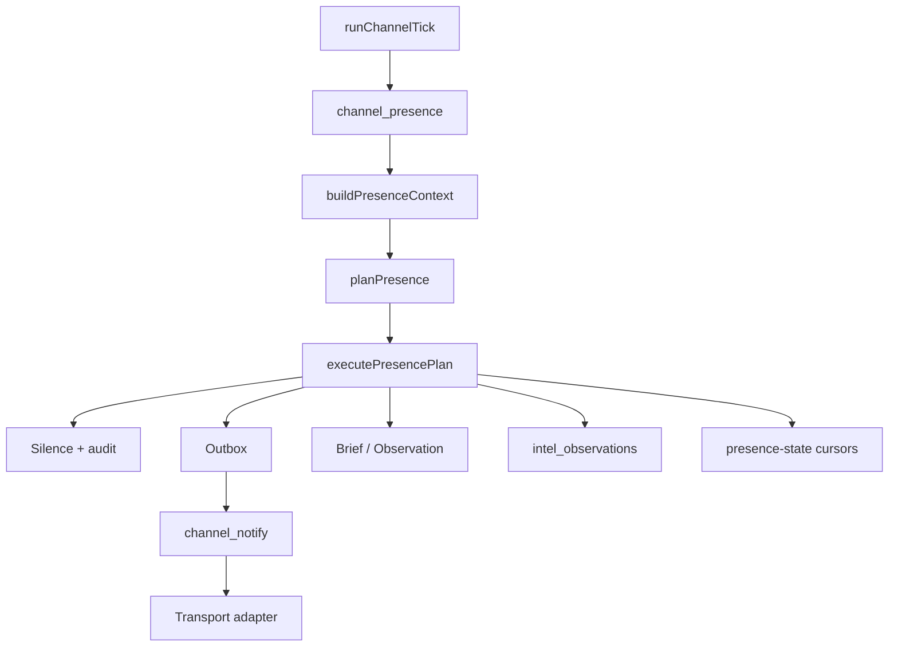
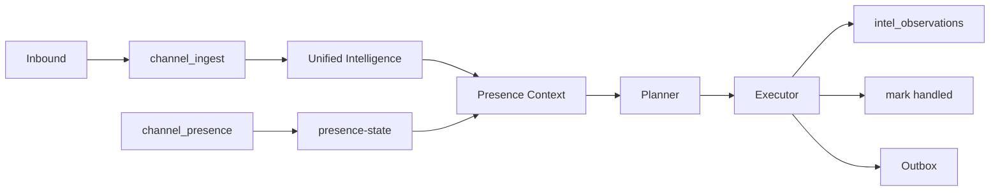

# Channel Presence Loop：让主体在通道里「活」过来，而不是等消息才回

> 日期：2026-06-02  
> 项目：js-evolution-agent  
> 类型：架构设计 / 功能实现  
> 来源：Cursor Agent 对话（含同日 **Presence Memory Unification** 增补）

---

## 目录

1. [背景与动机](#1-背景与动机)
2. [分析过程](#2-分析过程)
3. [方案设计](#3-方案设计)
4. [实现要点](#4-实现要点)
5. [Presence Memory Unification](#5-presence-memory-unification)
6. [验证与测试](#6-验证与测试)
7. [后续演化](#7-后续演化)
8. [附：本轮对话问题—思考—方案—执行对照](#附本轮对话问题思考方案执行对照)

---

## 1. 背景与动机

同一天内，Channel 域刚补上 **回复决策层**（`channel_reply` / `llm_autonomous`），能把飞书消息分类入库，并在 guarded 或 LLM 模式下决定是否 ack、是否闲聊。见 [`channel-reply-decision.md`](./channel-reply-decision.md)。

但对话里用户澄清了更深的设计初衷：

- Channel 不是「消息分类 + 安全回复器」，而是 subject 对外的**感知与表达器官**。
- 主体应能以自己的 persona **在场**：回应、追问、主动报告、选择沉默，形成连续关系。
- **驱动源不是 inbound 消息**，而是 **channel loop 本身** 周期性的 presence 步骤——消息只是 `observe()` 的输入之一。

若继续以 `inbound → ingest → reply` 为中心，即使用 LLM 润色，主体仍像后台任务系统在「收到才动」。这与「活过来」的目标不一致。

**同日后续约束**：外部交互记忆不能与 evolution cycle 分离。Channel 只是同一 subject intelligence 的对外感官与表达；长期记忆进 `intel_observations`，`presence-state.json` 只承担游标、去重与节流机械态。

---

## 2. 分析过程

### 2.1 现有 Channel 管线（presence 实现前）

| 环节 | 行为 |
| --- | --- |
| 飞书 WS / inbox | 写 `inbound/pending`，即时入队 `channel_ingest` |
| `channel_ingest` | 正则分类 → brief / fact / observation；结束后入队 `channel_reply` |
| `channel_reply` | 规则或 `llm_autonomous` 决定 send/none，写 outbox |
| `channel_watch` | `collectAttentionSignals` → 模板化 proactive → outbox |
| `channel_notify` | 适配器发送 |
| Worker 主循环 | 每轮 claim **一个** task；tick（默认 5min）补偿入队 ingest/watch/notify |

结论：系统是 **event/task driven**——无 inbound、无 signal 时 channel 基本 idle。

### 2.2 第一性原理优化（被否定的方向）

曾提议把 LLM **降级为「受边界约束的文案生成器」**，把 `mode` 拆成 `policy` + `draft_provider`，由规则先决定「回不回」。

用户反馈：这会让主体重新被压回「后台任务 + 模板 ack」，违背「主体通过 channel 活过来」的初衷。LLM 应参与 **主体如何理解互动、如何表达、是否主动说话**，而不是仅润色模板。

### 2.3 修正后的第一性原理

```text
Channel = subject 的外部交互循环
感知 → 理解 → 记忆/意图注入 → 表达 → 等待下一轮反馈
```

驱动改为：

```text
channel loop 周期性苏醒
→ observe（channel + daemon + unified intelligence + 新消息）
→ deliberate（presence planner）
→ act（send / brief / observation / silence）
→ remember（intel_observations + presence-state 游标）
```

### 2.4 Presence 试运行暴露的问题

在 `agentank-tank` 上启用 `planner: llm` 后观察到：

| 现象 | 根因 |
| --- | --- |
| 反复围绕旧入站消息发言 | context 用 `recent_ingested` 全量列表，未区分「本轮需回复」与「已处理背景」 |
| LLM 自造 CLI（如 `jea daemon mode continuous`） | prompt 无 grounded 命令菜单 |
| 历史 `task_failed` 等 signal 反复 proactive | signal 无 handled 游标，仅靠 cooldown 不足 |

### 2.5 硬约束（不变）

| 约束 | 含义 |
| --- | --- |
| 表达 ≠ 授权 | 不能产出 `approval_granted`、不能声称已发布 |
| 表达 ≠ 改队列 | 不能直接写 `pending_decisions.json` |
| 不与 Feishu 耦合 | presence 核心模块不 import `adapters/feishu/*`；transport 仅发送层解析 |
| 可审计 | 沉默也要记 `channel_presence_silenced` |
| 与 legacy 共存 | `channels.presence.legacy_reply` 控制是否保留旧 `channel_reply` 管线 |
| 记忆不分叉 | operator brief / operator fact 仍走既有入口；presence 不替代 Decide |

---

## 3. 方案设计

用 **presence loop** 取代「消息触发回复」作为 channel domain 的中心：



### 关键决策

| 决策 | 选择 | 理由 |
| --- | --- | --- |
| 中心任务 | `channel_presence` | 每轮 tick/worker 都可能是 subject 的「社交认知步」，不依赖新消息 |
| 配置位置 | `channels.presence`（非 `feishu.reply`） | transport-agnostic；飞书只是 adapter |
| 默认启用 | `enabled` 须显式 `true` | 避免未配置 subject 误关 legacy ingest/reply |
| ingest 位置 | presence 任务内可跑 `channel_ingest`（`skip_reply`） | 先可靠入库，再由同一轮 plan 决定是否表达 |
| 旧 watch/reply | `legacy_reply: false` 时跳过 watch 入队、ingest 不入队 reply | 防双重回复；旧路径保留给未迁移 subject |
| Planner | `deterministic` + `llm` | 无 API key 时规则可跑；有 key 时 LLM 以 persona 做 presence deliberation |
| 动作集合 | `send_message` / `write_operator_brief` / `record_observation` / `silence` | 收窄执行面，硬边界在 executor |
| Target 解析 | `operator` \| `channel_default` \| 显式 id | [`transport.mjs`](../../src/channel/transport.mjs) 懒加载 Feishu config |
| 长期记忆 | `intel_observations`（`source: channel_presence`） | cycle 与 channel 共享同一 intelligence |
| 机械去重 | `presence-state.json` 仅游标 | `handled_messages` / `handled_signals`，上限 200 条 |

### PresencePlan 形状

```json
{
  "stance": "speak | silence | ask | report | wait",
  "reason": "short reason",
  "actions": [
    { "type": "send_message", "target": "operator", "text": "...", "reply_to_message_id": "om_xxx" }
  ],
  "presence_targets": {
    "messages": ["om_xxx"],
    "signals": ["task_failed:task-id"]
  }
}
```

执行后不再把 `memory.summary` 长期写入 `presence-state`；交互摘要写入 intelligence。

---

## 4. 实现要点

### 调度变化

[`dispatch.mjs`](../../src/channel/dispatch.mjs)：`presence.enabled` 时每个 tick 入队 `channel_presence`（priority 15）；**不再**单独因 signal 入队 `channel_watch`；无 presence 时仍走 ingest/watch 旧逻辑。

[`listener.mjs`](../../src/channel/adapters/feishu/listener.mjs)：presence 开启时 WS 消息入队 `channel_presence` 而非 `channel_ingest`（adapter 层仅此一处耦合，核心 planner 无 Feishu import）。

### 模块一览

| 文件 | 职责 |
| --- | --- |
| [`presence-config.mjs`](../../src/channel/presence-config.mjs) | 解析 `channels.presence`；`shouldUseLegacyReplyPipeline` |
| [`presence-context.mjs`](../../src/channel/presence-context.mjs) | 聚合 identity、daemon、signals、briefs、goals/beliefs、**new/background messages**、**recent_presence_interactions**、**affordances** |
| [`presence-planner.mjs`](../../src/channel/presence-planner.mjs) | 仅对 `new_messages` / 未 handled signals 规划；LLM 禁止自造 CLI |
| [`presence-decision-executor.mjs`](../../src/channel/presence-decision-executor.mjs) | 决策落盘（brief/沉默/speech_intent 入队） |
| [`speech-generation.mjs`](../../src/channel/speech-generation.mjs) | 话术生成并写 outbox |
| [`presence-memory.mjs`](../../src/channel/presence-memory.mjs) | `recordPresenceInteraction`、从 store 读近期 presence 交互 |
| [`presence-affordances.mjs`](../../src/channel/presence-affordances.mjs) | grounded `operator_commands`（evolution-mode、cycle request、brief put 等） |
| [`presence.mjs`](../../src/channel/presence.mjs) | `runChannelPresenceTask` 编排 |
| [`transport.mjs`](../../src/channel/transport.mjs) | `resolveDefaultTransport` / `resolveOutboundTarget` |
| [`state.mjs`](../../src/channel/state.mjs) | `readPresenceState`、`markPresenceMessageHandled`、`markPresenceSignalHandled` 等 |

### 任务与状态

- `CHANNEL_TASK_TYPES` 增加 `channel_presence`（[`types.mjs`](../../src/channel/types.mjs)）。
- `data/channel/presence-state.json`（[`paths.mjs`](../../src/channel/paths.mjs)）——**仅游标**，示例：

```json
{
  "handled_messages": {
    "om_xxx": { "handled_at": "...", "outcome": "sent|silenced|brief_written" }
  },
  "handled_signals": {
    "task_failed:task-id": { "handled_at": "...", "outcome": "sent|silenced" }
  },
  "last_presence_tick_at": "...",
  "last_spoken_at": "...",
  "last_plan": { "stance": "silence", "reason": "...", "at": "..." }
}
```

- 审计事件：`channel_presence_decided`、`channel_presence_silenced`、`channel_presence_action_applied`、`channel_presence_completed`。

### 配置示例

```json
"channels": {
  "presence": {
    "enabled": true,
    "planner": "llm",
    "max_actions_per_tick": 2,
    "cooldown_ms": 1800000,
    "max_messages_per_hour": 8,
    "legacy_reply": false,
    "default_target": "oc_xxx"
  }
}
```

`agentank-tank` 已在 [`policies/subjects.json`](../../policies/subjects.json) 启用 presence（`planner: llm`）。[`AGENTS.md`](../../AGENTS.md) 与 [`subjects.example.json`](../../policies/subjects.example.json) 已补充 presence 说明。

### 与 legacy 的关系

| `legacy_reply` | `presence.enabled` | 行为 |
| --- | --- | --- |
| — | `false`（默认） | 仅旧 ingest → reply → watch |
| `false` | `true` | presence 统一表达；ingest 不入队 reply；tick 不入队 watch |
| `true` | `true` | presence + 旧 reply 可能重叠，仅用于迁移期 |

---

## 5. Presence Memory Unification

### 目标

Channel presence 成为**同一 subject memory** 的外部感知与表达循环，而不是在 channel runtime 另建长期对话记忆。

### 数据流



### Context 变化（`schema_version: 2`）

| 字段 | 含义 |
| --- | --- |
| `channel.new_messages` | 未在 `handled_messages` 中的近期入站，**可触发新回复** |
| `channel.background_messages` | 已 handled，仅作上下文 |
| `channel.recent_presence_interactions` | 从 intelligence 读 `source=channel_presence` 的近期观测 |
| `affordances.operator_commands` | LLM 引用 CLI 的唯一来源 |
| `attention_signals[].presence_handled` | signal 是否已表达过 |

### Executor 写入 intelligence

| 场景 | `interaction_kind` | 节流 |
| --- | --- | --- |
| `send_message` 成功 | `send_message` | 每次发送一条 |
| `write_operator_brief` 成功 | `write_operator_brief` | 每次一条 |
| 有意义的 `silence`（有新消息/未处理 signal） | `silence` | 不记录 `nothing_to_express` |

观测形状示例：

```json
{
  "kind": "observation",
  "source": "channel_presence",
  "interaction_kind": "send_message",
  "content": "Subject sent channel message (approval_request_ack). Text: ... In reply to message om_xxx.",
  "confidence": "medium",
  "tags": ["channel", "presence"],
  "evidence_refs": ["channel:message:om_xxx", "outbox:..."]
}
```

### Grounded affordances

[`presence-affordances.mjs`](../../src/channel/presence-affordances.mjs) 提供真实命令，例如：

```text
npm run jea -- daemon evolution-mode set continuous --subject <subject>
npm run jea -- daemon cycle request --subject <subject>
npm run jea -- intel brief put --subject <subject> --file <path>
```

LLM system prompt 硬性要求：涉及 CLI 时只能引用 `affordances.operator_commands` 中的 `cmd` 字段。

---

## 6. 验证与测试

```powershell
npm run test -- test/channel.test.mjs
```

结果：**31 passed**（含 11 个 presence / memory 相关用例）。

覆盖点：

- `buildPresenceContext`：`new_messages` / `background_messages` / `affordances` / `recent_presence_interactions`。
- `runChannelTick` 在 presence 开启时入队 `channel_presence`、不入队 `channel_watch`。
- 审批类入站经 presence 写 outbox，并写入 `channel_presence` intelligence、标记 `handled_messages`。
- **同一 message 第二轮 `stance: silence`，不重复 outbox**。
- 问候类入站后 `recent_presence_interactions` 来自 intelligence（非 presence-state）。
- `resolvePresenceAffordances` 含 `daemon evolution-mode set` 命令。
- LLM planner mock 使用 `new_messages` 而非全量 `recent_ingested`。
- 无表达需求时 `stance: silence`。

配置陷阱（已修）：`enabled` 曾误用「缺省即 true」，已改为 **仅 `enabled: true` 时开启**。

生产试运行注意：修改 presence 相关 **代码** 后需重启 channel daemon；仅改 `subjects.json` / reload 不足以加载新模块。

---

## 7. 后续演化

| 方向 | 说明 |
| --- | --- |
| ~~对话记忆~~ | ✅ 已并入 unified intelligence + presence-state 游标（本节 5） |
| Adapter registry | 将 inbound/outbound 收成按 `channel` 路由的 registry，弱化 listener 对 presence 的特殊分支 |
| Worker 与 tick 协同 | idle 时也可按较短 interval 触发 presence（不仅 5min tick），强化「持续在场」 |
| ~~Daemon/Channel 韧性~~ | ✅ channel worker-state 原子重试写入；loop 心跳写失败降级；长期运行推荐 `--domain cycle` / `--domain channel` 分进程（见 §8） |
| ~~合并 legacy~~ | ✅ 已移除 `channel_reply` / `channel_watch` / `reply.mjs` / `channels.feishu.reply`；tick/listener/inbox 统一入队 `channel_presence` |
| Viewer | `channel_presence_*` 事件中文标签；presence-state 游标与 `channel_presence` intelligence 面板 |
| LLM 输出校验 | 可选 post-check：回复中的 `npm run jea` 子串必须匹配 affordances 菜单 |

---

## 8. Daemon/Channel 韧性（2026-06-02 增补）

### 问题

`domain=all` 下 cycle 与 channel 在同一 Node 进程内 `Promise.all` 并行。Channel worker 写 `data/channel/worker-state.json` 时若 Windows 上 `rename` 返回 `EPERM`，旧实现会冒泡为 `uncaughtException`，整个 daemon（含正在跑的 cycle step）一起退出。

### 修复

| 层 | 改动 |
| --- | --- |
| 写入可靠性 | `src/channel/worker-state.mjs` 改用 `writeJsonAtomic`（与 evolution task queue 一致，重试 `EPERM`/`EBUSY`/`EACCES`） |
| 故障降级 | `safeUpdateChannelWorkerHeartbeat()`：loop 内心跳写失败记 `channel_worker_state_write_failed`，不杀进程；create/start 阶段仍 fail-fast |
| 运行隔离 | 长期运行推荐分进程：`jea daemon start --domain cycle` 与 `--domain channel` 各开一终端 |

### 架构不变量

- Cycle 队列与 channel 队列仍分离；channel 通过 `buildDaemonProjection` 只读 cycle 状态生成 attention signals。
- `domain=all` 默认语义未改；后续可选 supervisor 子进程化，不在本轮范围。

---

## 9. Async Channel Presence（2026-06-02）

### 动机

`channel_presence` 在 worker 内 **await 整轮 LLM**，会阻塞同进程的 `channel_notify`；且「决定发话」与「生成发话正文」混在一处，难以超时恢复。

### 架构

```text
刺激 → event-queue (pending_events.json) → requestPresenceReactor
  → channel_presence (bounded reactor, decision_timeout_ms)
    → drainChannelInbound → planPresence → speech_intent / silence / brief
    → speech_generation_requested 事件
  → channel_speech_generation (speech_generation_timeout_ms, persona LLM)
    → outbox
  → channel_notify（独立任务；tick 见 outbox 即入队，单 worker 下执行仍串行）
```

### 新模块

| 文件 | 职责 |
| --- | --- |
| `event-queue.mjs` | append / claim / handled / failed |
| `wake.mjs` | `requestPresenceReactor`、notify/speech 入队 helper |
| `presence-reactor.mjs` | `runPresenceReactor`、`runChannelSpeechGenerationTask` |
| `presence-decision-executor.mjs` | 决策落盘，**不**写 outbox |
| `speech-intent.mjs` / `speech-generation.mjs` | 两阶段表达 |
| `inbound-drain.mjs` | 原 ingest 逻辑 |
| `async-utils.mjs` | `runWithTimeout` |

`channel_ingest` 任务类型已废弃；`presence-state.reactor` 记录 run_id / deadline / event_ids。

### 验证

- `npm run test -- test/channel.test.mjs`（含 event wake 合并、presence 不 claim speech event、decision timeout 不落 speech/outbox 副作用、speech gen 写 outbox、timeout 不挡 notify）
- 全量 `npm test` 556+ passed

---

| 阶段 | 内容 |
| --- | --- |
| 问题 | 理解 Channel 与 worker；用户要 subject **活过来**、由 **channel loop 驱动**；记忆不能与 cycle 分离；试运行出现重复回复与自造 CLI |
| 思考 | event-driven 管线不够；LLM 不能仅润色模板；记忆应进 intelligence；`recent_ingested` 需拆 new/background；CLI 需 affordances 锚定 |
| 方案 | `channel_presence` + `channels.presence`；Memory Unification：`presence-state` 游标 + `intel_observations` 交互事实 + planner/executor 去重 |
| 执行 | presence 模块族 + Memory Unification；legacy cleanup 移除 reply/watch 管线；`agentank-tank` 已配置 presence |
