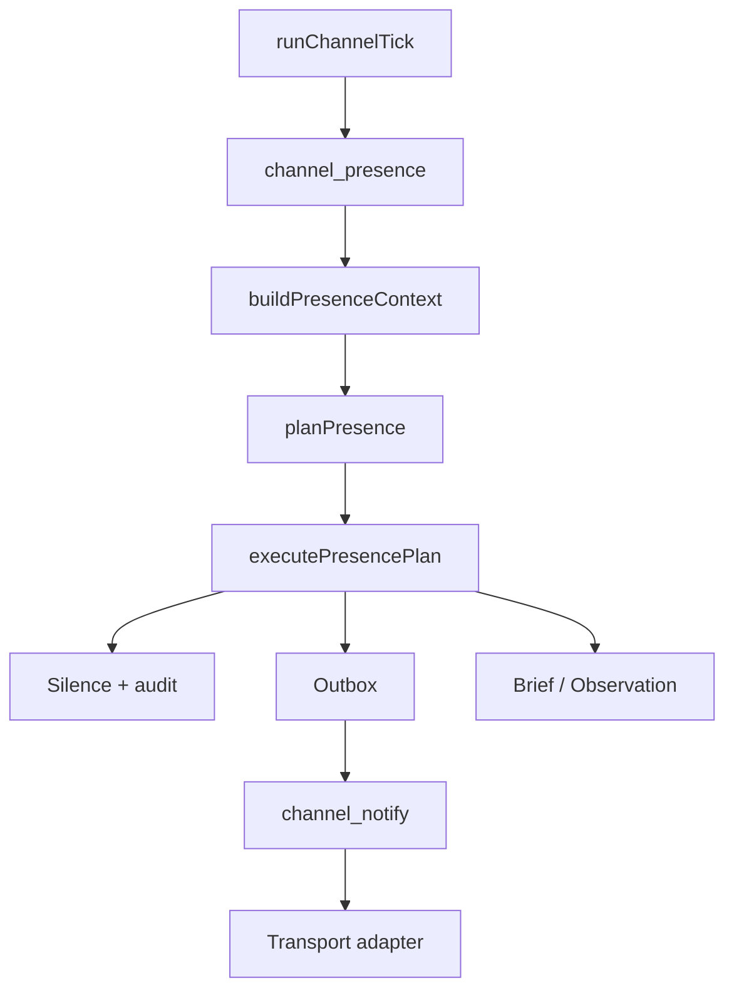

# Channel Presence Loop：让主体在通道里「活」过来，而不是等消息才回

> 日期：2026-06-02  
> 项目：js-evolution-agent  
> 类型：架构设计 / 功能实现  
> 来源：Cursor Agent 对话

---

## 目录

1. [背景与动机](#1-背景与动机)
2. [分析过程](#2-分析过程)
3. [方案设计](#3-方案设计)
4. [实现要点](#4-实现要点)
5. [验证与测试](#5-验证与测试)
6. [后续演化](#6-后续演化)
7. [附：本轮对话问题—思考—方案—执行对照](#附本轮对话问题思考方案执行对照)

---

## 1. 背景与动机

同一天内，Channel 域刚补上 **回复决策层**（`channel_reply` / `llm_autonomous`），能把飞书消息分类入库，并在 guarded 或 LLM 模式下决定是否 ack、是否闲聊。见 [`channel-reply-decision.md`](./channel-reply-decision.md)。

但对话里用户澄清了更深的设计初衷：

- Channel 不是「消息分类 + 安全回复器」，而是 subject 对外的**感知与表达器官**。
- 主体应能以自己的 persona **在场**：回应、追问、主动报告、选择沉默，形成连续关系。
- **驱动源不是 inbound 消息**，而是 **channel loop 本身** 周期性的 presence 步骤——消息只是 `observe()` 的输入之一。

若继续以 `inbound → ingest → reply` 为中心，即使用 LLM 润色，主体仍像后台任务系统在「收到才动」。这与「活过来」的目标不一致。

---

## 2. 分析过程

### 2.1 现有 Channel 管线（实现前）

| 环节 | 行为 |
| --- | --- |
| 飞书 WS / inbox | 写 `inbound/pending`，即时入队 `channel_ingest` |
| `channel_ingest` | 正则分类 → brief / fact / observation；结束后入队 `channel_reply` |
| `channel_reply` | 规则或 `llm_autonomous` 决定 send/none，写 outbox |
| `channel_watch` | `collectAttentionSignals` → 模板化 proactive → outbox |
| `channel_notify` | 适配器发送 |
| Worker 主循环 | 每轮 claim **一个** task；tick（默认 5min）补偿入队 ingest/watch/notify |

结论：系统是 **event/task driven**——无 inbound、无 signal 时 channel 基本 idle。

### 2.2 第一性原理优化（被否定的方向）

曾提议把 LLM **降级为「受边界约束的文案生成器」**，把 `mode` 拆成 `policy` + `draft_provider`，由规则先决定「回不回」。

用户反馈：这会让主体重新被压回「后台任务 + 模板 ack」，违背「主体通过 channel 活过来」的初衷。LLM 应参与 **主体如何理解互动、如何表达、是否主动说话**，而不是仅润色模板。

### 2.3 修正后的第一性原理

```text
Channel = subject 的外部交互循环
感知 → 理解 → 记忆/意图注入 → 表达 → 等待下一轮反馈
```

驱动改为：

```text
channel loop 周期性苏醒
→ observe（channel + daemon + memory + 新消息）
→ deliberate（presence planner）
→ act（send / brief / observation / silence）
→ remember（presence-state + events）
```

### 2.4 硬约束（不变）

| 约束 | 含义 |
| --- | --- |
| 表达 ≠ 授权 | 不能产出 `approval_granted`、不能声称已发布 |
| 表达 ≠ 改队列 | 不能直接写 `pending_decisions.json` |
| 不与 Feishu 耦合 | presence 核心模块不 import `adapters/feishu/*`；transport 仅发送层解析 |
| 可审计 | 沉默也要记 `channel_presence_silenced` |
| 与 legacy 共存 | `channels.presence.legacy_reply` 控制是否保留旧 `channel_reply` 管线 |

---

## 3. 方案设计

用 **presence loop** 取代「消息触发回复」作为 channel domain 的中心：



### 关键决策

| 决策 | 选择 | 理由 |
| --- | --- | --- |
| 中心任务 | `channel_presence` | 每轮 tick/worker 都可能是 subject 的「社交认知步」，不依赖新消息 |
| 配置位置 | `channels.presence`（非 `feishu.reply`） | transport-agnostic；飞书只是 adapter |
| 默认启用 | `enabled` 须显式 `true` | 避免未配置 subject 误关 legacy ingest/reply |
| ingest 位置 | presence 任务内可跑 `channel_ingest`（`skip_reply`） | 先可靠入库，再由同一轮 plan 决定是否表达 |
| 旧 watch/reply | `legacy_reply: false` 时跳过 watch 入队、ingest 不入队 reply | 防双重回复；旧路径保留给未迁移 subject |
| Planner | `deterministic` + `llm` | 无 API key 时规则可跑；有 key 时 LLM 以 persona 做 presence deliberation |
| 动作集合 | `send_message` / `write_operator_brief` / `record_observation` / `silence` | 收窄执行面，硬边界在 executor |
| Target 解析 | `operator` \| `channel_default` \| 显式 id | [`transport.mjs`](../../src/channel/transport.mjs) 懒加载 Feishu config，presence 模块不依赖飞书 |

### PresencePlan 形状

```json
{
  "stance": "speak | silence | ask | report | wait",
  "reason": "short reason",
  "actions": [
    { "type": "send_message", "target": "operator", "text": "..." }
  ],
  "memory": { "summary": "why spoke or stayed silent" }
}
```

---

## 4. 实现要点

### 调度变化

[`dispatch.mjs`](../../src/channel/dispatch.mjs)：`presence.enabled` 时每个 tick 入队 `channel_presence`（priority 15）；**不再**单独因 signal 入队 `channel_watch`；无 presence 时仍走 ingest/watch 旧逻辑。

[`listener.mjs`](../../src/channel/adapters/feishu/listener.mjs)：presence 开启时 WS 消息入队 `channel_presence` 而非 `channel_ingest`（adapter 层仅此一处耦合，核心 planner 无 Feishu import）。

### 新增模块

| 文件 | 职责 |
| --- | --- |
| [`presence-config.mjs`](../../src/channel/presence-config.mjs) | 解析 `channels.presence`；`shouldUseLegacyReplyPipeline` |
| [`presence-context.mjs`](../../src/channel/presence-context.mjs) | 聚合 identity、daemon projection、channel 事件、briefs、goals/beliefs、attention signals、轻量 intel 摘要 |
| [`presence-planner.mjs`](../../src/channel/presence-planner.mjs) | `planPresenceDeterministic` / `planPresenceWithLlm` |
| [`presence-executor.mjs`](../../src/channel/presence-executor.mjs) | 校验动作、写 outbox/brief/observation、cooldown、审计事件 |
| [`presence.mjs`](../../src/channel/presence.mjs) | `runChannelPresenceTask` 编排 |
| [`transport.mjs`](../../src/channel/transport.mjs) | `resolveDefaultTransport` / `resolveOutboundTarget` |

### 任务与状态

- `CHANNEL_TASK_TYPES` 增加 `channel_presence`（[`types.mjs`](../../src/channel/types.mjs)）。
- `data/channel/presence-state.json`（[`paths.mjs`](../../src/channel/presence-state.mjs)）。
- 审计事件：`channel_presence_decided`、`channel_presence_silenced`、`channel_presence_action_applied`、`channel_presence_completed`。

### 配置示例

```json
"channels": {
  "presence": {
    "enabled": true,
    "planner": "deterministic",
    "max_actions_per_tick": 2,
    "cooldown_ms": 1800000,
    "max_messages_per_hour": 8,
    "legacy_reply": false,
    "default_target": "oc_xxx"
  }
}
```

[`subjects.example.json`](../../policies/subjects.example.json) 与 [`AGENTS.md`](../../AGENTS.md) 已补充 presence 说明。

### 与 legacy 的关系

| `legacy_reply` | `presence.enabled` | 行为 |
| --- | --- | --- |
| — | `false`（默认） | 仅旧 ingest → reply → watch |
| `false` | `true` | presence 统一表达；ingest 不入队 reply；tick 不入队 watch |
| `true` | `true` | presence + 旧 reply 可能重叠，仅用于迁移期 |

---

## 5. 验证与测试

```powershell
npm run test -- test/channel.test.mjs
```

结果：**28 passed**（含 7 个 presence 用例）。

覆盖点：

- `buildPresenceContext` 不依赖 Feishu-only 模块路径。
- `runChannelTick` 在 presence 开启时入队 `channel_presence`、不入队 `channel_watch`。
- `shouldUseLegacyReplyPipeline` 在 `legacy_reply: false` 时为 false。
- 审批类入站经 presence + ingest 写 outbox，`reply_skipped` 为 true。
- 无表达需求时 `stance: silence` 并记审计。
- LLM planner mock 可对 observation 产出 `send_message`。
- `buildChannelProjection` 暴露 `presence.config`。

配置陷阱（已修）：`enabled` 曾误用「缺省即 true」，已改为 **仅 `enabled: true` 时开启**，避免未配置 subject 破坏旧 ingest/reply 测试。

---

## 6. 后续演化

| 方向 | 说明 |
| --- | --- |
| 生产 subject 启用 | 在目标 subject（如 `agentank-tank`）的 `policies/subjects.json` 加 `channels.presence`，`planner: llm` 需 `DEEPSEEK_API_KEY` |
| Adapter registry | 将 `normalizeInboundPayload` / `sendOutboundMessage` 收成按 `channel` 路由的 registry，进一步去掉 listener 对 presence 分支的特殊判断 |
| 对话记忆 | presence context 可增加「最近 channel 多轮对话」专用 store，而不只依赖 processed inbound 快照 |
| Worker 与 tick 协同 | 考虑 idle 时也按较短 interval 触发 presence（不仅 5min tick），强化「持续在场」 |
| 合并 legacy | presence 稳定后默认 `legacy_reply: false`，逐步废弃 `channel_reply` / `channel_watch` 中心地位 |
| Viewer | `channel_presence_*` 事件中文标签与 presence-state 面板 |

---

## 附：本轮对话问题—思考—方案—执行对照

| 阶段 | 内容 |
| --- | --- |
| 问题 | 理解 Channel 消息处理与 worker 主循环；评估 LLM 模式是否过复杂；明确用户要的是 subject 通过 channel **活过来**，且由 **channel loop 驱动**而非消息驱动 |
| 思考 | 旧管线是 event-driven（有消息才 ingest/reply）；把 LLM 收成「文案生成器」会背离「主体在场」；正确抽象是 **Presence Loop**：observe → deliberate → act/silence |
| 方案 | 新增 transport-agnostic `channel_presence`；`channels.presence` 配置；deterministic + LLM planner；受限 executor；`legacy_reply` 门控旧管线 |
| 执行 | 落地 5 个 presence 模块 + dispatch/tasks/types/paths/projection/listener/AGENTS/example；测试 28/28；journal 本篇 |
