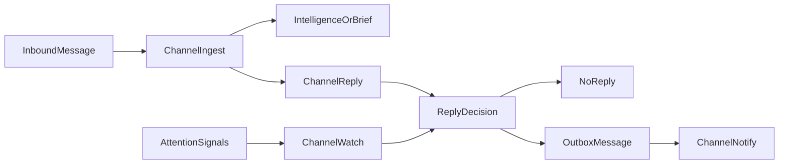

# Channel 回复决策：入库与说话分离，主体决定要不要回

> 日期：2026-06-02  
> 项目：js-evolution-agent  
> 类型：架构设计 / 功能实现  
> 来源：Cursor Agent 对话

---

## 目录

1. [背景与动机](#1-背景与动机)
2. [分析过程](#2-分析过程)
3. [方案设计](#3-方案设计)
4. [实现要点](#4-实现要点)
5. [验证与测试](#5-验证与测试)
6. [后续演化](#6-后续演化)
7. [附：本轮对话问题—思考—方案—执行对照](#附本轮对话问题思考方案执行对照)

---

## 1. 背景与动机

Channel 域已经能稳定完成一件事：**把飞书消息分类入库**——审批意图进 `operator_brief`，已确认口径进 `operator_fact`，普通消息进 `intel_observations`。`channel_watch` 也能在 daemon 异常、任务失败等场景主动写 outbox。

但用户在实际使用 `ai-researcher` 主体时发现了缺口：

- 私聊发了「你好」「知道了」，系统**静默入库**，操作者不知道是否收到。
- 发了「同意发布…」，brief 已写入，却**没有即时确认**，容易误以为已经授权发布。
- 用户希望主体能额外判断：**要不要回复、怎么回复**；也可以选择不回复；必要时**主动发起会话**——且这一切不能破坏 OADA 边界。

真正的问题不是「做一个聊天机器人」。

真正的问题是：**Channel 既要能对外表达，又不能把表达当成行动授权。**

---

## 2. 分析过程

### 2.1 先看清现有入站处理

通过 `jea channel status --json`、`channel events` 和 `runtime/subjects/ai-researcher/data/channel/inbound/processed/` 归档，确认最近 5 条入站消息的处理结果：

| 消息 | 分类 | 落盘 |
| --- | --- | --- |
| 「同意发布这个候选」「同意发布测试」（手工 inbox） | `approval_request` brief | `operator_briefs`，已被 cycle 消费 |
| 「测试 viewer channel 面板」 | `observation` | `intel_observations` |
| 「知道了」「你好」（飞书 WS 私聊） | `observation` | `intel_observations` |
| `JEA BIND` | 绑定握手 | `feishu-operator-binding.json`，不经 ingest 分类 |

分类逻辑在 [`src/channel/ingest.mjs`](../../src/channel/ingest.mjs) 的关键词正则里，**只回答「这条消息是什么」**，不回答「要不要回」。

### 2.2 现有主动通知的局限

[`src/channel/notify.mjs`](../../src/channel/notify.mjs) 的 `collectAttentionSignals` + `enqueueNotificationsForSignals` 能写 outbox，但：

- 入站消息**没有**对应的回复决策层；
- 主动通知与入站确认**共用一套模板化 enqueue**，缺少 subject 级策略（如不回复 observation、审批确认文案等）；
- 发送仍应走 `channel_notify`，不能把「决定回什么」和「真正发出去」耦在一起。

### 2.3 关键约束

| 约束 | 含义 |
| --- | --- |
| 不改 ingest 分类语义 | 回复不能反向改变 brief/fact/observation 的入库结果 |
| 回复 ≠ 授权 | 不能说「同意发布」就自动 `approval_granted` |
| 回复 ≠ 事实 | 确认话术不能写入 `operator_fact` |
| 失败隔离 | 入库成功、回复失败，不应污染 intelligence |
| 可审计 | 即使选择不回复，也要留下「为什么没回」 |

---

## 3. 方案设计

新增 **会话决策层**，与入库分离：



### 关键决策

| 决策 | 选择 | 理由 |
| --- | --- | --- |
| 决策与入库分离 | 新增 `channel_reply` task | ingest 只负责可靠分类归档；回复失败可重试且不影响情报 |
| 回复决策分层 | `guarded` 规则兜底 + `llm_autonomous` 自主决策 | 先保留可测模板路径，再允许 LLM 对入站消息决定是否闲聊与如何表达 |
| 主动会话复用 watch signals | `decideProactiveReply` 统一入口 | 不另起发送链路；仍写 outbox + cooldown |
| 配置放 `subjects.json` | `channels.feishu.reply` 块 | 与 per-subject 机器人配置一致；policy 只写语义边界 |
| 默认安全路径 | `guarded` | 只对审批/核实/事实/高价值主动信号回复；普通 observation 默认静默 |
| 当前 `ai-researcher` 模式 | `llm_autonomous` | 入站消息由 LLM 先产出结构化 `send|none` 决策；硬兜底仍限制授权、执行声称与密钥泄露 |
| 发送出口 | 仍仅 `channel_notify` | 保留 mock、failed/sent 归档与 Feishu adapter 边界 |

### 回复决策返回结构

```json
{
  "action": "none | send | defer",
  "reason": "short_machine_reason",
  "text": "optional reply text",
  "target": "optional target",
  "reply_to_message_id": "optional inbound message id",
  "idempotency_key": "reply:...",
  "metadata": {}
}
```

### 默认策略（`guarded`）

| 入库/信号类型 | 是否回复 |
| --- | --- |
| `approval_request` | 是：确认已记录为下一轮审批意图，**不会直接发布** |
| `verification_request` | 是：确认已记录为下一轮核实请求 |
| `operator_fact` | 是：确认已记录为高置信 fact |
| 普通 `observation` | 否（`reply_observations: true` 或 `mode: autonomous` 时可回寒暄；`mode: llm_autonomous` 时可由 LLM 自主决定） |
| `feishu_bind` / duplicate | 否（绑定另有握手回复） |
| 主动 `task_failed` / `daemon_health` / `cycle_drift` | 是 |
| 低优先级 `operator_brief_pending`（verification） | 否 |

### LLM 自主策略（`llm_autonomous`）

`llm_autonomous` 不改变入库分类：`approval_request` 仍是 brief，`operator_fact` 仍是 fact，普通消息仍是 observation。区别只在 `channel_reply` 阶段：LLM 收到消息内容、入库摘要和规则兜底决策后，返回结构化 JSON，决定 `send|none` 与回复文案。

保留的硬兜底很少，且只约束系统边界：

- 不能直接授予 `approval_granted` 或把“同意发布”解释成已经发布；
- 不能声称执行了未执行动作；
- 不能输出密钥、token、API key 等敏感内容；
- 仍然受 cooldown 与 `max_messages_per_hour` 限制。

如果 LLM 不可用、返回非法 JSON，或文案触发硬兜底，则回落到 `guarded` 的模板/静默规则，并在 metadata 中记录 `llm_decision.status = skipped`。

### 配置示例（`ai-researcher`）

```json
"reply": {
  "mode": "llm_autonomous",
  "on_inbound": true,
  "proactive": true,
  "reply_observations": true,
  "llm_decision": {
    "enabled": true,
    "timeout": 20,
    "thinking": "low"
  }
}
```

可选 `mode`：`off | audit_only | guarded | autonomous | llm_autonomous`。

---

## 4. 实现要点

### 4.1 新增模块

[`src/channel/reply.mjs`](../../src/channel/reply.mjs)：

| 导出 | 职责 |
| --- | --- |
| `resolveReplyConfig` | 从 `subjects.json` + Feishu config 解析 reply 策略 |
| `decideInboundReply` | 入站入库后的回复决策 |
| `decideInboundReplyWithLlm` | `llm_autonomous` 下由 LLM 产出结构化入站回复决策，失败或触发硬兜底时回落现有规则 |
| `decideProactiveReply` | attention signal 的主动会话决策 |
| `applyReplyDecision` | 写 outbox、冷却、审计事件 |
| `decideAndApplyInboundReply` / `decideAndApplyProactiveReply` | 决策 + 落盘一站式 |

### 4.2 任务链调整

[`src/channel/tasks.mjs`](../../src/channel/tasks.mjs)：

- `runChannelIngestTask` 完成后 enqueue `channel_reply`（input 带 `envelope` + `ingest_result`）。
- 新增 `runChannelReplyTask`：逐条调用 `decideInboundReplyWithLlm`，再经 `refineReplyDecisionWithDraft` 与 `applyReplyDecision`，有 outbox 则 enqueue `channel_notify`。
- `runChannelWatchTask` 改为对每个 signal 调用 `decideAndApplyProactiveReply`，不再直接 `enqueueNotificationsForSignals`。

[`src/channel/types.mjs`](../../src/channel/types.mjs) 注册 task type：`channel_reply`。

### 4.3 配置与可观测性

- [`src/channel/adapters/feishu/config.mjs`](../../src/channel/adapters/feishu/config.mjs)：解析 `reply` 块，默认 `mode: guarded`。
- [`policies/subjects.json`](../../policies/subjects.json)：`ai-researcher` 当前启用 `mode: llm_autonomous`、`reply_observations: true` 与 `llm_decision.enabled: true`。
- [`src/channel/projection.mjs`](../../src/channel/projection.mjs)：`jea channel status --json` 暴露 `feishu.reply`。
- [`tools/evolution-viewer/public/app.js`](../../tools/evolution-viewer/public/app.js)：新事件类型中文标签。

### 4.4 审计事件

| 事件 | 含义 |
| --- | --- |
| `channel_reply_decided` | 无论是否发送，记录 action + reason |
| `channel_reply_enqueued` | 已写入 outbox |
| `channel_reply_skipped` | 策略关闭、冷却、无 target、observation 静默等 |

`llm_autonomous` 的结果写入 reply decision metadata：

```json
{
  "llm_decision": {
    "status": "used | skipped",
    "action": "send | none",
    "reason": "model_reason_or_skip_reason",
    "confidence": "low | medium | high",
    "risk": "low | medium | high"
  }
}
```

### 4.5 运行时注意

**代码更新后必须重启 daemon/channel worker**，否则旧进程不会加载 `reply.mjs` 与 `channel_reply` task。仅改 `subjects.json` 的 reply 配置时，在新代码已运行的前提下通常下次读盘即生效。

```powershell
npm run jea -- daemon stop
npm run jea -- daemon start --subject ai-researcher
# 或 --domain channel
```

---

## 5. 验证与测试

### 5.1 自动化

```bash
npm run test -- test/channel.test.mjs
```

本轮新增 `llm_autonomous` 决策与硬兜底用例。当前环境下 `npm run test -- test/channel.test.mjs` 在 Vitest 装载阶段失败，报错为 `Cannot read properties of undefined (reading 'config')`，且无关的 `test/feishu-adapter.test.mjs` 同样在 0 tests 阶段失败，判断更像测试运行器环境问题，而不是新增断言失败。

已通过的轻量验证：

```bash
node --check src/channel/reply.mjs
node --check src/channel/tasks.mjs
node --check src/channel/adapters/feishu/config.mjs
node --check test/channel.test.mjs
```

直接冒烟验证显示：普通 observation 在 `llm_autonomous` 下可得到 `llm_autonomous_reply`，并记录 `llm_decision.status = used`。

覆盖点：

- 审批/核实入站 → reply 写 outbox；
- 普通 observation 默认不回复；
- `reply.mode=off` 只审计 skipped；
- 同 idempotency key 冷却下不重复发送；
- pending approval brief 的 proactive 通知；
- `task_failed` signal 允许 proactive reply；
- `llm_autonomous` 可回复普通 observation，并在越过硬兜底时回落模板规则；
- projection 暴露 `feishu.reply` 配置。

### 5.2 本地冒烟建议

```bash
npm run jea -- channel status --subject ai-researcher --json
# 确认 feishu.reply.mode = llm_autonomous

# 重启 worker 后，飞书私聊发送：
# - 「同意发布测试」→ 应收到审批意图确认（非直接授权）
# - 「说说你自己吧」→ LLM 可自主决定闲聊回复
```

---

## 6. 后续演化

以下几项已经在同一轮后续收口中落地：

| 方向 | 状态 | 说明 |
| --- | --- | --- |
| LLM 自主回复决策 | 已实现 | `mode: llm_autonomous` + `llm_decision.enabled` 时，入站消息先由 LLM 决定 `send|none` 与文案；ingest 分类不变，硬兜底保留授权/执行/密钥边界 |
| LLM 生成回复草稿 | 已实现，默认关闭 | `llm_draft.enabled` 开启后，在 `decide*` 之后为 `allowed_reasons` 生成结构化草稿；默认只允许 `proactive_signal`、`greeting_ack`，且保留“不授权、不声称动作执行、不编造事实”的约束 |
| `max_messages_per_hour` | 已实现 | `channel_reply` 写 outbox 前按最近 1 小时 `channel_reply_enqueued` 计数限流；`0` 表示不限制 |
| 减少重复通知 | 已实现 | 入站 ack 写入 `reply:brief_ack:<brief_id>` cooldown；`channel_watch` 遇到同一 pending brief 时跳过，原因是 `recent_inbound_ack` |
| 扩展 signal | 已实现 | `channel_watch` 额外覆盖 `cycle_completed`、`requires_human_review`、`long_idle` |
| 文档 | 已实现 | `AGENTS.md` Channel 章节补充 reply 配置、默认行为、安全边界与重启说明 |

---

## 附：本轮对话问题—思考—方案—执行对照

| 阶段 | 内容 |
| --- | --- |
| 问题 | Channel 能入库但不能按主体策略决定是否回复；后续用户希望减少模板边界，让 LLM 尽量自主决定闲聊与回应方式 |
| 思考 | ingest 只解决「消息是什么」；watch 只解决「系统要不要打扰人」；reply 应解决「对这条入站要不要回、回什么」；回复必须是外部表达，不能等于 action 或 fact |
| 方案 | 新增 `reply.mjs` + `channel_reply` task；入站与主动 signal 统一决策；outbox + notify 发送；subject 级 `reply.mode` 配置；`guarded` 作确定性兜底，`llm_autonomous` 让 LLM 先决策 |
| 执行 | 落地 reply 模块、tasks/types/config/projection/viewer；扩展 `test/channel.test.mjs`；`ai-researcher` 切到 `llm_autonomous`；确认需 restart daemon 后新代码才生效 |
