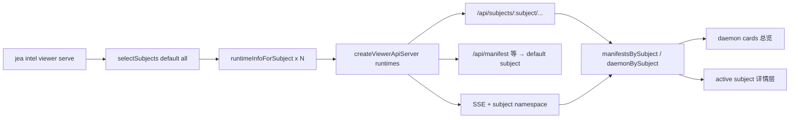

# Evolution Viewer 多 Daemon：一个页面盯住所有 subject 的演化 worker

> 日期：2026-06-02  
> 项目：js-evolution-agent  
> 类型：功能实现（Evolution Viewer / live serve）  
> 来源：Cursor Agent 对话（方案 → 实施 → 默认 `--all` 调整）

---

## 目录

1. [背景与动机](#1-背景与动机)
2. [分析过程](#2-分析过程)
3. [方案设计](#3-方案设计)
4. [实现要点](#4-实现要点)
5. [验证与测试](#5-验证与测试)
6. [后续演化](#6-后续演化)
7. [附：本轮对话问题—思考—方案—执行对照](#附本轮对话问题思考方案执行对照)

---

## 1. 背景与动机

[`evolution-viewer-daemon-console-phase1.md`](../2026-05-30/evolution-viewer-daemon-console-phase1.md) 与 [`evolution-viewer-channel-panel.md`](../2026-06-01/evolution-viewer-channel-panel.md) 之后，单 subject 的 live Viewer 已经能看 cycle daemon 健康条、open cycle、channel 面板和 evolution 事件流。

但多主体并行演化已是常态：`agentank-tank`、`js-evolution-agent`、`feishu-flow-test` 等往往各起一个 `jea daemon start --subject NAME`。CLI 侧早就有 `jea daemon status --all`，Viewer 却仍要 **每个 subject 单独 `serve` 一次**——观测面与运维习惯脱节。

用户先要求：把 Viewer 从「单 daemon 追踪」扩展为 **同一页面追踪多个 subject daemon**；随后又明确：**`serve` 默认应等同 `--all`**，只有显式 `--subject` / `--subjects` 时才缩小范围。

真正的问题不是「多开几个浏览器标签」，而是 **serve 进程与前端状态模型都绑死在单个 `runtimeRoot`**，SSE 也不区分事件来自哪个 subject。

---

## 2. 分析过程

### 2.1 后端：单 runtime 贯穿全链路

阅读 [`viewer-api.mjs`](../../src/intelligence/evolution-viewer/viewer-api.mjs) 与 [`intel-viewer.mjs`](../../src/cli/commands/intel-viewer.mjs)：

| 部位 | 单 subject 假设 |
| --- | --- |
| `intelViewerServe` | `resolveSubjectFromFlags` → 一个 `runtime` |
| `createViewerApiServer` | 一套 store、catalog/daemon cache、一组 tailer/watcher |
| HTTP | `/api/manifest`、`/api/daemon`、`/api/rounds/:id` 无 subject 前缀 |
| SSE | `hello` 只带一个 `subject`；`runtime_updated` 不区分来源 |

`buildDaemonProjection(root, subject)` 本身已支持按 subject 投影；瓶颈在 **API server 只实例化一次**。

### 2.2 前端：全局单例状态

[`tools/evolution-viewer/public/app.js`](../../tools/evolution-viewer/public/app.js) 使用单个 `manifest`、`daemonState`、`feedEvents`，`fetch('/api/daemon')` 无 subject 维度。多 subject 下会 **串台**：时间线、open cycle、channel 面板都指向同一份 daemon 投影。

### 2.3 「多个 daemon」的语义边界

与 [`multi-subject-daemon-management.md`](../2026-05-20/multi-subject-daemon-management.md) 一致：这里的 daemon 指 **每个 subject 各自的 cycle worker + channel worker 投影**，不是同一 subject 下多进程 worker。运行时 `worker-state.json`、任务队列按 subject 隔离，Viewer 只需 **多 runtime 并行读盘**，不必改 daemon 本体。

### 2.4 与 CLI 多 subject 能力对齐

[`subject-selection.mjs`](../../src/cli/utils/subject-selection.mjs) 的 `selectSubjects({ all, subjects, subject })` 已被 `daemon status --all` 使用。Viewer `serve` 应复用同一选择逻辑，避免再发明一套 subject 列表规则。

---

## 3. 方案设计

### 3.1 数据流



### 关键决策

| 决策 | 选择 | 理由 |
| --- | --- | --- |
| 多 subject 模型 | 每 subject 独立 context（store + cache + tailer + watcher） | 与 runtime 目录边界一致；避免 `cycle_id` 跨 subject 污染 cache |
| API 形态 | 新增 `/api/subjects` 与 `/api/subjects/:subject/*` | 路径即隔离；前端切换只需改 subject 段 |
| 旧 API | 保留，委托 **第一个 runtime**（registry `default_subject` 排序后居首） | 不破坏脚本与单 subject 习惯 |
| SSE payload | 所有业务事件带 `subject`、`namespace` | 前端只刷新对应 subject；`runtime_updated` 可定向 `scheduleLoadDaemon(subject)` |
| `subjects.json` watch | 仅单 subject 时 watch | 多 subject 时不重复 watch 同一文件触发 N 次广播 |
| 前端布局 | 顶栏 **daemon cards** + 选中 subject 复用原侧栏/详情 | 总览一眼对比健康；详情层不重复造轮子 |
| URL 状态 | `?subject=NAME#cycle-…` | hash 仍表 cycle；query 表 subject |
| 默认 serve 范围 | **未指定 flag 时等同 `--all`** | 与「多 daemon 观测」目标一致；`--subject` 显式收窄 |
| 离线 build | 不扩展多 subject | build 仍单 subject 静态快照；live serve 优先 |

### 3.2 备选方案（未采用）

| 方案 | 未选原因 |
| --- | --- |
| 每个 subject 独立端口 / 独立 serve 进程 | 操作成本高，无法一屏对比 |
| 单 API 聚合一个大 JSON | 前端仍要分桶；SSE 难以增量 |
| 仅轮询 `/api/daemon` 不做 per-subject SSE | 多 subject 时刷新风暴、延迟差 |

---

## 4. 实现要点

### 4.1 CLI：`serve` 默认 all

[`src/cli/commands/intel-viewer.mjs`](../../src/cli/commands/intel-viewer.mjs)：

- `viewerServeSelectAll(flags)`：无 `--subject` / `--subjects` 时 `selectSubjects(..., { all: true })`。
- 将 `resolveDefaultSubjectName` 对应 subject **排在 runtimes 数组首位**，使 `default_subject` 与旧 API 默认一致。

```powershell
jea intel viewer serve --open
# 默认：所有 policies/subjects/*.md 对应 subject

jea intel viewer serve --subject agentank-tank
# 仅一个 subject
```

### 4.2 后端：多 runtime API server

[`src/intelligence/evolution-viewer/viewer-api.mjs`](../../src/intelligence/evolution-viewer/viewer-api.mjs) 主要变更：

| 能力 | 说明 |
| --- | --- |
| `createViewerApiServer({ runtimes })` | 兼容 `{ runtime }` 单元素 |
| `createSubjectContext` | 每 subject 独立 LRU cache、`getCatalog` / `getDaemon` |
| `createEvolutionEventsTailer` + `withSubjectMeta` | SSE 带 `subject` / `namespace` |
| `createRuntimeWatcher` | 按 subject 广播 `runtime_updated` |
| `GET /api/subjects` | `daemonSummaryFromProjection` 摘要列表 |
| `GET /api/subjects/:subject/{manifest,daemon,events/recent,rounds/:id,cycles/:id}` | 作用域 API |
| 旧路径 | `/api/manifest`、`/api/daemon` 等 → `defaultSubject` context |

### 4.3 前端：按 subject 分桶

| 文件 | 职责 |
| --- | --- |
| [`tools/evolution-viewer/public/index.html`](../../tools/evolution-viewer/public/index.html) | `#subject-overview` daemon cards 容器 |
| [`tools/evolution-viewer/public/app.js`](../../tools/evolution-viewer/public/app.js) | `manifestsBySubject`、`daemonBySubject`、`feedEventsBySubject`；`setActiveSubject`；SSE 按 `payload.subject` 过滤 |
| [`tools/evolution-viewer/public/styles.css`](../../tools/evolution-viewer/public/styles.css) | `.daemon-card`、`.subject-overview` |
| [`tools/evolution-viewer/public/live-state.js`](../../tools/evolution-viewer/public/live-state.js) | 指纹函数不变，由调用方传入各 subject 的 daemon state |

多 subject 时顶栏展示卡片（health、worker、open cycle、队列、channel 入出站）；单 subject 时隐藏 cards 行，行为与改版前接近。

### 4.4 文档

[`AGENTS.md`](../../AGENTS.md)、[`src/cli/commands/intel.mjs`](../../src/cli/commands/intel.mjs) 帮助文本已更新：默认追踪所有 subject、`?subject=` URL 约定。

---

## 5. 验证与测试

```powershell
npm test -- test/evolution-viewer-live.test.mjs
```

结果：**23 passed**（含新增用例）。

| 用例类别 | 覆盖点 |
| --- | --- |
| 单 subject（既有） | `/api/manifest`、`/api/daemon`、`/events` SSE、`round_added` 带 `subject` |
| 多 subject（新增 describe） | `/api/subjects` 列表；`/api/subjects/:subject/daemon` 隔离；legacy `/api/daemon` 指向 default subject |

本地手动验收建议：

```powershell
jea intel viewer serve --open
# 应加载所有 subject；顶栏出现多张 daemon card

jea intel viewer serve --subject js-evolution-agent --open
# 仅一个 subject；无 cards 行

# 浏览器：?subject=agentank-tank#cycle-2026...
```

未在本次自动化中覆盖：真实多 daemon 进程同时写入时的浏览器长时间 SSE 压测；仅依赖单元/集成级 API 测试与架构对齐。

---

## 6. 后续演化

| 方向 | 说明 |
| --- | --- |
| 离线 build 多 subject | 若需要静态 dist 聚合多 subject，需扩展 `intel viewer build` 与 `dist/manifest.json` 结构 |
| 总览 Attention 区 | 跨 subject 汇总 `stuck_steps`、`evolution_stalled`（对齐 `daemon inbox --all`） |
| 卡片上直接显示最近一条异常事件 | 减少切 subject 前的不确定感 |
| `JEA_SUBJECT` 与 serve 默认 all 的交互 | 是否在设 env 时默认收窄为单 subject，待操作者反馈 |
| Phase 2–4 Viewer | tick 倒计时、checkpoint 面板、Viewer 内 enqueue/retry 仍不在本次范围 |

---

## 附：本轮对话问题—思考—方案—执行对照

| 阶段 | 内容 |
| --- | --- |
| **问题** | Evolution Viewer 似乎只支持单 daemon；如何在同一 Viewer 追踪多个 subject 的 daemon？ |
| **思考** | 根因是 serve/API/SSE/前端均单 `runtimeRoot`；多 daemon = 多 subject 投影，可复用 `buildDaemonProjection` 与 `selectSubjects` |
| **方案** | 多 runtime context + subject-scoped API + SSE 带 subject + 前端 cards/分桶状态 + 保留 legacy API |
| **执行** | 实现并测试通过；用户追问后把 **`serve` 默认改为 all**，`default_subject` 排序居首；更新 AGENTS.md |
