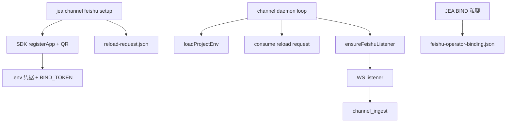

# 飞书 Channel 一键部署与热更新：从 registerApp 到 JEA BIND 全链路

> 日期：2026-06-02  
> 项目：js-evolution-agent  
> 类型：功能实现 / 问题排查  
> 来源：Cursor Agent 对话

---

## 目录

1. [背景与动机](#1-背景与动机)
2. [分析过程](#2-分析过程)
3. [方案设计](#3-方案设计)
4. [实现要点](#4-实现要点)
5. [验证与测试](#5-验证与测试)
6. [后续演化](#6-后续演化)

---

## 1. 背景与动机

飞书 adapter 解耦后，给新 subject 接机器人仍然太繁琐：要去开放平台建应用、复制 App ID/Secret、手改 `.env` 和 `subjects.json`，再启动 daemon、私聊 `JEA BIND`。

真正的问题不是「缺一个飞书 SDK 封装」——[`src/channel/adapters/feishu/`](../../src/channel/adapters/feishu/) 已经有了。问题是 **部署路径没有产品化**：操作者要在多个入口之间跳转，且 setup 写 env 后还要重启 daemon。

对话中进一步暴露的体验问题：

- 官方 `registerApp()` 只打印 URL，**终端看不到二维码**，Windows 上扫码不便。
- `@larksuiteoapi/node-sdk` 若未安装，listener 静默起不来；`npm install` 可能因 peer 冲突失败。
- `channel status` 在独立 CLI 进程里查 `feishu.listener.running`，**常为 false**，容易误判 listener 未启动。

目标：把新 subject 接飞书收敛为一条命令链，并支持 daemon 运行中热加载凭据与 listener。

---

## 2. 分析过程

### 2.1 现有基础

| 部位 | 发现 |
| --- | --- |
| [`config.mjs`](../../src/channel/adapters/feishu/config.mjs) | `resolveFeishuConfig()` 每次从 `subjects.json` + `process.env` + binding 文件解析，适合重复调用 |
| [`listener.mjs`](../../src/channel/adapters/feishu/listener.mjs) | 绑定成功后会 reload config 并刷新 policy，但 listener 仅在 daemon **启动时**拉起一次 |
| [`daemon.mjs`](../../src/cli/commands/daemon.mjs) | `runChannelDomainWorker` 有独立 loop，可参考 evolution mode 热加载模式 |
| 飞书 SDK | `registerApp()`（Device Flow，≥ SDK 1.61.1）可扫码创建应用并返回 `client_id` / `client_secret` |

### 2.2 根因与约束

- **凭据变更不生效**：daemon 启动时读一次 env；旧代码不会在 loop 中 `loadProjectEnv()`，setup 后必须重启。
- **listener 不重建**：`app_id` / `app_secret` 变化后，旧 WS 长连接仍用旧凭据。
- **Secret 不进 JSON**：与现有 `app_secret_env` 约定一致，setup 只写 `.env`。
- **跨进程 status 误报**：`activeListeners` Map 在 daemon 进程内存，CLI 查 status 读不到 running 态。

---

## 3. 方案设计

### 3.1 总体流程



### 3.2 关键决策

| 决策 | 选择 | 理由 |
| --- | --- | --- |
| 凭据获取 | SDK `registerApp()` | 官方 Device Flow，无需手建应用 |
| 配置写入 | `.env` upsert + 可选 `--init-subject-config` | Secret 不进 `subjects.json`；skeleton 仅显式请求时写入 |
| 热更新信号 | `reload-request.json` | 与 runtime 文件驱动风格一致，setup 进程无需 RPC |
| listener 重建 | `feishuListenerConfigFingerprint()` | 仅核心字段变化时 stop/start；policy/reply 变化只 soft refresh |
| 二维码展示 | 终端 ASCII + PNG + Windows 自动打开 | 解决「只有链接看不到码」；依赖 `qrcode` 包 |
| env 覆盖策略 | 同名 key 不同值默认拒绝，需 `--force` | 防止误覆盖生产凭据 |

---

## 4. 实现要点

### 4.1 新增 CLI

[`src/cli/commands/channel-feishu.mjs`](../../src/cli/commands/channel-feishu.mjs)：

| 命令 | 作用 |
| --- | --- |
| `jea channel feishu setup --subject NAME` | 扫码注册 + 写 env（默认）+ 生成 BIND 口令 + reload 请求 |
| `jea channel feishu register --subject NAME` | 仅注册凭据，不写 reload 请求 |

辅助模块：

| 文件 | 职责 |
| --- | --- |
| [`src/cli/utils/env-file.mjs`](../../src/cli/utils/env-file.mjs) | `.env` upsert，保留注释与其它 key |
| [`src/cli/utils/register-qr.mjs`](../../src/cli/utils/register-qr.mjs) | 终端 QR、PNG 路径、`openImageFile()` |

二维码 PNG 默认路径：

```text
runtime/subjects/<ns>/data/channel/feishu-register-qr.png
```

### 4.2 热更新

[`src/channel/state.mjs`](../../src/channel/state.mjs)：

- `writeChannelReloadRequest` / `consumeChannelReloadRequest` / `readChannelReloadState`

[`src/channel/adapters/feishu/listener.mjs`](../../src/channel/adapters/feishu/listener.mjs)：

- `feishuListenerConfigFingerprint(config)`
- `ensureFeishuListener()` / `reloadFeishuListener()` / `refreshChannelFeishuListener()`

[`src/cli/commands/daemon.mjs`](../../src/cli/commands/daemon.mjs)：`runChannelDomainWorker` 每轮 loop 调用 `refreshChannelFeishuListener()`（重载 `.env`、消费 reload、ensure listener）。

[`src/channel/adapters/feishu/monitor.mjs`](../../src/channel/adapters/feishu/monitor.mjs)：`stop()` 尝试调用 SDK `WSClient.stop/close/shutdown`。

[`src/channel/projection.mjs`](../../src/channel/projection.mjs)：`feishu.reload`（pending、last_error、fingerprint）与 listener 元数据。

### 4.3 文档

[`AGENTS.md`](../../AGENTS.md) 新增「飞书快速部署」「配置热更新」章节，并修正 listener status 跨进程误读说明。

### 4.4 依赖

- `@larksuiteoapi/node-sdk`（已有，`registerApp` 需 ≥ 1.61.1）
- `qrcode`（新增，终端/PNG 二维码）
- 若 `npm install` peer 冲突：`npm install --legacy-peer-deps`

---

## 5. 验证与测试

### 5.1 自动化

```bash
npm install --legacy-peer-deps
npm run test
```

新增/扩展：

- `test/env-file.test.mjs`
- `test/register-qr.test.mjs`
- `test/channel-feishu-setup.test.mjs`
- `test/channel-feishu-reload.test.mjs`
- `test/feishu-adapter.test.mjs`（fingerprint）

全量结果：**542 passed**。

### 5.2 端到端（`feishu-flow-test` subject）

| 步骤 | 结果 |
| --- | --- |
| `jea subject init feishu-flow-test` + `data init --all` | OK |
| `jea channel feishu setup --write-env --init-subject-config` + 扫码 | OK，凭据写入 `.env` |
| `jea daemon start --domain channel` | `feishu_listener_started` / `connected` |
| 飞书私聊 `JEA BIND <token>` | `feishu_operator_bound`，写入 binding 文件 |
| 私聊发 `hi` | `channel_message_received` → ingest 为 `observation` → 写入 `intel_observations`；guarded 模式 `observation_no_reply` |

### 5.3 排查备忘

| 现象 | 原因 | 处理 |
| --- | --- | --- |
| listener 一直不启 | `@larksuiteoapi/node-sdk` 未安装 | `npm install --legacy-peer-deps` 后重启或等 reload |
| `channel status` listener=false | CLI 与 daemon 不同进程 | 以 `channel events` 的 `feishu_listener_*` 为准 |
| setup 后 daemon 不 reload | 旧 daemon 进程无热更新代码 | 重启 `jea daemon start --domain channel` |

---

## 6. 后续演化

1. **持久化 listener 运行态**：写入 `worker-state` 或 `reload-state`，让 CLI `channel status` 不依赖 in-memory Map。
2. **`channel doctor` 智能提示**：凭据齐全但 events 无 `feishu_listener_*` 时，区分 SDK 缺失 vs 权限未开。
3. **`.env.example`**：补充 per-subject 飞书 env 模板与 setup 命令示例。
4. **审批/核实类消息 E2E**：在 `feishu-flow-test` 上验证 `同意发布` / `请下一轮核实` → brief + 自动回复路径。

---

## 附：本轮对话问题—思考—方案—执行对照

| 阶段 | 内容 |
| --- | --- |
| 问题 | 新 subject 接飞书步骤多；setup 后需重启 daemon；扫码只有 URL 没有二维码 |
| 思考 | 已有 adapter 与 config 解析；缺 onboarding CLI、reload 信号、listener ensure；status 跨进程误报 |
| 方案 | `channel feishu setup` + env upsert + reload-request + `ensureFeishuListener` + QR 终端/PNG |
| 执行 | 实现 CLI/热更新/QR；全量测试通过；`feishu-flow-test` 全链路验收；更新 AGENTS.md |
