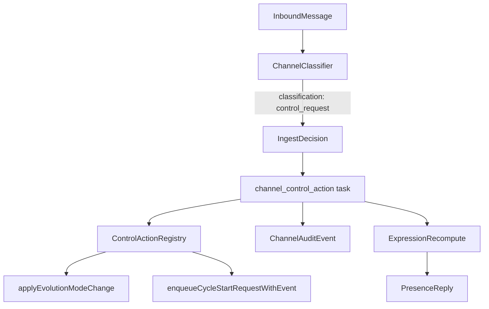

# Channel Control Request：飞书一句话切换进化模式，但不把 Classifier 变成 root

> 日期：2026-06-03  
> 项目：js-evolution-agent  
> 类型：架构设计 / 功能实现  
> 来源：Cursor Agent 对话

---

## 目录

1. [背景与动机](#1-背景与动机)
2. [分析过程](#2-分析过程)
3. [方案设计](#3-方案设计)
4. [实现要点](#4-实现要点)
5. [验证与测试](#5-验证与测试)
6. [后续演化](#6-后续演化)
7. [附：本轮对话问题—思考—方案—执行对照](#附本轮对话问题思考方案执行对照)

---

## 1. 背景与动机

Channel loop 已经能处理飞书入站：Classifier 分类 → brief/fact/observation 落盘 → Presence 决策 → Speech 生成 → Notify 出站。

操作者自然会问：**能不能在飞书里直接说「切换为按需进化」或「启动一轮进化」？**

现状里只有一部分命令能间接生效：

- 「同意发布 / 下一轮核实」→ `approval_request` / `verification_request` brief → **顺带** `enqueueCycleStartRequestWithEvent`
- 「切换进化模式」→ 最多变成 observation，或 Presence 回复里贴 CLI 指引，**不会改** `subjects.json` 的 `evolution.mode`

真正的问题不是「Classifier 不够聪明」，而是 **缺少一条受控的「本地控制动作」执行通道**。如果把每个操作都做成单独分类，或让 Classifier/ingest 直接改配置，都会把 LLM 误判放大成配置写入。

---

## 2. 分析过程

### 2.1 Channel loop 现状（分析结论）

当前 loop 是三层驱动：

| 层 | 职责 |
| --- | --- |
| 定时 tick | presence tick（默认 5min）、classifier tick（默认 30s）只负责入队 |
| Role worker | notify / presence / speech / classifier 并行 claim 任务 |
| Feishu listener | 写 `inbound/pending` 并尝试入队 classifier |

Classifier 输出 schema 原先只有五类：`approval_request`、`verification_request`、`operator_fact`、`observation`、`ignore`。Presence 边界里明确写着不能直接改 evolution mode，只能在 `operator_commands` 里告诉操作者去跑 CLI。

### 2.2 为什么不在 Classifier 里直接执行

| 风险 | 说明 |
| --- | --- |
| LLM 误判 | 分类错 = 配置被改 |
| retry 语义 | 同一 inbound 重试可能重复执行 |
| 职责混乱 | ingest 同时承担「理解」和「动手」 |
| 扩展成本 | 每加一个操作就要污染 classifier/ingest |

### 2.3 被否定的备选

| 方案 | 结论 |
| --- | --- |
| 为每个操作新增单独分类（如 `evolution_mode_change`） | 分类爆炸，难维护 |
| Classifier 识别后直接 `applyEvolutionModeChange` | 无授权层、无审计隔离 |
| 仅扩展 Presence planner 执行 CLI | planner 不应有写配置能力 |
| 保留 brief 路径处理「启动一轮」 | 与「切换模式」语义不同，且 brief 不应承担 daemon 配置 |

选定：**新增通用分类 `control_request` + 白名单 registry + 独立 `channel_control_action` executor**。

---

## 3. 方案设计



### 关键决策

| 决策 | 选择 | 理由 |
| --- | --- | --- |
| 分类名 | `control_request`（通用） | 一个分类承载多种本地控制，避免 schema 膨胀 |
| 执行位置 | `channel_control_action` + control role | Classifier 只识别意图；executor 校验并执行 |
| 动作注册 | 白名单 `action_id`，禁止任意 shell | LLM 只能输出注册过的 id + params |
| 授权 | 写类 action 需 Feishu operator binding + high confidence | 降低误触发与未绑定滥用 |
| Presence 唤醒 | control 完成后才 `requestExpressionRecompute` | 避免先 ack、后执行导致回复与事实不一致 |
| 任务优先级 | `channel_control_action` = 12，高于 presence(15) | 执行结果先入审计，再驱动回复 |
| 首批 action | mode set/show、cycle request | 覆盖用户最常用本地控制，风险可控 |

### 首批注册动作

| action_id | 含义 | 写操作 | 需要 binding |
| --- | --- | --- | --- |
| `daemon_evolution_mode_set` | 切换 `continuous` / `on_demand` | 是 | 是 |
| `daemon_evolution_mode_show` | 查看当前 mode/source | 否 | 否 |
| `daemon_cycle_request` | 入队 cycle start request | 是 | 是 |

仍不可通过 channel 自动执行：`approval_granted`、远端发布、凭据、subject policy、`pending_decisions.json` 直写。

---

## 4. 实现要点

### 数据流摘要

1. Classifier（LLM 或 deterministic）输出 `control_request` + `action_id` + `params` + `confidence`
2. [`src/channel/ingest.mjs`](../../src/channel/ingest.mjs) 校验后入队 `channel_control_action`，**不**直接改配置
3. [`src/channel/control-executor.mjs`](../../src/channel/control-executor.mjs) 校验注册、置信度、参数、operator 身份后执行
4. 写 `channel_control_action_completed` / `channel_control_action_failed` 审计事件
5. `requestExpressionRecompute(reason: control_action_completed|failed)` → Presence 从审计事件生成 `reply.control_action` → `control_action_ack` 话术

Classifier 对 `control_request` **不**触发 `inbound_classified` wake；只有 executor 完成后才唤醒 Presence。

### 关键模块

| 文件 | 职责 |
| --- | --- |
| [`src/channel/control-actions.mjs`](../../src/channel/control-actions.mjs) | 白名单 registry、`parseControlRequestFromText`、deterministic 短语解析 |
| [`src/channel/control-executor.mjs`](../../src/channel/control-executor.mjs) | 授权、校验、执行、审计、presence wake |
| [`src/channel/ingest.mjs`](../../src/channel/ingest.mjs) | `control_request` decision、`enqueueControlAction` |
| [`src/channel/classifier.mjs`](../../src/channel/classifier.mjs) | LLM schema 扩展、deterministic 回退、跳过 control 的 inbound_classified wake |
| [`src/channel/wake.mjs`](../../src/channel/wake.mjs) | `enqueueControlAction` |
| [`src/channel/types.mjs`](../../src/channel/types.mjs) | 任务类型与优先级（control=12） |
| [`src/channel/channel-roles.mjs`](../../src/channel/channel-roles.mjs) | 默认 roles 增加 `control` |
| [`src/channel/expression-candidates.mjs`](../../src/channel/expression-candidates.mjs) | 从 control 审计事件生成 `reply.control_action` candidate |
| [`src/channel/presence-planner.mjs`](../../src/channel/presence-planner.mjs) | `planPresenceControlActionFastAck` |
| [`src/channel/speech-generation.mjs`](../../src/channel/speech-generation.mjs) | `control_action_ack` 确定性回复模板 |
| [`src/cli/utils/evolution-mode-apply.mjs`](../../src/cli/utils/evolution-mode-apply.mjs) | `trigger: 'channel_control'` 支持 |
| [`AGENTS.md`](../../AGENTS.md) | Channel Control Actions 章节 |

### 默认 channel roles（升级后需重启 daemon）

```text
notify / control / presence / speech / classifier
```

### 幂等与审计

- task idempotency：`control:<subject>:<message_id>:<action_id>`
- 失败 reason：`unknown_action`、`invalid_params`、`low_confidence`、`operator_not_bound`、`unauthorized_sender`
- mode set 若目标与当前一致：no-op success，不报错

### 飞书使用示例

1. 私聊完成 `JEA BIND <口令>`
2. 发送：`切换为按需进化` / `切换为持续进化` / `启动一轮进化` / `当前进化模式是什么`
3. 验收：`jea channel events --limit 20`、`jea daemon evolution-mode show`

---

## 5. 验证与测试

```bash
npm test -- test/channel.test.mjs
```

结果：**56 passed**（实现前为 46，新增 control_request 相关用例）。

覆盖要点：

- `parseControlRequestFromText` / `classifyChannelEnvelope` 识别进化模式与开轮短语
- classifier 只入队 `channel_control_action`，不直接改 mode
- 已绑定 operator 执行 `daemon_evolution_mode_set` 后 `subjects.json` mode 变化
- 未绑定写类 action 失败且 mode 不变
- `daemon_cycle_request` 写入 pending cycle start request
- control 任务优先级高于 presence；executor 完成后 presence 产出 `control_action_ack`

未做真实 Feishu 联调；建议 BIND 后在私聊发「切换为按需进化」观察 `channel_control_action_completed` 与 `daemon evolution-mode show`。

---

## 6. 后续演化

| 方向 | 说明 |
| --- | --- |
| 扩展 registry | `presence_enable/disable`、`classifier_mode_set` 等，仍走同一 `control_request` 分类 |
| 群聊控制 | 当前写类 action 依赖私聊 BIND；群聊需额外 allowlist 策略 |
| 误触发熔断 | registry 层可临时禁用写类 action，只保留 show |
| 与 brief 边界 | 「启动一轮」走 control；审批/核实仍走 brief，避免语义混用 |
| viewer | channel events 面板可突出 `channel_control_action_*` |

---

## 附：本轮对话问题—思考—方案—执行对照

| 阶段 | 内容 |
| --- | --- |
| 问题 | 飞书能否切换进化模式？Classifier 能否像「启动一轮进化」那样执行本地控制？ |
| 思考 | 现有 Classifier 只有 brief/fact/observation；brief 可顺带 cycle start，但无 evolution mode 路径；Presence 只能贴 CLI，不能写配置 |
| 方案 | 通用 `control_request` + 白名单 registry + `channel_control_action` executor + control role；写类需 binding；Presence 只回复 executor 审计结果 |
| 执行 | 新增 `control-actions.mjs`、`control-executor.mjs`；扩展 classifier/ingest/types/roles/wake/presence 链路；56 项 channel 测试通过；更新 AGENTS.md |
