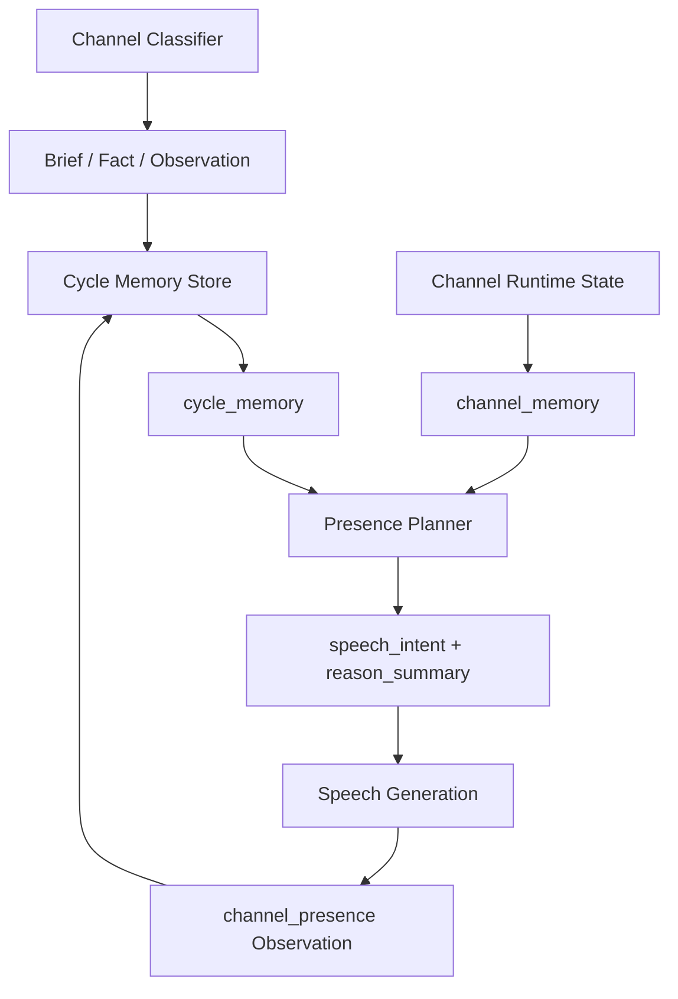

# Channel 不再另造记忆：复用 Cycle Memory 的 Presence 升级

> 日期：2026-06-03  
> 项目：js-evolution-agent  
> 类型：架构设计 / 功能实现 / 问题排查  
> 来源：Cursor Agent 对话

---

## 目录

1. [背景与动机](#1-背景与动机)
2. [分析过程](#2-分析过程)
3. [方案设计](#3-方案设计)
4. [实现要点](#4-实现要点)
5. [验证与测试](#5-验证与测试)
6. [后续演化](#6-后续演化)
7. [附：本轮对话问题—思考—方案—执行对照](#附本轮对话问题思考方案执行对照)

---

## 1. 背景与动机

Channel Presence 已经从「收到消息才回复」演进成了 subject 的外部感知与表达循环。它会读入站消息、daemon 态势、operator brief、goals、beliefs，再决定说话、沉默或写入意图。

但这里出现了一个危险的诱惑：既然要像「持续存在的人」，是不是应该为 channel 单独做一套长期对话记忆、关系模型、obligation store？

这次对话最后收敛出的答案很明确：

**不要。**

Channel 不应该成为第二个 evolution loop。它只保留运行态：inbound / outbox、event queue、presence-state、cooldown。真正的长期连续性，应该继续落在 cycle loop 已经认识并能审计的机制里：

- `intel_observations`
- operator brief
- operator fact
- goals / beliefs
- intel report
- verify report
- evolution diary
- standing memory summary

真正的问题不是「channel 记不记得」。  

真正的问题是：**channel 记住的东西，cycle loop 能不能继续消费、验证和审计。**

---

## 2. 分析过程

### 2.1 当前 Channel 已经有三条记忆线

检查 channel loop 后，发现现有系统并不是没有记忆，而是记忆分布在三条线上：

| 线索 | 写入位置 | 作用 |
| --- | --- | --- |
| 入站分类 | `intel_observations` / `operator_briefs` / `operator_fact` | 把操作者消息转成 cycle 可消费材料 |
| Presence 交互 | `source: channel_presence` 的 `intel_observations` | 记录 subject 准备说、实际说、选择沉默、写 brief 等表达行为 |
| Speech 事件 | `speech_generation_requested` event queue | 决策阶段与话术生成阶段之间的短期桥 |

这说明 channel 已经不是孤立系统。它已经在读写 intelligence store，只是上下文结构还不够清楚，speech payload 也偏薄。

### 2.2 Cycle 侧已经有长期记忆机制

Cycle loop 侧的长期记忆能力更完整：

| 机制 | 作用 |
| --- | --- |
| `buildContextSummary()` | 从近期 observations / events / probes 构造轻量摘要 |
| Operator facts | 高置信且未被 supersede 的事实可升格为 Seen |
| Operator briefs | 单轮意图，进入下一轮 report / decide prompt，消费后归档 |
| Goals / beliefs | 目标与可验证行动假设 |
| Standing memory | Phase 1 后经 admission 更新的滚动态势索引 |
| Diary / verify / report | 每轮结果、验证状态、演化解释 |

因此，如果 channel 另建 `channel_obligations.json`、`operator_model.json` 或私有 relationship memory，就会产生两个后果：

- 同一 subject 会拥有两套长期叙事；
- channel 侧记忆无法自然进入 Decide / Verify / Diary 的审计闭环。

这与 OADA 的边界相冲突。

### 2.3 方案转折：从「人类记忆」回到「Cycle 记忆复用」

对话中曾讨论过更复杂的人类式记忆：关系、偏好、欠跟进、长期印象。

但最终选择了更保守的工程路线：

**Channel 可以表现得更连续，但长期连续性必须复用 cycle memory。**

也就是说：

- 「发布后告诉我 rank」不是 channel 私有 obligation，而是 `verification_request` brief；
- 「以后都这样称呼我」只有明确长期偏好时才可能成为 operator fact；
- 「刚才我为什么说这句话」可以作为短期 `reason_summary` 带给 speech generation；
- 「我说过什么」写回 `channel_presence` observation，供 cycle 与下一轮 presence 回读。

---

## 3. 方案设计

### 3.1 新的上下文分层

Presence context 被重组为两个显式视图：



| 视图 | 内容 | 语义 |
| --- | --- | --- |
| `cycle_memory` | briefs、intel summary、goals、beliefs、artifacts、recent channel presence | subject 的长期连续性，来自 cycle 已有机制 |
| `channel_memory` | recent ingested、new/background/ignored messages、cooldown、presence cursor、pending 计数 | channel 当前感知与游标 |

旧字段继续保留，避免破坏既有 planner / speech / 测试消费者。

### 3.2 关键决策

| 决策 | 选择 | 理由 |
| --- | --- | --- |
| 长期记忆 | 不新增 channel 私有长期 store | 避免与 cycle memory 分裂，保持 Decide / Verify / Diary 可审计 |
| Follow-up | 优先写 `verification_request` operator brief | 欠跟进本质上需要下一轮 cycle 处理，不应由 channel 私下背账 |
| Speech 桥接 | 增加 `reason_summary` / `tone_hint` / `source_refs` / `memory_effect` | 给话术生成短期可审计摘要，但不存 chain-of-thought |
| Presence observation | 结构化写 `why`、`content_summary`、`candidate_id`、`outbox_ref` | 让 cycle loop 更容易回读表达历史 |
| SOUL 边界 | SOUL 控制声音，不控制事实与权限 | 避免 persona 文档被误用为治理权威 |

---

## 4. 实现要点

### 4.1 Presence Context：显式分层

[`src/channel/presence-context.mjs`](../../src/channel/presence-context.mjs)：

- `schema_version` 升为 `3`；
- 新增 `cycle_memory`；
- 新增 `channel_memory`；
- 保留 `operator_briefs`、`goals`、`beliefs`、`intel_summary`、`channel.*` 等旧字段；
- 将 `recent_presence_interactions` 进一步拆成：
  - `recent_said`
  - `recent_silence`
  - `recent_decisions`
  - `all`

这一步的重点不是多塞字段，而是让 LLM 明白：**哪些是长期连续性，哪些只是当前通道状态。**

### 4.2 Presence Memory：写给 Cycle 读

[`src/channel/presence-memory.mjs`](../../src/channel/presence-memory.mjs)：

- 新增 `partitionPresenceInteractions()`；
- 新增 `defaultDeliberationHints()`；
- 新增 `formatPresenceInteractionContent()`；
- 收紧 `shouldRecordSilenceObservation()`：只有真实 `silence` 且有 candidate 时才写 observation。

`recordPresenceInteraction()` 仍然写入 `intel_observations`，没有新增存储。

典型内容从「Requirements JSON 预览」变成更可读的结构化文本：

```text
interaction=send_message; why=operator_brief_fast_ack; content_summary=...; candidate_id=...; outbox_ref=...
```

### 4.3 Speech Intent：把决策理由带到生成阶段

[`src/channel/speech-intent.mjs`](../../src/channel/speech-intent.mjs)：

- `normalizeSpeechIntent()` 支持：
  - `reason_summary`
  - `tone_hint`
  - `source_refs`
  - `memory_effect`
- `buildSpeechGenerationEventPayload()` 将这些字段写入 `speech_generation_requested` payload；
- [`src/channel/speech-generation.mjs`](../../src/channel/speech-generation.mjs) 在恢复 intent 时读取这些字段。

这解决了一个旧问题：决策阶段知道「为什么要说」，但 speech 阶段只看到很薄的 `context_summary`。现在 speech generation 至少能看到经过裁剪的短期摘要。

### 4.4 Prompt：从「回复器」改成「cycle-memory aware presence」

[`src/channel/presence-planner.mjs`](../../src/channel/presence-planner.mjs) 与 [`src/channel/speech-generation.mjs`](../../src/channel/speech-generation.mjs) 的 prompt 被更新：

- 明确 `cycle_memory` 是长期连续性；
- 明确 `channel_memory` 是当前外部感知；
- 明确 follow-up 应写 `write_operator_brief`；
- 明确 SOUL 只控制声音，不控制事实和权限；
- 禁止批准、声称执行、泄密、发明 runtime facts。

### 4.5 Classifier：follow-up 进入 brief，而不是 channel 私有待办

[`src/channel/ingest.mjs`](../../src/channel/ingest.mjs)：

- 确定性路径识别「发布后告诉我 rank」「跑完后帮我看结果」等 follow-up；
- 这类话语写为 `verification_request` operator brief；
- `operator_fact` 正则收紧，只在明确长期偏好或确立事实时才写高置信 fact。

[`src/channel/classifier.mjs`](../../src/channel/classifier.mjs)：

- LLM classifier prompt 同步强调 follow-up → `verification_request`；
- 长期偏好 / 已确立事实才进入 `operator_fact`。

### 4.6 代码检查中补上的两个闭环修复

实施后又专门检查了一遍相关逻辑，发现两处不是语法问题，而是流程闭环问题。

| 问题 | 修复 |
| --- | --- |
| Planner prompt 允许 LLM 输出 `write_operator_brief`，但 `planPresenceWithLlm()` 只消费 `intents`，导致 `actions` 被丢弃 | 接入 `parsed.actions`，用既有 `normalizeAction()` 规范化，支持 `act` / `write_operator_brief` / `record_observation` |
| Presence 写 `operator_brief` 后只落 pending brief，不请求 cycle start | 在 [`src/channel/presence-decision-executor.mjs`](../../src/channel/presence-decision-executor.mjs) 中调用 `enqueueCycleStartRequestWithEvent()`，对齐 classifier / CLI brief 入口 |

这两处修复很关键。否则 follow-up 虽然在 prompt 里被设计为 brief，但 LLM 路径可能根本写不进去；即使写进去，在 `on_demand` 模式下也可能不被 cycle 及时消费。

### 4.7 关键文件

| 文件 | 职责 |
| --- | --- |
| [`src/channel/presence-context.mjs`](../../src/channel/presence-context.mjs) | 构造 `cycle_memory` / `channel_memory`，保留 legacy context |
| [`src/channel/presence-memory.mjs`](../../src/channel/presence-memory.mjs) | 读取 / 分区 presence interactions，结构化写 `channel_presence` observation |
| [`src/channel/speech-intent.mjs`](../../src/channel/speech-intent.mjs) | 规范 speech intent 与 speech event payload |
| [`src/channel/presence-planner.mjs`](../../src/channel/presence-planner.mjs) | LLM / deterministic presence 计划，接入 action 输出 |
| [`src/channel/presence-decision-executor.mjs`](../../src/channel/presence-decision-executor.mjs) | 执行 speech / brief / observation / silence，并唤醒 cycle |
| [`src/channel/speech-generation.mjs`](../../src/channel/speech-generation.mjs) | 使用短期摘要生成最终 outbound 文本并写回表达 observation |
| [`src/channel/ingest.mjs`](../../src/channel/ingest.mjs) | follow-up 与 operator fact 的确定性分类 |
| [`src/channel/classifier.mjs`](../../src/channel/classifier.mjs) | LLM classifier 边界提示 |
| [`test/channel.test.mjs`](../../test/channel.test.mjs) | 覆盖 context、payload、follow-up brief、presence observation、LLM action 执行 |

---

## 5. 验证与测试

本轮验证分两段。

### 5.1 初始实现后

```powershell
npm test -- test/channel.test.mjs
npm test
```

结果：

- `test/channel.test.mjs`：69 passed；
- 全量测试：603 passed。

### 5.2 代码检查修复后

补上 LLM `actions` 执行与 presence brief 唤醒 cycle 后再次验证：

```powershell
npm test -- test/channel.test.mjs
npm test
```

结果：

- `test/channel.test.mjs`：70 passed；
- 全量测试：604 passed；
- 相关文件 linter：无错误。

新增测试覆盖：

- `buildPresenceContext` 暴露 `cycle_memory` / `channel_memory` 且 legacy 字段仍可用；
- speech payload 带 `reason_summary` / `tone_hint` / `source_refs` / `memory_effect`；
- follow-up 确定性分类为 `verification_request`；
- `send_message` 写入结构化 `channel_presence` observation；
- decision phase 写出的 `speech_generation_requested` payload 带 deliberation 字段；
- LLM planner 输出 `write_operator_brief` action 时会实际写 pending brief，并创建 `cycle_start_requested`。

---

## 6. 后续演化

这次没有把所有 cycle memory 都塞进 presence。原因很简单：先建立边界，再逐步加厚上下文。

可继续推进的方向：

1. **加入 operator established facts 切片**  
   复用 `operator-facts` 的 supersede / high-confidence 逻辑，把已确立事实以小切片放入 `cycle_memory`。

2. **加入 standing memory excerpt**  
   只读 `Current State` 或轻量摘要，不让 presence 直接写 standing memory。

3. **复用 diary anchors**  
   将 `gatherDiaryAnchors()` 中的 goals / guidance / active facts 作为 interpretation anchors 供 presence 使用。

4. **合并 channel 入站线程与 presence 交互线程**  
   当前 `recent_channel_presence` 只来自 `source: channel_presence`；后续可读取近期 `source: channel` observation，让 planner 看到「对方说了什么」与「我回应了什么」的连续线索。

5. **加厚 speech event 决策快照**  
   `speech_generation_requested` 已携带短期摘要，但仍依赖生成阶段重新 `buildPresenceContext()`。后续可加入 candidate / message 的小快照，降低跨 tick 漂移。

---

## 附：本轮对话问题—思考—方案—执行对照

| 阶段 | 内容 |
| --- | --- |
| 问题 | Channel Presence 需要更像主体的外部意识循环，但不能新建一套与 cycle 分裂的长期记忆系统。 |
| 思考 | Channel 已经通过 classifier 与 presence 写入 intelligence store；真正缺的是上下文分层、短期决策摘要和 follow-up 归属，而不是新 store。 |
| 方案 | 新增 `cycle_memory` / `channel_memory` 视图；speech intent 增加短期摘要；presence observation 结构化；follow-up 写 operator brief；SOUL 只管声音边界。 |
| 执行 | 修改 channel context、memory、planner、executor、speech、classifier / ingest 与测试；检查中补上 LLM `actions` 执行和 presence brief 唤醒 cycle；全量测试 604 passed。 |
