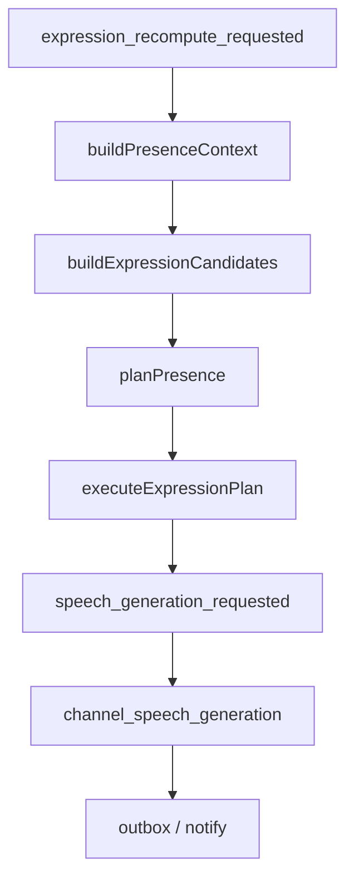

# Presence 表达候选模型：从事件驱动到 Candidate 驱动

> 日期：2026-06-03  
> 项目：js-evolution-agent  
> 类型：架构设计 / 功能实现  
> 来源：Cursor Agent 对话

---

## 目录

1. [背景与动机](#1-背景与动机)
2. [分析过程](#2-分析过程)
3. [方案设计](#3-方案设计)
4. [实现要点](#4-实现要点)
5. [验证与测试](#5-验证与测试)
6. [后续演化](#6-后续演化)
7. [附：本轮对话问题—思考—方案—执行对照](#附本轮对话问题思考方案执行对照)

---

## 1. 背景与动机

Channel 多 worker 架构已经拆成：

```text
classifier → presence → speech_generation → notify
```

但 Presence 内部仍同时处理三类概念：

- **事件类型**（`timer_tick`、`inbound_classified`、`feishu_message_received`…）
- **原材料**（`new_messages`、`ignored_messages`、`attention_signals`）
- **游标**（`handled_messages`、`handled_signals`）

Planner 需要同时理解 ingest 语义、ignore 边界、signal 类型、handled 状态，心智负担大，且容易出现：

- `nothing_to_express` 被表示成 `stance: silence`
- ignore-only 批次仍触发 silence 游标
- message/signal 双游标与 candidate 语义不一致

本轮在不考虑向后兼容的前提下，把 Presence 收敛为：**每次 wake 只重算 Expression Candidates，再决定 no_op / speak / silence / act**。

---

## 2. 分析过程

### 2.1 第一性原理

Channel 只做三件事：

| 层 | 职责 |
| --- | --- |
| Ingest | raw inbound → classified record |
| Attention | 系统状态 → notify 类候选 |
| Expression | 从候选中选是否说话、说什么 intent |

Presence 不应再回答：「这条事件是什么意思」，而应回答：「当前有哪些表达候选，要不要处理」。

### 2.2 与同日其他 journal 的关系

| 文档 | 关系 |
| --- | --- |
| [`channel-multiworker-classifier.md`](channel-multiworker-classifier.md) | 已约定 classifier 拥有 ingest；presence 不 drain inbound |
| [`inbound-classifier-presence-routing.md`](inbound-classifier-presence-routing.md) | 入站只唤醒 classifier，不直唤醒 presence |
| [`ignore-presence-boundary.md`](ignore-presence-boundary.md) | ignore 可见但不可 reply-eligible；本重构用 candidate 固化该边界 |

### 2.3 被否定的设计

| 方案 | 结论 |
| --- | --- |
| 继续扩展 `new_messages` / `ignored_messages` 双轨 | planner 仍要懂两套规则 |
| 仅重命名 `nothing_to_express` → `no_op` | 语义对了，但 planner 仍扫 raw 列表 |
| 删除所有 wake 事件 | 定时巡检与 daemon attention 仍需触发重算 |

选定：**`expression.candidates` + `plan.kind` + `handled_candidates`**。

---

## 3. 方案设计



### 关键决策

| 决策 | 选择 | 理由 |
| --- | --- | --- |
| 唤醒语义 | 统一 `requestExpressionRecompute` | 事件只表示「重算表达状态」，不承载业务分类 |
| Presence claim | 仅 `expression_recompute_requested` | 去掉 `feishu_message_received` 等历史事件类型 |
| 计划输出 | `kind: no_op \| speak \| silence \| act` | 区分「无候选」与「有候选但不说」 |
| 游标 | `handled_candidates` | 统一 reply/notify 的 handled 状态 |
| Planner 输入 | 仅 `expression.candidates` + background | LLM 不再直接读 `ingest_kind` 做决策 |
| 入站路由 | 仍 classifier → `inbound_classified` → recompute | 与 [`inbound-classifier-presence-routing.md`](inbound-classifier-presence-routing.md) 一致 |
| Daemon task | `channel_presence` 不内联 speech | 与多 role worker 模型一致；CLI 可保留直跑 speech 便利 |

### Candidate 映射（规则）

| 原材料 | candidate |
| --- | --- |
| `operator_brief` + `approval_request` | `reply.approval_request` |
| `operator_brief` + `verification_request` | `reply.verification_request` |
| `operator_fact` | `reply.operator_fact` |
| 寒暄 `observation` | `reply.greeting` |
| `ignore` | **无**（仅 background） |
| `task_failed` 等 signal | `notify.*` |

### Plan 语义

| `plan.kind` | 含义 |
| --- | --- |
| `no_op` | `candidates` 为空，无需表达 |
| `speak` | 选中候选，产出 `speech_intent` |
| `silence` | 有候选，明确选择不回应 |
| `act` | 非说话动作（brief / observation 等） |

---

## 4. 实现要点

### 新增 / 核心

| 文件 | 职责 |
| --- | --- |
| [`src/channel/expression-candidates.mjs`](../../src/channel/expression-candidates.mjs) | 从 processed + signals 构建 `expression.candidates`；`candidateIdForMessage` / `candidateIdForSignal` |
| [`src/channel/presence-context.mjs`](../../src/channel/presence-context.mjs) | 输出 `context.expression.candidates`；`recent_ingested` 分区用 candidate handled 判断 |
| [`src/channel/presence-planner.mjs`](../../src/channel/presence-planner.mjs) | candidates-first；`planPresenceOperatorBriefFastAck` 基于 candidates |
| [`src/channel/presence-decision-executor.mjs`](../../src/channel/presence-decision-executor.mjs) | `no_op` / `silence` / `speak` 分支；`markExpressionCandidatesHandled` |
| [`src/channel/presence-reactor.mjs`](../../src/channel/presence-reactor.mjs) | 只 claim `expression_recompute_requested` |
| [`src/channel/wake.mjs`](../../src/channel/wake.mjs) | `requestExpressionRecompute` 替代 `requestPresenceReactor` |
| [`src/channel/speech-intent.mjs`](../../src/channel/speech-intent.mjs) | intent 增加 `candidate_id` |
| [`src/channel/speech-generation.mjs`](../../src/channel/speech-generation.mjs) | 发送后按 `candidate_id` 回写 handled |

### 删除 / 替换的遗留

| 项 | 说明 |
| --- | --- |
| `handled_messages` / `handled_signals` | 从 `presence-state.json` 与 state API 移除 |
| `presence_targets` | 计划改为 `candidate_ids` |
| `plan.stance` | 改为 `plan.kind` |
| `requestPresenceReactor` | 源码与测试已移除；仅 `reason` 字符串保留在 payload 中作审计 |
| 审计事件 | 新增 `channel_expression_planned` / `channel_expression_noop` / `channel_expression_silenced`；保留 `channel_presence_completed` 等 |

### 数据流（生产）

```text
Feishu / inbox / channel_inbound
  → writePendingInbound
  → enqueueClassifierIfPendingInbound

classifier 完成
  → requestExpressionRecompute(reason: inbound_classified)

presence tick / daemon attention
  → requestExpressionRecompute(reason: timer_tick | ...)

runPresenceReactor
  → buildExpressionContext
  → buildExpressionCandidates
  → planPresence (fast_ack / deterministic / llm / fallback)
  → execute → speech_generation_requested
  → channel_speech_generation → outbox → channel_notify
```

### 配置与文档

- [`AGENTS.md`](../../AGENTS.md) Channel 小节已更新：入站只唤醒 classifier、表达重算事件、新审计事件名。
- [`tools/evolution-viewer/public/app.js`](../../tools/evolution-viewer/public/app.js) 事件标签：`channel_expression_*`。

---

## 5. 验证与测试

```bash
npm test -- test/channel.test.mjs
```

结果：**46 passed**。

覆盖要点包括：

- `expression_recompute_requested` tick 与 wake 合并
- raw inbound 事件不被 presence claim
- ignore-only → `no_op`，不写 `handled_candidates`
- ignore + brief 同批 → fast ack 仅 `candidate_ids` 含 brief
- proactive signal 与 ignore 并存 → 仍 `speak` 且 ignore 不在 candidate_ids
- decision timeout → deterministic fallback + speech 入队
- `handled_candidates` 在 ack 后写入

生产部署后需 **重启 channel daemon** 加载新代码。

---

## 6. 后续演化

- 将 `channel_presence` 任务类型重命名为 `channel_expression`（可选，当前仍用 `channel_presence` 任务类型名）。
- projection / `jea channel status --json` 增加 `expression.candidates` 计数摘要。
- 考虑 event-queue 清理工具，归档遗留 `feishu_message_received` pending 事件。
- LLM planner 可进一步收紧为「只输出 candidate_ids + intents」，禁止 `act` 除非明确需要。

---

## 附：本轮对话问题—思考—方案—执行对照

| 阶段 | 内容 |
| --- | --- |
| 问题 | Presence 逻辑混乱；ignore 与 reply 边界不清；希望无兼容地简化 |
| 思考 | 事件只触发重算；候选统一表达对象；no_op 与 silence 分离；handled_candidates 统一游标 |
| 方案 | ExpressionCandidate 模型 + 新 wake + 新 plan + 新 executor/state |
| 执行 | 实现并跑通 46 项 channel 测试；更新 AGENTS 与 viewer 标签 |