# Channel Presence：Expression Candidate 重构

> 日期：2026-06-03  
> 项目：js-evolution-agent  
> 类型：架构设计 / 功能实现  
> 来源：Cursor Agent 对话

---

## 目录

1. [背景与动机](#1-背景与动机)
2. [分析过程](#2-分析过程)
3. [方案设计](#3-方案设计)
4. [实现要点](#4-实现要点)
5. [验证与测试](#5-验证与测试)
6. [后续演化](#6-后续演化)
7. [附：本轮对话问题—思考—方案—执行对照](#附本轮对话问题思考方案执行对照)

---

## 1. 背景与动机

Channel 在 classifier + 多 role worker 架构下，Presence 仍承担过多语义：同时理解 `new_messages`、`ignored_messages`、`attention_signals`、双套 handled 游标、多种 wake 事件类型，并把 `nothing_to_express` 伪装成 `silence`。

用户要求**不考虑向后兼容**，清理历史遗留，让逻辑干净。目标模型：

```text
Classifier → Expression Candidates → Presence Plan → Speech → Notify
```

Wake 只表示「表达状态可能变了，不参与业务判断。

---

## 2. 分析过程

### 2.1 当前 loop 校验结论

- 入站路径已正确：`raw inbound → classifier → requestExpressionRecompute(inbound_classified)`；不再由飞书/inbox 直接唤醒 Presence。
- Daemon 下 `channel_presence` 已 `skip_speech_generation`，与 notify/speech/classifier 异步解耦一致。
- 主要混乱来自 Presence 内部仍用 `stance` / `presence_targets` / `handled_messages|handled_signals`，以及 `ignore` 与 `silence` 语义混用。

### 2.2 第一性原理收敛

| 层 | 职责 |
| --- | --- |
| Classifier | 消息 → 分类结果（brief/fact/observation/ignore） |
| Candidate Builder | 可表达对象 → `ExpressionCandidate[]` |
| Planner | 从 candidates 选 `no_op` / `speak` / `silence` / `act` |
| Speech / Notify | 生成与发送（不变） |

`ignore` 只进 `background`，不生成 candidate，不驱动回复，不进入 silence 游标。

---

## 3. 方案设计

```mermaid
flowchart LR
  inbound["inbound/pending"]
  classifier["channel_classifier"]
  wake["expression_recompute_requested"]
  ctx["buildExpressionContext"]
  candidates["buildExpressionCandidates"]
  plan["planPresence"]
  exec["executeExpressionPlan"]
  speechEvt["speech_generation_requested"]
  speech["channel_speech_generation"]
  outbox["outbox"]
  notify["channel_notify"]

  inbound --> classifier
  classifier --> wake
  wake --> ctx
  ctx --> candidates
  candidates --> plan
  plan --> exec
  exec --> speechEvt
  speechEvt --> speech
  speech --> outbox
  outbox --> notify
```



### 关键决策

| 决策 | 选择 | 理由 |
| --- | --- | --- |
| 表达输入 | `expression.candidates` | Planner 只看「要不要表达」的对象 |
| 无候选 | `no_op` | 与「有候选但选择沉默」分离 |
| 游标 | `handled_candidates` | 统一 candidate id，删除 message/signal 双游标 |
| Wake 事件 | 仅 `expression_recompute_requested` | 废弃 `timer_tick`/`inbound_classified` 等 claim 类型 |
| Wake API | `requestExpressionRecompute` | 替代 `requestPresenceReactor` |
| 计划结构 | `kind` + `candidate_ids` + `intents` | 删除 `stance` / `presence_targets` |

---

## 4. 实现要点

### 新增

| 文件 | 职责 |
| --- | --- |
| [`src/channel/expression-candidates.mjs`](../../src/channel/expression-candidates.mjs) | 从 processed inbound + attention signals 生成 candidates；cooldown 过滤 |

### 核心改写

| 文件 | 变更摘要 |
| --- | --- |
| [`presence-context.mjs`](../../src/channel/presence-context.mjs) | `expression.candidates`；partition 仍保留 `ignored_messages` / `background_messages` |
| [`presence-planner.mjs`](../../src/channel/presence-planner.mjs) | `no_op`/`speak`/`silence`/`act`；LLM prompt 只看 candidates + background |
| [`presence-decision-executor.mjs`](../../src/channel/presence-decision-executor.mjs) | `channel_expression_planned` / `noop` / `silenced`；`handled_candidates` |
| [`state.mjs`](../../src/channel/state.mjs) | 删除 `handled_messages`/`handled_signals` API，改为 `handled_candidates` |
| [`wake.mjs`](../../src/channel/wake.mjs) | `requestExpressionRecompute` → `expression_recompute_requested` |
| [`presence-reactor.mjs`](../../src/channel/presence-reactor.mjs) | 只 claim `expression_recompute_requested` |
| [`speech-intent.mjs`](../../src/channel/speech-intent.mjs) | intent 增加 `candidate_id` |
| [`speech-generation.mjs`](../../src/channel/speech-generation.mjs) | 发送后按 `candidate_id` 标记 handled |

### 调用方更新

- [`classifier.mjs`](../../src/channel/classifier.mjs)、[`dispatch.mjs`](../../src/channel/dispatch.mjs)、[`presence.mjs`](../../src/channel/presence.mjs)
- [`tools/evolution-viewer/public/app.js`](../../tools/evolution-viewer/public/app.js)：新审计事件标签
- [`AGENTS.md`](../../AGENTS.md)：Channel Presence / inbox 行为说明

### 删除/不再使用（源码层）

- `requestPresenceReactor`
- `isPresenceMessageHandled` / `markPresenceMessage*` / `handled_messages` / `handled_signals`
- `plan.stance` / `plan.presence_targets`
- 旧 presence claim 类型：`feishu_message_received`、`manual_inbox_added`、`timer_tick` 等（仅作 reason 字符串保留在 `payload_summary`）

### Candidate 映射规则（摘要）

| 来源 | candidate kind |
| --- | --- |
| `operator_brief` approval/verification | `reply.approval_request` / `reply.verification_request` |
| `operator_fact` | `reply.operator_fact` |
| 寒暄 observation | `reply.greeting` |
| task_failed / requires_human_review 等 | `notify.*` |
| `ignore` | 无 candidate（仅 background） |

---

## 5. 验证与测试

```bash
npm test -- test/channel.test.mjs
```

结果：**46 passed**。

覆盖要点：

- expression recompute 事件与 wake 合并
- raw inbound 事件不被 presence claim
- ignore-only → `no_op`，不写 handled_candidates
- ignore + brief 同批 → fast ack 仅 brief candidate
- proactive signal 仍可从 candidates 发言
- decision timeout fallback 仍产出 speak intents
- handled_candidates 替代 handled_messages

`src/channel` 与相关测试无新增 linter errors。

生产侧需 **重启 channel daemon** 后加载新逻辑。

---

## 6. 后续演化

- 旧运行时 `presence-state.json` 若含 `handled_messages`/`handled_signals`，新代码不读取；可文档说明需重置或迁移（未做自动迁移脚本）。
- 队列中遗留 `feishu_message_received` 等 pending 事件不会被 claim，依赖新的 `expression_recompute_requested` 或清理 event-queue。
- 可进一步删除 `runChannelPresenceTask` 内联 speech 路径（daemon 已 skip），仅保留 CLI 直跑便利。
- Projection / viewer 可展示 `expression.candidates` 数量与 `handled_candidates` 摘要。

---

## 附：本轮对话问题—思考—方案—执行对照

| 阶段 | 内容 |
| --- | --- |
| 问题 | Presence 逻辑复杂；ignore 不应驱动回复；入站不应直接触发 Presence；希望无兼容地简化 |
| 思考 | 保留四 role 流水线；Presence 只处理 candidates；`no_op` 与 `silence` 分离；wake 仅触发重算 |
| 方案 | `expression-candidates.mjs` + 新 plan 结构 + `handled_candidates` + 统一 wake 事件 |
| 执行 | 重构 planner/executor/state/wake/reactor/tests/AGENTS/viewer 标签；46 tests pass |