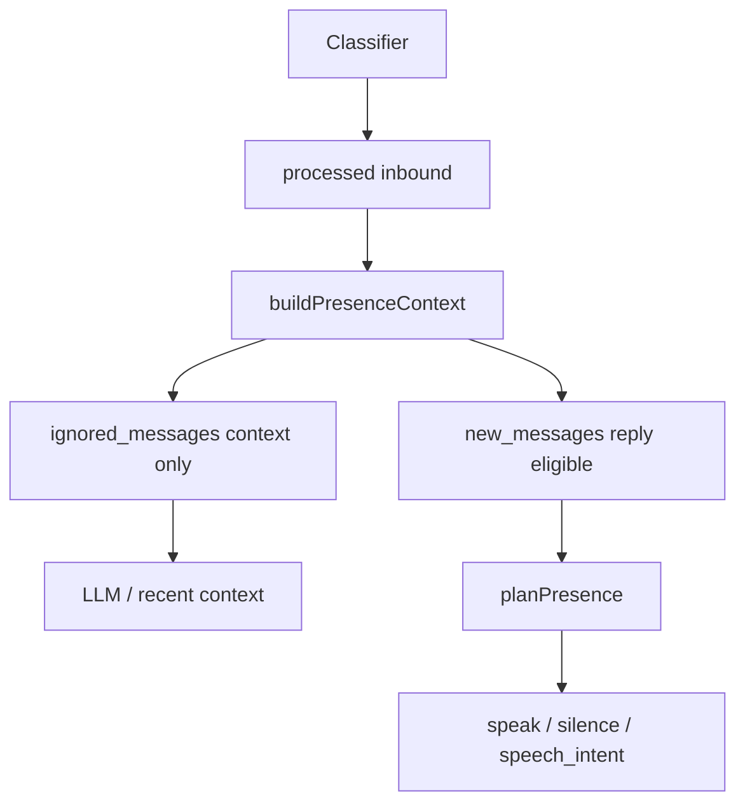

# Ignore 与 Presence：上下文可见，但不驱动回复

> 日期：2026-06-03  
> 项目：js-evolution-agent  
> 类型：架构设计 / 功能实现  
> 来源：Cursor Agent 对话

---

## 目录

1. [背景与动机](#1-背景与动机)
2. [分析过程](#2-分析过程)
3. [方案设计](#3-方案设计)
4. [实现要点](#4-实现要点)
5. [验证与测试](#5-验证与测试)
6. [后续演化](#6-后续演化)
7. [附：本轮对话问题—思考—方案—执行对照](#附本轮对话问题思考方案执行对照)

---

## 1. 背景与动机

Classifier 的 `ignore` 表示：**这条入站不值得写入 intelligence**（不写 brief/fact/observation）。这与 Presence 的「要不要对外说话」是两层语义。

对话中澄清的目标边界是：

- `ignore` **要交给 presence**（作为上下文，让主体知道最近发生了什么）。
- `ignore` **不应影响** presence 是否回复、reply_to 谁、silence 游标、fast ack 或 fallback。

真正的问题不是「presence 看不见 ignore」。

真正的问题是：**ignore 被塞进了 `new_messages`，被当成 reply-eligible 输入**，导致 planner 与 silence 游标把它和业务消息混在一起。

---

## 2. 分析过程

### 2.1 当前数据流（改前）

1. `channel_classifier` 将 `ignore` 标为 `ingest_result.kind === 'ignore'`，仍 `markInboundProcessed`。
2. `processed.length > 0` 时 **`requestPresenceReactor`**（合理：presence 仍应跑一轮）。
3. `buildPresenceContext` → `partitionIngestedByHandled` 把未 handled 的 **所有** recent ingest（含 ignore）放入 `channel.new_messages`。
4. `planPresenceDeterministic` / LLM 把 `new_messages` 当作「可能需要回复的新消息」。
5. `collectCursorTargets` 在 `stance: silence` 时把 **全部** `new_messages` 标为 handled。

### 2.2 被否定的理解

| 理解 | 结论 |
| --- | --- |
| ignore 不进入 presence | 过窄；LLM 需要上下文连续性 |
| ignore 不唤醒 presence | 过窄；presence 仍应看到批次并处理 attention signal |
| ignore 触发 silence 并消费游标 | 错误；ignore 不是「presence 决定沉默的对象」 |

### 2.3 选定抽象

```text
ingest 语义（classifier）     presence 语义（表达层）
ignore → 不写 intelligence    → context-only，presence_eligible: false
observation/brief/fact        → 可进入 new_messages（reply-eligible）
```

---

## 3. 方案设计



### 关键决策

| 决策 | 选择 | 理由 |
| --- | --- | --- |
| 消息分区 | 新增 `channel.ignored_messages` | 与 `new_messages` 分离，prompt 与规则可显式区分 |
| `recent_ingested` | 仍含全部 processed（含 ignore） | 审计与完整时间线 |
| classifier 唤醒 | **不**因 ignore 收窄 `requestPresenceReactor` | ignore 仍「交给 presence」，是否回复由 eligible 集合决定 |
| LLM 动作 | 过滤 `reply_to` 指向 ignore 的 `speech_intent` | 防止模型误回 ignore 消息 |
| silence 游标 | 只消费 reply-eligible `new_messages` | ignore 不进入 `handled_messages` |

---

## 4. 实现要点

### 关键模块

| 文件 | 职责 |
| --- | --- |
| [`src/channel/presence-context.mjs`](../../src/channel/presence-context.mjs) | `partitionIngestedByHandled` 拆分；导出 `isPresenceReplyEligible()`；`constraints.ignored_messages_are_context_only` |
| [`src/channel/presence-planner.mjs`](../../src/channel/presence-planner.mjs) | `buildPresenceTargets` 仅用 eligible；LLM prompt 含 `ignored_messages`；过滤 reply_to ignore |
| [`src/channel/presence-decision-executor.mjs`](../../src/channel/presence-decision-executor.mjs) | silence 时 `collectCursorTargets` 跳过 ignore |
| [`src/channel/presence-memory.mjs`](../../src/channel/presence-memory.mjs) | `shouldRecordSilenceObservation` 只计 eligible targets |
| [`src/channel/speech-generation.mjs`](../../src/channel/speech-generation.mjs) | 生成阶段 payload 带上 `ignored_messages` 作上下文 |
| [`src/channel/classifier.mjs`](../../src/channel/classifier.mjs) | **未改**唤醒条件 |

### Context 字段约定

| 字段 | 内容 |
| --- | --- |
| `new_messages` | `ingest_kind !== 'ignore'` 且未 presence handled |
| `ignored_messages` | `ingest_kind === 'ignore'`，`presence_eligible: false` |
| `background_messages` | 已 handled 的非 ignore 业务消息 |

---

## 5. 验证与测试

```bash
npm test -- test/channel.test.mjs
```

结果：**44 passed**。

新增 `ignore presence boundary` 用例组覆盖：

- classifier ignore → `ignored_messages` 可见、`new_messages` 为空
- ignore-only → `nothing_to_express`，无 speech，ignore 不进入 `handled_messages`，无 silence intel 记录
- ignore-only 仍入队 `channel_presence` / `inbound_classified`
- ignore + `task_failed` signal → 仍可 `proactive_signal`
- 同批 ignore + brief → fast ack 仅 `presence_targets.messages` 含 brief id
- LLM 返回 reply_to ignore → 动作被剥离

生产侧需 **重启 channel daemon**。

---

## 6. 后续演化

- 在 `AGENTS.md` Channel Presence 小节补充 `ignored_messages` / `fast_ack_operator_brief` 文档（可选）。
- Viewer / `channel status --json` 若展示 presence context，可增加 `ignored_messages` 计数便于运维。
- 评估是否在 projection API 中区分 `pending_reply_messages` vs `context_only_messages`。

---

## 附：本轮对话问题—思考—方案—执行对照

| 阶段 | 内容 |
| --- | --- |
| 问题 | classifier 的 ignore 与 presence 回复决策混为一谈 |
| 思考 | ignore 要可见，但不能作为 reply-eligible；唤醒与回复判断分离 |
| 方案 | `ignored_messages` + eligible `new_messages`；planner/游标/LLM 过滤 |
| 执行 | 改 presence-context/planner/executor/memory/speech-generation；补单测 |
