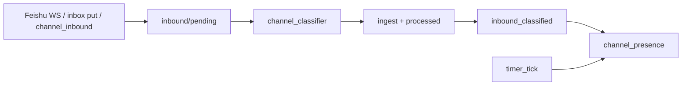

# 飞书入站先分类再 Presence：去掉原始入站直唤醒

> 日期：2026-06-03  
> 项目：js-evolution-agent  
> 类型：问题排查 / 功能实现  
> 来源：Cursor Agent 对话

---

## 目录

1. [背景与动机](#1-背景与动机)
2. [分析过程](#2-分析过程)
3. [方案设计](#3-方案设计)
4. [实现要点](#4-实现要点)
5. [验证与测试](#5-验证与测试)
6. [后续演化](#6-后续演化)
7. [附：本轮对话问题—思考—方案—执行对照](#附本轮对话问题思考方案执行对照)

---

## 1. 背景与动机

多 worker + `channel_classifier` 上线后，架构约定是：

```text
inbound/pending → classifier（分类 + ingest）→ inbound_classified → Presence 决策
```

但代码里仍保留旧路径：飞书 WebSocket listener 在 `writePendingInbound` 之后直接 `requestPresenceReactor({ type: 'feishu_message_received' })`；`jea channel inbox put` 与 `channel_inbound` 任务同理唤醒 Presence。`runPresenceReactor` 的 claim 列表也仍包含 `feishu_message_received`、`manual_inbox_added`。

真正的问题不是「Presence 不该跑」，而是 **Presence 在消息尚未分类时不该被当作决策触发器**。

未分类时 Presence 只能看到 `pending_unclassified_count`，看不到 `ingest_kind` / `brief_kind` / `ignore` 边界，容易导致：

- 空跑 `nothing_to_express`
- 与 classifier 完成后的 `inbound_classified` **重复 wake**
- 与「ignore 仅作上下文、不驱动回复」的语义冲突

---

## 2. 分析过程

### 2.1 与 classifier 主线的关系

[`journal/2026-06-03/channel-multiworker-classifier.md`](channel-multiworker-classifier.md) 已写明：`runPresenceReactor` 不再 drain inbound，presence 只读已分类结果。但 **唤醒源** 未同步收敛，listener 仍按旧模型直推 presence。

### 2.2 合理 vs 不合理的触发

| 触发 | 是否合理 |
| --- | --- |
| `inbound_classified` | 是 — 已有 ingest 语义 |
| `timer_tick` / `daemon_attention` | 是 — 系统级巡检与主动信号 |
| `feishu_message_received` | 否 — 仅 raw inbound |
| `manual_inbox_added` | 否 — 仅写入 pending，未分类 |

### 2.3 被否定的改法

| 方案 | 结论 |
| --- | --- |
| 飞书入站不进入 channel loop | 过窄；应触发 classifier |
| 保留双 wake（listener + classifier 各唤醒 presence） | 重复、易空跑 |
| 仅文档说明、不改代码 | 与实现不一致，运维难排查 |

选定：**入站统一只唤醒 classifier；Presence 仅由 `inbound_classified` 及系统事件驱动。**

---

## 3. 方案设计



### 关键决策

| 决策 | 选择 | 理由 |
| --- | --- | --- |
| 飞书 onMessage | `enqueueClassifierIfPendingInbound` | 与 classifier tick、pending 语义一致 |
| 手工 `channel inbox put` | 同上，返回 classifier task 元数据 | CLI 行为与 listener 对齐 |
| `channel_inbound` 任务 | 写入后入队 classifier | 外部批量入站不走 presence |
| Presence claim 类型 | 移除 `feishu_message_received`、`manual_inbox_added` | 遗留事件不再被 reactor 消费，避免误跑 |
| Classifier 完成后 | **保留** `requestPresenceReactor(inbound_classified)` | 唯一「新入站 → presence」路径 |

---

## 4. 实现要点

| 文件 | 变更 |
| --- | --- |
| [`src/channel/adapters/feishu/listener.mjs`](../../src/channel/adapters/feishu/listener.mjs) | `requestPresenceReactor` → `enqueueClassifierIfPendingInbound` |
| [`src/cli/commands/channel.mjs`](../../src/cli/commands/channel.mjs) | `inbox put` 入队 classifier，JSON 输出 `classifier_created` / `task` |
| [`src/channel/tasks.mjs`](../../src/channel/tasks.mjs) | `runChannelInboundTask` 返回 `classifier_task` / `classifier_created` |
| [`src/channel/presence-reactor.mjs`](../../src/channel/presence-reactor.mjs) | `PRESENCE_REACTOR_EVENT_TYPES` 去掉两类 raw inbound 事件 |
| [`src/channel/classifier.mjs`](../../src/channel/classifier.mjs) | **未改** — 仍在 `processed.length > 0` 时 `inbound_classified` 唤醒 presence |
| [`src/channel/dispatch.mjs`](../../src/channel/dispatch.mjs) | **未改** — `runChannelTick` 仍分别 tick presence（定时）与 classifier（pending） |

### 运维提示

- 队列里若仍有历史的 `feishu_message_received` / `manual_inbox_added` pending 事件，**新代码不会 claim**，表现为 `no_pending_events`；可依赖后续 `inbound_classified` 或手动清理 event-queue（非本次必做）。
- 修改后需 **重启 channel daemon**。

---

## 5. 验证与测试

```bash
npm test -- test/channel.test.mjs
```

结果：**46 passed**。

新增/调整用例：

- `raw inbound events are not claimed directly by presence` — append 遗留事件类型，reactor `skipped: no_pending_events`
- `channel_inbound task queues classifier instead of presence`
- `multiple wakes merge` 测试改为 `presence_wake` 事件（不再用 `feishu_message_received`）

与既有 journal 的衔接：

- [`ignore-presence-boundary.md`](ignore-presence-boundary.md)：分类后的 ignore 不进 `new_messages`
- [`presence-timeout-ack.md`](presence-timeout-ack.md)：分类后的 brief fast ack / fallback

三者合起来构成完整的入站 → 表达链路。

---

## 6. 后续演化

- 在 `AGENTS.md` Channel 小节明确：**飞书/手工入站只唤醒 classifier，Presence 由 `inbound_classified` 触发**（可选文档同步）。
- Event-queue 清理工具或 doctor：提示长期 pending 的 deprecated wake 事件类型。
- `channel status --json` 可区分 `pending_inbound` vs `pending_presence_events`，便于运维。

---

## 附：本轮对话问题—思考—方案—执行对照

| 阶段 | 内容 |
| --- | --- |
| 问题 | 按当前架构，飞书入站不应直接触发 Presence |
| 思考 | 应触发 classifier；Presence 需要已分类的 `ingest_kind` 与 ignore 边界 |
| 方案 | 入站 → classifier 单唤醒；presence 只 claim `inbound_classified` + 系统事件 |
| 执行 | 改 listener / CLI inbox / inbound task / reactor 事件列表；补单测 46 passed |
