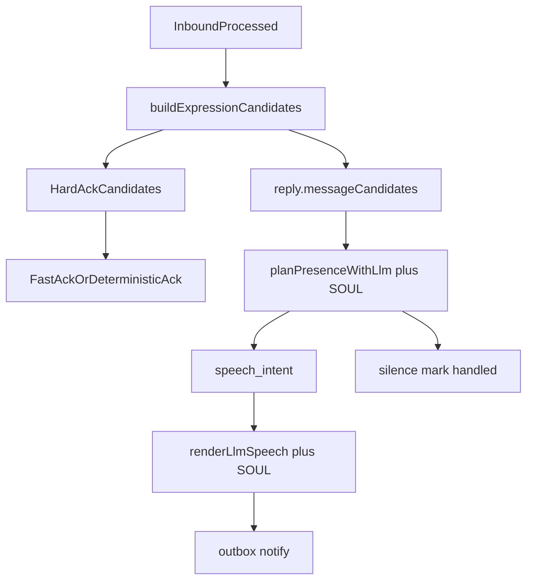

# 普通入站不再靠问候正则：Presence 把「说不说」交给 SOUL

> 日期：2026-06-03  
> 项目：js-evolution-agent  
> 类型：架构设计 / 功能实现  
> 来源：Cursor Agent 对话

---

## 目录

1. [背景与动机](#1-背景与动机)
2. [分析过程](#2-分析过程)
3. [方案设计](#3-方案设计)
4. [实现要点](#4-实现要点)
5. [验证与测试](#5-验证与测试)
6. [后续演化](#6-后续演化)
7. [附：本轮对话问题—思考—方案—执行对照](#附本轮对话问题思考方案执行对照)

---

## 1. 背景与动机

操作者在飞书私聊 `agentank-tank` 连续发了两条消息：先「你好」，后「聊聊你自己」。前者收到了铁坦式简短问候；后者分类与 ingest 都成功，但 **channel 侧完全沉默**。

真正的问题不是「LLM 没配好」或「worker 挂了」。

真正的问题是：**普通 `observation` 只有命中 `isGreeting()` 才会进入表达候选**；「聊聊你自己」在候选构建阶段就被丢掉，presence 在 `candidate_count: 0` 时直接 `no_op`，连 `subject_identity.soul`（[`policies/subjects/agentank-tank/SOUL.md`](../../policies/subjects/agentank-tank/SOUL.md)）都没机会参与决策。

用户明确要求：

- 去掉 `isGreeting` 这类语义硬编码门槛；
- 除审批、核实、operator fact、control action 等**硬性要回复**的类型外，是否回复应由 LLM 按 SOUL 与上下文判断，更像人而不是关键词规则。

---

## 2. 分析过程

### 2.1 运行时证据（`agentank-tank`）

| 阶段 | 「你好」 | 「聊聊你自己」 |
| --- | --- | --- |
| 分类 | `observation`（LLM，low） | `observation`（LLM，low） |
| intel ingest | 已写入 `intel_observations` | 已写入 |
| presence | **LLM** → `speak` → outbox 已发 | **deterministic** → `no_op`（`no_expression_candidates`） |
| 用户可见 | 有回复 | 无回复 |

审计链完整：classifier → `expression_recompute_requested` → `channel_presence` 均 `ok`；不是 daemon 卡死。

### 2.2 代码根因

[`src/channel/expression-candidates.mjs`](../../src/channel/expression-candidates.mjs) 中：

- `candidateIdForMessage()` 对 `observation` 仅在 `isGreeting(content)` 时返回 `reply:greeting:<id>`；
- 其它 observation 返回 `null` → `buildExpressionCandidates()` 候选数为 0；
- [`src/channel/presence-planner.mjs`](../../src/channel/presence-planner.mjs) 在 `planner: llm` 且零候选时短路为 deterministic `no_op`，**不会调用** `planPresenceWithLlm()`。

因此「你好」与「聊聊你自己」在分类层形态相同，表达层结果却分叉——这是规则缺口，不是偶发故障。

### 2.3 与既有 journal 的关系

| 文档 | 关系 |
| --- | --- |
| [`expression-candidate-architecture.md`](./expression-candidate-architecture.md) | 已建立 candidate 驱动模型；本轮补齐 **普通 message 候选** |
| [`ignore-presence-boundary.md`](./ignore-presence-boundary.md) | `ignore` 仍不进候选；本轮不改动 |
| [`presence-timeout-ack.md`](./presence-timeout-ack.md) | 超时 fast ack 针对 brief；本轮普通 observation 超时改为 **silence** |

---

## 3. 方案设计



### 关键决策

| 决策 | 选择 | 理由 |
| --- | --- | --- |
| 候选门槛 | 所有非 `ignore` 的 `observation` → `reply.message:<id>` | 候选只表示「可考虑表达」，不表示必回 |
| 去掉 `isGreeting` | 删除函数与 `reply.greeting` 专用路径 | 问候语义交给 LLM + SOUL，不再用正则 gate |
| 硬性确认 | control / approval / verification 仍 fast ack | 协议性确认不能被闲聊策略吞掉 |
| 普通消息决策 | `planner: llm` 时 `planPresenceWithLlm` | 输出 `speak` / `silence` / `no_op`，`silence` 写 handled 防重复 tick |
| LLM 缺失/错误/超时 | 仅对 `reply.message` 回退为 `silence` | 避免 deterministic 把普通消息模板化成「已收到并记录」刷屏 |
| deterministic planner | 不再自动 speak 普通 `reply.message` | `planPresenceDeterministic` 过滤 open message，只处理 signal / brief 等 |
| 话术生成 | `renderLlmSpeech` 强化 SOUL + `expression.candidates` | 普通 `custom` intent 按人设写，不走 `greeting_ack` 模板 |

### 被否定的备选

| 备选 | 为何不选 |
| --- | --- |
| 保留 `isGreeting`，只扩更多正则（自我介绍、在吗…） | 永远追不完；不符合「像人」目标 |
| 所有 observation  deterministic 必回 | 与 SOUL「克制、不刷屏」冲突；无 API 时更糟 |
| 零候选时 LLM 仍 no_op 且不 mark handled | 会导致 timer tick 反复重算同一消息 |

---

## 4. 实现要点

### 4.1 候选构建

[`src/channel/expression-candidates.mjs`](../../src/channel/expression-candidates.mjs)

- 移除 `isGreeting()`；
- `observation` 统一：`id = reply:message:<message_id>`，`kind = reply.message`，`recommended_intent = custom`；
- 候选附带 `message: { id, channel, content, ingest_kind }` 供 planner / speech 使用。

### 4.2 Presence 决策

[`src/channel/presence-planner.mjs`](../../src/channel/presence-planner.mjs)

- 新增 `isOpenMessageCandidate` / `silencePlanForOpenMessages`；
- `planPresenceDeterministic` 排除 `reply.message`，避免无 LLM 时自动回复闲聊；
- `planPresenceWithLlm` prompt 补充：按 `subject_identity.soul` 决定 speak/silence；普通消息用 `content_requirements.kind = custom`；
- user payload 增加 `channel.new_messages`；
- 缺失 client、无效 intents、LLM 异常、`planPresenceDecisionFallback` 时：若仅有 open message 候选则 **silence 并带 candidate_ids**。

Fast ack 路径未改：`reply.control_action`、`reply.approval_request`、`reply.verification_request`。

### 4.3 话术生成

[`src/channel/speech-generation.mjs`](../../src/channel/speech-generation.mjs)

- system prompt 要求普通 `custom` 回复遵循 SOUL，避免泛泛 ack；
- user payload 增加 `expression.candidates`。

身份仍由 [`src/channel/subject-identity.mjs`](../../src/channel/subject-identity.mjs) 读取 `SOUL.md`，无需新配置入口。

### 4.4 数据流（改后）

```text
feishu WS → inbound/processed
  → classifier (observation | brief | fact | control | ignore)
  → buildExpressionCandidates
       observation → reply.message (unless ignore)
       brief/fact/control → 原硬性候选
  → planPresence (fast ack → LLM)
       reply.message → speak | silence
  → speech_generation (LLM + SOUL) → outbox → notify
```

`presence-state.json` 的 `handled_candidates`：speak 路径 `sent`；silence 路径 `silenced`。

### 4.5 测试

[`test/channel.test.mjs`](../../test/channel.test.mjs)

- 新增：plain observation 生成 `reply.message` 候选；
- 新增：LLM silence 普通消息并 mark handled；
- 调整：`reply:message` 取代 `reply:custom` / `reply:greeting`；
- 调整：observation 决策超时期望为 `silence` + handled，而非无候选 `no_op`。

---

## 5. 验证与测试

| 命令 | 结果 |
| --- | --- |
| `npm run test -- test/channel.test.mjs` | 62 passed |
| `npm run test` | 36 files，596 tests passed |
| 编辑文件 lint | 无新增错误 |

**未做**：对运行中 `agentank-tank` channel daemon 的热路径复现（需重启 channel daemon 后飞书实测「聊聊你自己」是否按 SOUL 回复）。代码与单测已覆盖候选与 planner 行为。

---

## 6. 后续演化

| 项 | 说明 |
| --- | --- |
| 生产验收 | 重启 `jea daemon start --domain channel --subject agentank-tank` 后，用「聊聊你自己」验证 LLM speak + SOUL 口吻 |
| `planner: deterministic` 主体 | 普通消息将永不自动回复（仅 silence 或无候选）；若需 deterministic 主体也回闲聊，需单独策略 |
| 主动信号 | `cycle_completed` / `long_idle` 仍无 expression 候选（见 expression-candidate-architecture）；与本轮无关 |
| journal 旧文 | `expression-candidate-architecture.md` 中「寒暄 → `reply.greeting`」表项已过时，读者以本篇为准 |
| 可选增强 | LLM silence 时把 reason 写入 `channel_presence` intel 交互，便于操作者审计「为何不回」 |

---

## 附：本轮对话问题—思考—方案—执行对照

| 阶段 | 内容 |
| --- | --- |
| 问题 | 「聊聊你自己」已分类入库但 channel 不回复；用户认为 `isGreeting` 无意义，希望普通消息是否回复由 LLM 按 SOUL 决定 |
| 思考 | 根因是候选构建阶段的问候正则 gate，而非 classifier 或 worker；`planner: llm` 在零候选时根本不会调 LLM |
| 方案 | 所有非 ignore observation → `reply.message` 候选；硬性类型 fast ack；LLM speak/silence；无 LLM 时 open message 默认 silence |
| 执行 | 改 `expression-candidates.mjs`、`presence-planner.mjs`、`speech-generation.mjs`、`channel.test.mjs`；channel 62 + 全量 596 测试通过 |
