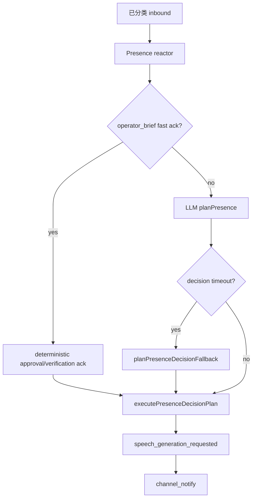

# Presence 决策超时与 operator_brief 稳定确认

> 日期：2026-06-03  
> 项目：js-evolution-agent  
> 类型：问题排查 / 功能实现  
> 来源：Cursor Agent 对话

---

## 目录

1. [背景与动机](#1-背景与动机)
2. [分析过程](#2-分析过程)
3. [方案设计](#3-方案设计)
4. [实现要点](#4-实现要点)
5. [验证与测试](#5-验证与测试)
6. [后续演化](#6-后续演化)
7. [附：本轮对话问题—思考—方案—执行对照](#附本轮对话问题思考方案执行对照)

---

## 1. 背景与动机

飞书侧已能完成「分类 → 写 brief → 请求开轮」，但操作者仍可能**收不到确认回复**。

典型现象（`agentank-tank`）：用户发送「启动一轮进化」后，审计里可见 `operator_brief` 与 cycle 启动，同时出现 `channel_presence_timeout`（phase: `decision`，约 15s），outbox 无 outbound。

用户期望：在 brief/开轮之外，至少有一条**稳定、合规**的确认（「已记录为下一轮意图」），且不能声称 `approval_granted` 或「已发布」。

---

## 2. 分析过程

### 2.1 流水线边界

Channel 对外表达是两段式：

1. **Presence 决策**：产出 `speech_intent`（无最终文案）。
2. **Speech generation + notify**：生成正文并 flush outbox。

问题出在决策阶段，而非 notify 或 classifier。

### 2.2 根因

| 现象 | 原因 |
| --- | --- |
| LLM 决策常被外层掐断 | `decision_timeout_ms` 默认 **15s**，而 `llm.timeout` 默认 **25s**，`runWithTimeout` 包住整段 `buildPresenceContext + planPresence` 时外层更短 |
| 超时后无声失败 | 旧逻辑在 `ChannelTimeoutError` 时 `failPresenceRun` + `markChannelEventsFailed`，**不**执行 deterministic fallback |
| brief 类消息仍走慢 LLM | deterministic 路径本可对 `operator_brief` 生成 `approval_ack` / `verification_ack`，但 LLM planner 默认仍先调模型 |

### 2.3 与分类的关系

「启动一轮进化」在 **deterministic 分类**下常为 `observation`（不匹配审批/核实正则），因此**不会**走 operator_brief fast ack；若 LLM 分类为 `approval_request` 则会。超时修复与 fast ack 解决的是「有 brief 仍不回」；分类口径另议。

---

## 3. 方案设计



### 关键决策

| 决策 | 选择 | 理由 |
| --- | --- | --- |
| 超时范围 | 仅 `planPresence`，context 在超时外构建 | 避免 context 构建失败被误判为决策超时；超时后仍有完整 context 做 fallback |
| 默认决策超时 | `max(30s, llm.timeout×1000)`，显式配置也不得短于 LLM | 消除 15s/25s 结构性矛盾 |
| brief 确认 | `fast_ack_operator_brief`（默认 true） | 审批/核实类新消息直接 deterministic ack，不等待慢 LLM |
| 超时后行为 | `planPresenceDecisionFallback` + 正常 execute/complete/handled | 记 `channel_presence_timeout` 仍保留，但成功 fallback 时补 `channel_presence_fallback_applied` |
| 语义边界 | ack 仅确认「已记录意图」 | 与 AGENTS.md 一致，不输出 `approval_granted` |

---

## 4. 实现要点

### 关键模块

| 文件 | 职责 |
| --- | --- |
| [`src/channel/presence-config.mjs`](../../src/channel/presence-config.mjs) | `decision_timeout_ms` / `timeout_ms` 解析；`fast_ack_operator_brief` |
| [`src/channel/presence-reactor.mjs`](../../src/channel/presence-reactor.mjs) | 先 `buildPresenceContext`，再对 `planPresence` 超时；fallback 后 complete + handled |
| [`src/channel/presence-planner.mjs`](../../src/channel/presence-planner.mjs) | `planPresenceOperatorBriefFastAck`、`planPresenceDecisionFallback` |
| [`src/channel/presence-decision-executor.mjs`](../../src/channel/presence-decision-executor.mjs) | 执行 plan、入队 `speech_generation_requested`（未改边界，沿用既有链路） |

### 配置（`channels.presence`）

- `decision_timeout_ms`：可选；未设则用 `max(30000, llm.timeout*1000)`。
- `fast_ack_operator_brief`：设为 `false` 可强制 brief 走 LLM（测试或实验）。
- `speech_generation_timeout_ms`：与 LLM 超时关系保持不变。

### 审计事件

- `channel_presence_timeout`（phase: `decision`）
- `channel_presence_fallback_applied`（fallback 成功且 `decision_fallback`）
- `channel_presence_completed` 可带 `decision_timed_out`、`fallback_applied`

---

## 5. 验证与测试

```bash
npm test -- test/channel.test.mjs
```

结果：**44 passed**（含 presence 超时与 fast ack 用例）。

主要用例：

- `resolvePresenceConfig`：`decision_timeout_ms >= llm.timeout * 1000`
- LLM planner 对 `operator_brief` fast ack 不调用慢 LLM
- `decision_timeout_ms` 极短 + `fast_ack: false`：fallback 仍入队 speech
- observation 超时：迟到 LLM 结果不产生 speech/outbox 副作用

生产侧需 **重启 channel daemon** 后新逻辑才生效。

可选验收：

```bash
npm run jea -- channel events --subject agentank-tank --limit 30
npm run jea -- channel status --subject agentank-tank --json
```

---

## 6. 后续演化

- 为「启动一轮进化」等口语在 **deterministic classifier** 中是否应映射为 `verification_request` 或 `approval_request` 单独评审（与本次 presence 修复正交）。
- `subjects.json` 可为 `agentank-tank` 显式写 `decision_timeout_ms`（非必须，代码默认已抬高）。
- 观察 `channel_presence_fallback_applied` 占比，评估是否仍需调大 LLM 决策窗口。

---

## 附：本轮对话问题—思考—方案—执行对照

| 阶段 | 内容 |
| --- | --- |
| 问题 | brief/开轮已完成，飞书无确认；presence decision 约 15s 超时 |
| 思考 | 外层超时短于 LLM；超时分支未 fallback；brief 可用 deterministic ack |
| 方案 | 抬高/对齐超时；fast ack；超时后 deterministic fallback 且 complete |
| 执行 | 改 `presence-config` / `presence-reactor` / `presence-planner`；补 channel 单测 |
