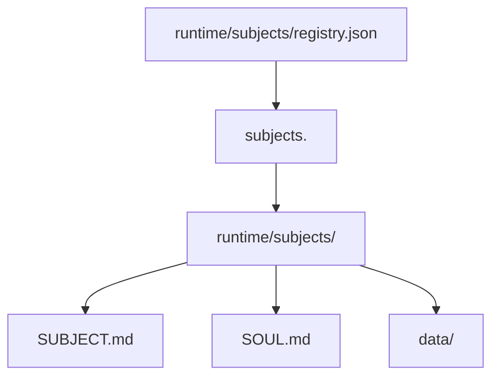

# Runtime Subjects：把 registry 与 workspace 收进 `runtime/subjects/`

> 日期：2026-06-03  
> 项目：js-evolution-agent  
> 类型：架构设计 / 升级迁移 / 功能实现  
> 来源：Cursor Agent 对话

---

## 目录

1. [背景与动机](#1-背景与动机)
2. [分析过程](#2-分析过程)
3. [方案设计](#3-方案设计)
4. [实现要点](#4-实现要点)
5. [验证与测试](#5-验证与测试)
6. [后续演化](#6-后续演化)
7. [附：本轮对话问题—思考—方案—执行对照](#附本轮对话问题思考方案执行对照)

---

## 1. 背景与动机

真正的问题不是「`policies/` 里能不能放 subject 配置」。

真正的问题是：**同一主体的机器配置、治理文档、channel persona 和运行数据被拆在两条根路径上**——`policies/subjects.json` + `policies/subjects/<id>/`，与 `runtime/subjects/<data_namespace>/data/` 并列存在。操作者备份、迁移整机环境或理解「这个 bot 的一切」时，总要记两个目录；`jea data backup` 也只拷 `data/`，容易漏掉 `SUBJECT.md` / `SOUL.md` 和 registry。

此前同一天已完成 [subject workspace 拆分](subject-workspace-policy.md)（`SUBJECT.md` + `SOUL.md`），但路径仍在 `policies/`。本轮要把 **本地 subject 实例配置** 与 **namespace 运行态** 对齐到同一棵树。

| 痛点 | 表现 |
| --- | --- |
| 路径分裂 | registry 在 `policies/subjects.json`，workspace 在 `policies/subjects/<id>/`，数据在 `runtime/subjects/<namespace>/data/` |
| 备份不对称 | `data backup` 不包含治理文与 registry |
| 与 git 策略重复 | 主体相关文件本就被 ignore，放在 `policies/` 没有「可提交权威」的语义收益 |
| 热加载观测误导 | daemon / viewer 盯旧 `policies/subjects.json`，迁移后 `evolution_mode_source` 仍显示 `subjects.json` |

`policies/authority/`（CONSTITUTION、GUIDE）和 `policies/subjects.example.json`（schema 示例）**不迁移**，仍代表宿主项目级权威与可复制模板。

---

## 2. 分析过程

### 2.1 现有解析链

枢纽仍在 [`src/cli/utils/subjects.mjs`](../../src/cli/utils/subjects.mjs)：

- `readSubjectsRegistry()` / `writeSubjectsRegistry()` 指向 `policies/subjects.json`
- `subjectWorkspaceDir()` 指向 `policies/subjects/<id>/`
- `resolveSubjectPolicyPath()` 优先 registry 中的 `policy` 相对路径，再 workspace、再扁平 `*.md`
- `oada.config.mjs`、daemon evolution mode、channel classifier/presence 均经 `resolveSubjectConfig()` 间接读 registry

多主体并行、daemon 热加载、viewer SSE `runtime_updated` 已在 [subject-registry-migration](journal/2026-05-27/subject-registry-migration.md) 与 [policy 结构化](journal/2026-05-27/policy-structured-runtime-fields.md) 中落地；本轮是 **路径收拢**，不改变「registry 承载 lane/resources/channels，Markdown 只承载语义边界」的分工。

### 2.2 方案形态对比

| 方案 | 优点 | 缺点 |
| --- | --- | --- |
| **A. 集中式 `runtime/subjects/registry.json`** | 与现有全局 `subjects.json` 最接近；`--all`、viewer、default_subject 改动小 | registry 与 namespace 目录略分离 |
| **B. 每 namespace 一份 `manifest.json` + 轻量索引** | 单主体打包/迁移最自然 | 扫描目录、合并索引逻辑更重 |
| **C. 仅迁 workspace，registry 留 `policies/`** | 改动最小 | 仍双根路径，备份与心智模型未统一 |

操作者确认采用 **A + workspace 放在 namespace 根目录**（`SUBJECT.md` / `SOUL.md` 与 `data/` 并列，不用 `policy/` 子目录）。

### 2.3 被否定的做法

| 做法 | 结论 |
| --- | --- |
| 无 fallback 硬切 | 本机与测试 fixture 仍有 `policies/subjects*` |
| 迁移时自动删除旧文件 | 破坏性高；改为显式命令 + 人工清理 |
| `data reset` 默认删 SUBJECT/SOUL/registry | 与「只清运行数据」预期冲突 |
| 把 lane/resources 塞回 Markdown | 违背结构化迁移原则 |

---

## 3. 方案设计

### 3.1 目标目录

```text
runtime/subjects/
  registry.json
  <data_namespace>/
    SUBJECT.md
    SOUL.md
    data/
      evolution/
      intelligence/
      channel/
      goals/
```



### 关键决策

| 决策 | 选择 | 理由 |
| --- | --- | --- |
| Registry 位置 | `runtime/subjects/registry.json` | 集中式索引，热加载与 `--all` 简单 |
| Workspace 位置 | namespace 根下 `SUBJECT.md` / `SOUL.md` | 路径短；`data reset` 只删 `data/` 时不误伤治理文 |
| 写入策略 | **只写**新 registry；旧路径只读 | 避免双写漂移 |
| 读取优先级 | 新 registry → 旧 `policies/subjects.json` → `active-subject.json` → default | 兼容期平滑 |
| Policy 解析 | 显式 `policy` 先相对 namespace 解析；旧 `subjects/...` 仍走 `policies/` | 迁移前后 entry 均可读 |
| 迁移命令 | `jea subject migrate-runtime-layout`（复制，不删旧文件） | 可审计、可重复 |
| 生命周期 | `data backup` 备份整个 `runtimeRoot`；`data reset` 仍只清 `data/*` | 备份含配置；reset 保守 |

### 3.2 兼容与清理

- 新写入：`writeSubjectsRegistry()`、`registerSubject()`、`createSubject()`、`setSubjectEvolutionMode()` 等统一写 `runtime/subjects/registry.json`。
- 旧 `policies/subjects.json` 与 `policies/subjects/<id>/` 在兼容期内只读 fallback。
- 本机迁移后执行清理：删除 `policies/subjects.json` 与各 subject 下 legacy `SUBJECT.md` / `SOUL.md`（保留 `subjects.example.json`）。

---

## 4. 实现要点

### 4.1 路径与 resolver

[`src/cli/utils/subjects.mjs`](../../src/cli/utils/subjects.mjs) 核心变更：

| 函数 / 行为 | 职责 |
| --- | --- |
| `subjectsRuntimeDir()` | `runtime/subjects` |
| `subjectsRegistryFile()` | `runtime/subjects/registry.json`（写入口） |
| `legacySubjectsRegistryFile()` | `policies/subjects.json`（只读） |
| `subjectWorkspaceDir(configOrName)` | 按 `data_namespace` 解析 namespace 根 |
| `legacySubjectWorkspaceDir()` 等 | 旧 workspace fallback |
| `readSubjectsRegistry()` | 新 → 旧 registry → active-subject → default；`source` 区分 `runtime-registry.json` / `subjects.json` |
| `resolveSubjectPolicyPath()` / `resolveSubjectSoulPath()` | runtime 优先，再 legacy workspace / 扁平 `.md` |
| `migrateSubjectsToRuntime()` | 从旧 registry 复制 workspace 并写入新 registry，`policy` 规范为 `SUBJECT.md` |

[`src/cli/utils/evolution-mode.mjs`](../../src/cli/utils/evolution-mode.mjs)：`resolveEvolutionMode` 的 `source` 使用 `config.registrySource`，写入后返回 `runtime-registry.json`（修复 daemon 仍显示 `subjects.json` 的观测问题）。

### 4.2 CLI 与数据生命周期

| 模块 | 变更 |
| --- | --- |
| [`src/cli/commands/subject.mjs`](../../src/cli/commands/subject.mjs) | 子命令 `migrate-runtime-layout`；提示文案指向新 registry |
| [`src/cli/commands/data.mjs`](../../src/cli/commands/data.mjs) | `backup` 源改为 `runtime.runtimeRoot`；init 输出显示新 registry 路径 |
| [`src/cli/jea.mjs`](../../src/cli/jea.mjs) | help 更新 |
| [`src/intelligence/evolution-viewer/viewer-api.mjs`](../../src/intelligence/evolution-viewer/viewer-api.mjs) | watcher 增加 `runtime/subjects/registry.json`，保留旧路径辅助 |
| [`tools/evolution-viewer/public/app.js`](../../tools/evolution-viewer/public/app.js) | `EVOLUTION_MODE_SOURCE_LABELS` 增加 `runtime-registry.json` |

文档与示例：[`README.md`](../../README.md)、[`AGENTS.md`](../../AGENTS.md)、[`policies/README.md`](../../policies/README.md)、[`policies/subjects.example.json`](../../policies/subjects.example.json)（`policy` 示例改为 `SUBJECT.md`）。

### 4.3 本机迁移与清理（对话内执行）

```powershell
npm run jea -- subject migrate-runtime-layout --json
```

结果摘要：

- `agentank-tank`、`feishu-flow-test`：`SUBJECT.md` / `SOUL.md` 复制到 runtime namespace。
- `js-evolution-agent`：runtime 目标已存在，跳过覆盖。
- 写入 `runtime/subjects/registry.json`。

清理删除：

- `policies/subjects.json`
- `policies/subjects/*/SUBJECT.md` 与 `SOUL.md`（三个已注册 subject）

---

## 5. 验证与测试

### 5.1 自动化测试

```powershell
npm test -- --run
```

结果：**36** 个测试文件、**612** 个测试全部通过。新增/调整包括：

- [`test/cli.test.mjs`](../../test/cli.test.mjs)：`migrateSubjectsToRuntime`、新 registry 路径断言
- [`test/evolution-mode.test.mjs`](../../test/evolution-mode.test.mjs)：`runtime-registry.json` source

### 5.2 本机冒烟（迁移 + 清理后）

```powershell
npm run jea -- subject show --json
npm run jea -- subject check --subject agentank-tank --json
npm run jea -- data status --subject agentank-tank --json
npm run jea -- daemon status --json
```

| 检查项 | 结果 |
| --- | --- |
| 默认 subject policy / soul | `runtime/subjects/agentank-tank/SUBJECT.md`、`SOUL.md` |
| `registrySource` | `runtime-registry.json` |
| `subject check` | `ok: true`，`diagnostics: []`（清理后无 legacy coexist warning） |
| daemon | running / fresh / health ok；`evolution_mode_source: runtime-registry.json` |

### 5.3 未在本 journal 覆盖的项

- 多 subject 并行 daemon 在生产环境的长期 soak。
- 从**仅 legacy、无 runtime registry** 的冷启动机器首次 `subject init` 路径（依赖 `ensureSubjectsRegistry` 从旧文件引导）。

---

## 6. 后续演化

| 项 | 建议 |
| --- | --- |
| 兼容代码收缩 | 数个版本后评估移除 `policies/subjects.json` 只读链路与 legacy workspace helper |
| `subject check` / `doctor` | 若检测到旧 `policies/subjects*` 仍存在，提示运行 `migrate-runtime-layout` 或确认可删 |
| `data purge-config` | 可选显式删除 namespace 下 SUBJECT/SOUL 与 registry entry，与保守 `data reset` 区分 |
| 空目录清理 | `policies/subjects/<id>/` 空目录可手工删除 |
| 文档中的历史 journal | `journal/2026-05-27/*` 等仍写旧路径，作历史记录保留即可 |

---

## 附：本轮对话问题—思考—方案—执行对照

| 阶段 | 内容 |
| --- | --- |
| **问题** | 希望把 `policies/subjects` workspace 与 `policies/subjects.json` 合并到 `runtime/subjects/`，减少双路径与备份遗漏 |
| **思考** | 本地主体配置应与 `data_namespace` 同树；`policies/` 只保留 authority 与 example；需双读 + 显式迁移，不能硬切 |
| **方案** | 集中式 `runtime/subjects/registry.json`；`SUBJECT.md`/`SOUL.md` 在 namespace 根；只写新路径；`migrate-runtime-layout` 复制迁移 |
| **执行** | 改 `subjects.mjs`、data/subject CLI、viewer watcher、evolution-mode source、文档与测试；本机 migrate + 删 legacy；全量测试通过，daemon 热加载观测正常 |
