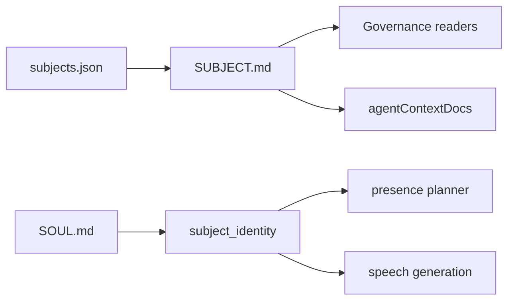

# Subject Workspace：治理与人格拆成 SUBJECT.md + SOUL.md

> 日期：2026-06-03  
> 项目：js-evolution-agent  
> 类型：架构设计 / 升级迁移 / 问题排查  
> 来源：Cursor Agent 对话

---

## 目录

1. [背景与动机](#1-背景与动机)
2. [分析过程](#2-分析过程)
3. [方案设计](#3-方案设计)
4. [实现要点](#4-实现要点)
5. [验证与测试](#5-验证与测试)
6. [后续演化](#6-后续演化)
7. [附：本轮对话问题—思考—方案—执行对照](#附本轮对话问题思考方案执行对照)

---

## 1. 背景与动机

`policies/subjects/` 长期采用**单文件**模型：`subjects/<id>.md` 同时承载治理边界（Subject、Off-Limits、Runtime Boundary）与少量 **Persona**（如 `agentank-tank` 的「铁坦」语气）。这带来两类问题：

| 问题 | 表现 |
| --- | --- |
| 语义混杂 | 演化管线把整份 policy 当作权威文献注入 `agentContextDocs`；Persona 若写在同一文件，会参与 Decide / goals assess，容易让「口吻」影响治理判断 |
| 扩展困难 | Channel 两阶段表达（presence 决策 → speech 生成）只需 persona，却要从治理全文里抽 `## Persona` 章节 |

操作者希望升级为 **subject workspace 目录**（目录名仍为主体 id），内含：

- `SUBJECT.md`：治理与审批边界  
- `SOUL.md`：对外人设与表达风格（参考 OpenClaw `SOUL.dev.md` 结构）

同时要求迁移期不破坏现有测试 fixture 与未迁移主体的扁平 `.md` 路径。

---

## 2. 分析过程

### 2.1 代码阅读结论

枢纽在 [`src/cli/utils/subjects.mjs`](../../src/cli/utils/subjects.mjs)：

- `readSubjectPolicy()` 返回单一 `text` blob  
- `subjectFile()`、`listSubjectPolicyFiles()` 只认顶层 `*.md`  
- `oada.config.mjs` 的 `buildAgentContextDocs()` 将整份 policy 作为 `js-evolution-agent:subject:<id>` 注入  

Channel 侧仅 [`src/channel/subject-identity.mjs`](../../src/channel/subject-identity.mjs) 读取 `## Subject` + `## Persona`，与演化权威文献路径分离需求一致。

### 2.2 与 OpenClaw 模板的差异

参考 `openclaw/docs/reference/templates/SOUL.dev.md`：SOUL 采用第一人称、Purpose、Operate、Quirks、What I will not do。JEA 模板沿用结构，但**不**引入 OpenClaw 专属角色语义；并明确 SOUL **不得**声明发布授权或凭据放行。

### 2.3 被否定的方案

| 方案 | 结论 |
| --- | --- |
| 硬切：只认目录、删除 `.md` 兼容 | 大量测试与手工 subject 会立即失败 |
| SOUL 一并注入 `agentContextDocs` | Persona 会升格为治理约束，违背拆分目的 |
| 保留 Persona 章节在 SUBJECT.md | 与 SOUL 双源并存，长期更易漂移 |

选定：**registry 默认 `subjects/<id>/SUBJECT.md` + 读取层多级 fallback + SOUL 独立 API**。

---

## 3. 方案设计

### 3.1 目标结构

```text
policies/subjects/<subject-id>/
  SUBJECT.md    # 治理；agentContextDocs、subject check、lane 解析
  SOUL.md       # persona；channel presence / speech 仅消费
```



### 3.2 读取优先级（SUBJECT）

1. `subjects.json` 中显式 `policy` 路径（若存在）  
2. `policies/subjects/<id>/SUBJECT.md`  
3. 遗留 `policies/subjects/<id>.md`  
4. `policies/project-guidance.md`（兜底）

### 3.3 SOUL 读取顺序

1. `SOUL.md` 全文  
2. 遗留 policy 内 `## Persona`  
3. 空（channel 可降级模板话术）

### 关键决策

| 决策 | 选择 | 理由 |
| --- | --- | --- |
| 权威文献范围 | 仅 SUBJECT.md | 避免 persona 影响 Decide / report / goals |
| Persona 来源 | SOUL.md 优先 | 与治理文件物理隔离，便于运营迭代人设 |
| 列举 subject | 扫描 workspace 目录 + 顶层 `.md` | `--all` / `listRegisteredSubjects` 不漏新布局 |
| 迁移存量 | 三主体拆目录并删旧 `.md` | 仓库内 policy 与 `subjects.json` 路径一致 |
| 兼容 API | `createChannelWorkerState` 无 coordinator 时保留自定义 `worker_id` | 多 role 改造后误写 coordinator id，导致单测失败（见下文） |

---

## 4. 实现要点

### 4.1 路径与读取

| 文件 | 职责 |
| --- | --- |
| [`src/cli/utils/subjects.mjs`](../../src/cli/utils/subjects.mjs) | `subjectWorkspaceDir`、`subjectGovernanceFile`、`subjectSoulFile`、`subjectPolicyExists`、`readSubjectSoul`、`diagnoseSubjectWorkspace`；`createSubject` 写双文件 |
| [`src/cli/utils/markdown-sections.mjs`](../../src/cli/utils/markdown-sections.mjs) | 共享 `extractMarkdownSection`（避免 subjects ↔ subject CLI 循环依赖） |
| [`src/channel/subject-identity.mjs`](../../src/channel/subject-identity.mjs) | `subject_description` 来自 SUBJECT；`persona`/`soul` 来自 SOUL 或 legacy Persona |
| [`oada.config.mjs`](../../oada.config.mjs) | `buildAgentContextDocs` 仍只读 `readSubjectPolicy()`（注释标明不含 SOUL） |
| [`src/cli/commands/subject.mjs`](../../src/cli/commands/subject.mjs) | `show`/`check` 输出 soul 路径与 workspace 诊断 |
| [`src/cli/utils/i18n.mjs`](../../src/cli/utils/i18n.mjs) | `soulTemplate` / `defaultSoulTemplate` |
| [`src/cli/utils/evolve-runs.mjs`](../../src/cli/utils/evolve-runs.mjs)、[`subject-selection.mjs`](../../src/cli/utils/subject-selection.mjs) | 存在性检查改用 `subjectPolicyExists` |

### 4.2 已迁移 policy

| Subject | 说明 |
| --- | --- |
| `agentank-tank` | Persona「铁坦」迁入 `SOUL.md` |
| `js-evolution-agent` | 新增默认 SOUL 占位 |
| `feishu-flow-test` | 新增测试用 SOUL 占位 |

`policies/subjects.json` 与 `subjects.example.json` 的 `policy` 字段已改为 `subjects/<id>/SUBJECT.md`。

### 4.3 附带修复：channel worker_id

全量测试曾 593/594 失败：`createChannelRoleWorkerState` 在无 `coordinator` 时仍将顶层 `worker_id` 设为 `channel-coordinator-${pid}`，与 [`test/channel-worker-state.test.mjs`](../../test/channel-worker-state.test.mjs) 中 `createChannelWorkerState({ workerId: 'channel-worker-test' })` 预期不符。

修复：仅当 `state.coordinator` 存在时写 coordinator id；否则顶层 `worker_id` 使用传入的 `workerId`（[`src/channel/worker-state.mjs`](../../src/channel/worker-state.mjs)）。

---

## 5. 验证与测试

```powershell
npm test -- test/cli.test.mjs test/channel.test.mjs
npm test
npm run jea -- subject check --subject agentank-tank --json
npm run jea -- policy check --subject agentank-tank --json
npm run jea -- subject show --subject agentank-tank --json
```

| 项 | 结果 |
| --- | --- |
| `cli.test.mjs` + `channel.test.mjs` | 184 passed |
| 全量 `npm test` | **594 / 594** passed（修复 worker_id 后） |
| `jea subject check --subject agentank-tank --json` | `ok: true`，`soul_source: soul_file`，`file` 指向 `SUBJECT.md` |

新增 CLI 测试覆盖：workspace 创建、SOUL 读取、legacy `## Persona` fallback、`listSubjects` 同时识别目录与扁平 `.md`。

---

## 6. 后续演化

| 项 | 建议 |
| --- | --- |
| SOUL 必填 | 当前缺失 SOUL 且无 legacy Persona 时为 **warning**；稳定后可改为 `subject check` error |
| 旧扁平 `.md` | 测试 fixture 仍可用；生产 subject 建议全部迁 workspace，避免与 SUBJECT 并存 warning |
| `jea subject migrate` | 可选 CLI：从单文件自动拆 SUBJECT/SOUL 并更新 registry |
| Channel LLM prompt | 可在 `speech-generation` payload 中显式区分 `soul` 与 `subject_description`（identity 已带字段） |
| 文档 | `AGENTS.md`、`policies/README.md` 已同步；新 subject 用 `jea subject init <name>` 即可生成双文件 |

---

## 附：本轮对话问题—思考—方案—执行对照

| 阶段 | 内容 |
| --- | --- |
| 问题 | 将 `policies/subjects/<id>.md` 升级为 workspace（`SUBJECT.md` + `SOUL.md`），人格参考 OpenClaw SOUL 格式，且不影响演化治理权威链 |
| 思考 | 单文件被 `agentContextDocs` 整包注入；Persona 仅 channel 需要；必须在 `subjects.mjs` 集中解析并保留 legacy fallback |
| 方案 | SUBJECT 进权威文献；SOUL 仅 `subject_identity`；registry 默认新路径；列举与存在性检查支持目录布局 |
| 执行 | 实现读取/模板/CLI/迁移三主体；测试与文档更新；修复无 coordinator 时 `worker_id` 被误写导致 1 例失败 |
