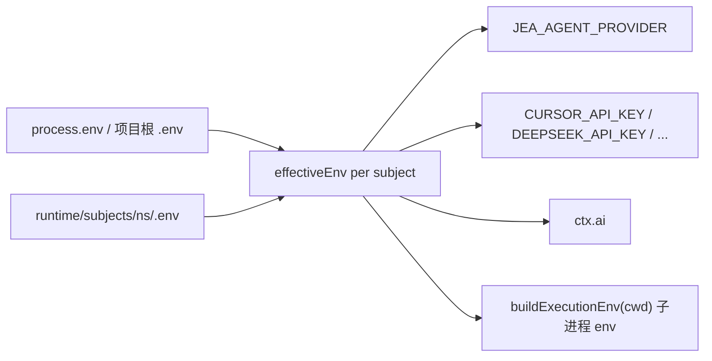

# Channel Agent Run 跑不起来：缺 `ctx.ai` 与按 Subject 运行时 `.env` 覆盖

> 日期：2026-06-04  
> 项目：js-evolution-agent  
> 类型：问题排查 / 功能实现  
> 来源：Cursor Agent 对话

---

## 目录

1. [背景与动机](#1-背景与动机)
2. [分析过程](#2-分析过程)
3. [方案设计](#3-方案设计)
4. [实现要点](#4-实现要点)
5. [逻辑审查与补修](#5-逻辑审查与补修)
6. [验证与测试](#6-验证与测试)
7. [后续演化](#7-后续演化)
8. [附：本轮对话问题—思考—方案—执行对照](#附本轮对话问题思考方案执行对照)

---

## 1. 背景与动机

[`channel_agent_run`](channel-presence-async-agent.md) 上线后，操作者在飞书里收到类似话术：

> 你之前请求的关于我历史进化情况的调研任务已在后台启动，但在执行时被 agent provider (`cursor_sdk`) 限制，未能完成。系统已记录此事件（`human_review:evt-…`），需要人工审核。

这句话**误导性很强**：

- 任务确实在后台入队并「启动」了 ack；
- 但 agent **从未真正执行**；
- `human_review:evt-*` 在代码里**不存在**，是 speech LLM 根据贫乏上下文编造的。

用户先要求只做分析、不改代码；确认根因后，再按计划实现修复，并补做逻辑审查中的两处遗留问题。

---

## 2. 分析过程

### 2.1 调用链

```text
presence start_agent_async
  -> enqueue channel_agent_run
  -> runChannelAgentRunTask (agent-runner.mjs)
  -> actionHandlers.agent_execute
  -> runAgenticAction (agent-adapter.mjs)
  -> cursor_sdk / claude / reasonix / llm_only
```

`channel_agent_run` 与 cycle Phase 2 共用 `agent_execute`，但 channel 侧自己构造 `ctx`。

### 2.2 根因：`buildContext` 没有 `ctx.ai`

[`src/channel/agent-runner.mjs`](../../src/channel/agent-runner.mjs) 原先只注入 `host` 与 `_agentRunLogMeta`，**没有 `ai` 也没有 `env`**。

而所有 provider 都依赖 `ctx.ai`：

| Provider | 依赖 `ctx.ai` 的位置 |
| --- | --- |
| `cursor_sdk` / `claude_code_sdk` / `reasonix_cli` | `translateAgentTaskPrompt()` 第一步检查，缺失即 `{ ok: false }` |
| `llm_only` | `runLlmOnly()` 开头 `if (!ai) return deferred` |

全局 `.env` 为 `JEA_AGENT_PROVIDER=cursor_sdk` 时，channel run 在**翻译步**就 `deferred`，从未进入 Cursor SDK。有 `CURSOR_API_KEY` 也救不了，因为卡在翻译之前。

这不是「Cursor 平台限制」，而是 **channel 执行上下文接线缺口**。

### 2.3 误导话术从何而来

`channel_agent_run_completed` 只写了 `status: error` 和 `summary`（错误文本），没有 `deferred` 字段。  
`expression-candidates` → `speech_intent` → LLM speech 在信息不足时自行编造「人工审核 / human_review 事件 id」。

### 2.4 环境与多 Subject 约束

用户确认：

- **默认继承项目根 `.env` 可以**；
- **还要支持** `runtime/subjects/<namespace>/.env`，且优先级更高；
- **`daemon --all` 单进程多 subject** 时，不能把 subject A 的 env 写进全局 `process.env`。

[`src/actions/execution-env.mjs`](../../src/actions/execution-env.mjs) 已有 `readExecutionEnvFile` / `buildExecutionEnv`，但 `streamWithExecutionEnv` 会通过 `applyProcessEnv` 临时污染 `process.env`——对 Claude SDK 并发不安全。

---

## 3. 方案设计



### 关键决策

| 决策 | 选择 | 理由 |
| --- | --- | --- |
| env 作用域 | 按 subject 解析，不写 `process.env` | `daemon --all` 多 subject 安全 |
| 优先级 | 全局 env < `runtimeRoot/.env` < `executionCwd/.env`（子进程） | 与计划一致；后者仍由 `buildExecutionEnv` 叠加 |
| `ctx.ai` 来源 | `createAiFromEnv(effectiveEnv)` | 与 classifier / speech 一样用 DeepSeek；`JEA_FORCE_MOCK` 走 Mock |
| provider 解析 | `envValue(ctx, key)` | `agent-adapter` 统一优先 `ctx.env`，无则回退 `process.env`（cycle 路径不变） |
| Claude 执行 | 去掉 `streamWithExecutionEnv` | 环境经 `buildClaudeOptions().options.env` 传入，避免全局污染 |
| deferred 表达 | 事件透传 + deterministic 兜底 + LLM 约束 | 避免再编造 `human_review:evt-*` |

被否定的方案：

| 方案 | 为什么不选 |
| --- | --- |
| `loadProjectEnv` 后写 `process.env` | 多 subject 互相覆盖 |
| 仅修 channel 默认 `llm_only` | 不解决 runtime `.env` 覆盖与 cursor 路径凭据读取 |
| 只改 speech prompt | 不解决 agent 从未执行 |

---

## 4. 实现要点

### 4.1 按 Subject 有效 env

[`src/actions/execution-env.mjs`](../../src/actions/execution-env.mjs) 新增：

```javascript
export function resolveEffectiveEnv(envDir, { baseEnv = process.env } = {})
```

读取 `envDir/.env`（即 `runtime/subjects/<namespace>/.env`），合并到 `baseEnv` 副本，**不**调用 `applyProcessEnv`。

### 4.2 Channel agent runner

[`src/channel/agent-runner.mjs`](../../src/channel/agent-runner.mjs)：

| 项 | 行为 |
| --- | --- |
| `resolveEffectiveEnv(runtime.runtimeRoot)` | 得到 `effectiveEnv` |
| `buildContext` | `env: effectiveEnv`，`ai: createAiFromEnv(effectiveEnv)` |
| `buildAction` | `provider: request.provider ?? env.JEA_AGENT_PROVIDER ?? 'llm_only'` |
| `channel_agent_run_started` | 记录 `provider`、`runtime_env.path/exists` |
| `channel_agent_run_completed` | 透传 `deferred`、`error`、`reason: provider_deferred` |

`createAiFromEnv`：`JEA_FORCE_MOCK` → `MockAIClient`；否则有 `DEEPSEEK_API_KEY` → `DeepSeekOpenAIClient`（显式传 key/baseURL/model）。

### 4.3 Agent adapter 读 `ctx.env`

[`src/actions/agent-adapter.mjs`](../../src/actions/agent-adapter.mjs)：

- `envValue(ctx, key)` → `ctx?.env?.[key] ?? process.env[key]`；
- `resolveProvider(action, ctx)`、`CURSOR_API_KEY`、`ANTHROPIC_*`、`JEA_REASONIX_*` 等改走 `envValue`；
- `buildClaudeOptions` / `buildCursorOptions` / `buildReasonixOptions` 的 `buildExecutionEnv(..., { baseEnv: ctx?.env ?? process.env })`；
- Claude SDK：`for await (const message of query(...))`，**不再**包 `streamWithExecutionEnv`。

未传 `ctx.env` 的 cycle exec 等调用方行为不变。

### 4.4 Deferred 与话术硬化

| 文件 | 改动 |
| --- | --- |
| [`expression-candidates.mjs`](../../src/channel/expression-candidates.mjs) | `agent_result.deferred`、`reason: provider_deferred` |
| [`speech-generation.mjs`](../../src/channel/speech-generation.mjs) | deferred 确定性文案；禁止编造 `human_review:evt-*`；LLM system 约束 |

---

## 5. 逻辑审查与补修

实现后复查发现两处遗漏，已一并修复：

| 问题 | 修正 |
| --- | --- |
| Claude 路径仍用 `streamWithExecutionEnv` | 改为直接 `query({ prompt, options })`，env 已在 `options.env` |
| `channel_agent_run_started.provider` 可能为 `null` | `DEFAULT_AGENT_PROVIDER = 'llm_only'`，与 adapter 默认一致 |

审查确认成立：

- `cursor_sdk` 在注入 `ctx.ai` 后可通过翻译步（不再必然 deferred）；
- runtime `.env` 可覆盖全局 `JEA_AGENT_PROVIDER`（测试用 `llm_only` + `JEA_FORCE_MOCK=1`）；
- `speech-generation` / `classifier` 仍读全局 `process.env.DEEPSEEK_API_KEY`——**未改**，仅 channel agent run 路径按 subject env 建 ai（与计划范围一致）。

---

## 6. 验证与测试

| 命令 | 结果 |
| --- | --- |
| `npm test -- test/channel.test.mjs` | 87 passed |
| `npm test` | 36 files，629 tests passed |
| `ReadLints`（改动文件） | 无诊断错误 |

新增/加强测试：

- `runChannelAgentRunTask uses subject runtime .env over global agent env`：全局 `cursor_sdk`，runtime `.env` 为 `llm_only` + mock，断言 started/completed 的 `provider`；
- `runChannelTask` 路由用例断言 `channel_agent_run_started.provider === 'llm_only'`。

未做真实 `cursor_sdk` 端到端联调（依赖本机 Cursor SDK 与 API）。

---

## 7. 后续演化

| 方向 | 说明 |
| --- | --- |
| 真实 cursor_sdk 验收 | 在 `runtime/subjects/<ns>/.env` 配置 `CURSOR_API_KEY`，发飞书调研类消息，确认翻译 + SDK 执行 + 二次通知 |
| speech/classifier 按 subject env | 若需多 subject 不同 DeepSeek key，可让 `createLlmClient` 也读 `resolveEffectiveEnv` |
| `withExecutionEnv` 退役或加锁 | 若 cycle 路径仍用，需评估并发；channel/claude agent 路径已避开 |
| agent run 观测 | `jea channel status --json` 的 `tasks.agent_runs` 可展示 `deferred` / `runtime_env` |
| 文档 | [`AGENTS.md`](../../AGENTS.md) 可补充 `runtime/subjects/<ns>/.env` 覆盖说明 |

关联日记：[Channel Presence 异步 Agent](channel-presence-async-agent.md)。

---

## 附：本轮对话问题—思考—方案—执行对照

| 阶段 | 内容 |
| --- | --- |
| 问题 | 飞书提示「cursor_sdk 限制 / 需人工审核」；调研类 channel agent 实际未跑起来 |
| 思考 | 缺 `ctx.ai` → 全 provider 翻译步 deferred；话术 LLM 编造 human_review；需 per-subject env 且不污染 `process.env` |
| 方案 | `resolveEffectiveEnv` + `ctx.env`/`ctx.ai` + `envValue` + deferred 事件/话术硬化 + 去掉 Claude 全局 env 包裹 |
| 执行 | 5 个源文件 + channel 测试；审查补修 Claude/stream 与 started provider；629 tests 通过 |
