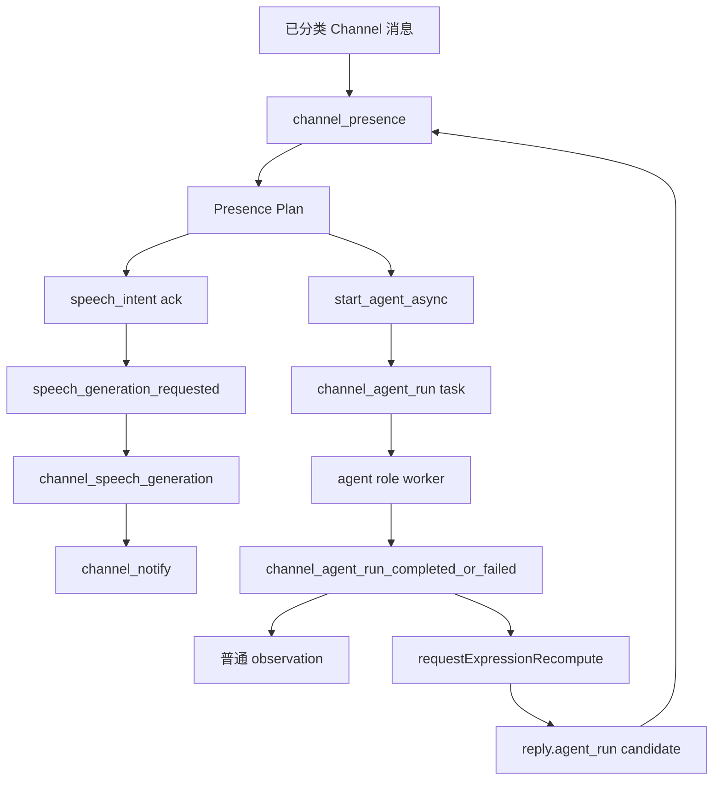

# Channel Presence 异步 Agent：让一句话触发调查，但不拖住对话回路

> 日期：2026-06-04  
> 项目：js-evolution-agent  
> 类型：架构设计 / 功能实现  
> 来源：Cursor Agent 对话

---

## 目录

1. [背景与动机](#1-背景与动机)
2. [分析过程](#2-分析过程)
3. [方案设计](#3-方案设计)
4. [实现要点](#4-实现要点)
5. [逻辑审查与修正](#5-逻辑审查与修正)
6. [验证与测试](#6-验证与测试)
7. [后续演化](#7-后续演化)
8. [附：本轮对话问题—思考—方案—执行对照](#附本轮对话问题思考方案执行对照)

---

## 1. 背景与动机

Channel loop 已经能做到一件事：用户在飞书里说话，系统分类、入库、presence 决策，然后 speech 生成回复。

但操作者提出了一个更进一步的问题：**presence 能不能在判断需要进一步处理时，异步启动一个 agent？**

这不是简单地「多回一句话」。

真正的问题是：如果用户一句话需要调查、分析或整理，presence 不能同步等 agent 跑完。agent 可能很慢，甚至需要工具调用、日志、失败重试。把它直接塞进 presence reactor，会把 channel loop 变成长任务执行器，进而影响 speech、notify、classifier 等并行角色。

用户还补充了一个关键体验要求：**只要 agent 被启动，也应该立刻 speak，告诉用户已经激活了 agent。**

因此本轮目标不是新造一套 agent 系统，而是在 channel domain 内补上一个受控的异步后效：

```text
presence 决策
  -> 排队一个 channel_agent_run
  -> 同时排队一个 speech_intent ack
  -> agent 完成后再唤醒 presence 做二次通知
```

---

## 2. 分析过程

### 2.1 现有 channel 已经有异步骨架

这次没有从零开始。

代码阅读确认，channel loop 已经有两层异步追踪：

| 层 | 已有机制 | 作用 |
| --- | --- | --- |
| task queue | [`src/channel/task-queue.mjs`](../../src/channel/task-queue.mjs) | 复用 daemon task queue，维护 `pending / running / completed / failed` 等状态 |
| event queue | [`src/channel/event-queue.mjs`](../../src/channel/event-queue.mjs) | 追踪 `expression_recompute_requested`、`speech_generation_requested` 等细粒度事件 |
| role worker | [`src/channel/channel-roles.mjs`](../../src/channel/channel-roles.mjs) | notify / control / **agent** / presence / speech / classifier 按任务类型隔离领取 |

Presence 本身已经遵循这个模式：

```text
channel_presence
  -> executePresenceDecisionPlan
  -> speech_generation_requested
  -> channel_speech_generation
  -> channel_notify
```

也就是说，正确做法不是让 presence `await agent`，而是把「启动 agent」也变成一个可入队、可审计、可重试的 channel task。

### 2.2 为什么不走 cycle loop

用户特别关心：这会不会影响 cycle loop？

结论是：不应该影响。

Cycle loop 的语义是完整进化周期：

```text
intel -> exec(agent_run) -> verify -> belief_update -> goals -> diary
```

Channel presence 的语义是外部对话回路。用户的一句话触发一个即时调查，不等同于进入下一轮 OADA decide，也不应该写 `pending_decisions.json`。

被否定的路径：

| 方案 | 为什么不选 |
| --- | --- |
| presence 直接调用 agent 并等待结果 | 会阻塞 channel reactor，破坏 bounded presence loop |
| 写 cycle `pending_decisions.json` | 绕过 decide，污染 cycle loop 的治理边界 |
| 自动 enqueue `run_cycle` | 用户想要的是即时异步 agent，不是完整进化轮次 |
| 用 `write_operator_brief` 表达所有需求 | brief 适合下一轮意图，不适合「现在启动一个异步调查」 |

最终选择：**新增 `channel_agent_run`，留在 channel domain 内执行；结果最多写 channel audit / 普通 observation，让后续 cycle 自然读取。**

### 2.3 与 control action 的相似与差异

本轮方案借鉴了 [`channel_control_action`](../../journal/2026-06-03/channel-control-request.md) 的边界：LLM 或 presence 可以识别意图，但真正执行必须进入独立 task。

差异在于：

| 项 | `channel_control_action` | `channel_agent_run` |
| --- | --- | --- |
| 目的 | 执行白名单本地控制动作 | 启动只读/提案型 agent 调查 |
| 来源 | classifier 识别 `control_request` | presence plan 输出 `start_agent_async` |
| 回复时机 | executor 完成后回复结果 | 启动时立即 ack，完成后再二次通知 |
| 权限 | 写类 action 需 binding / allowlist | 默认只读；禁止 `approval_granted` 与远端写 |

---

## 3. 方案设计



### 关键决策

| 决策 | 选择 | 理由 |
| --- | --- | --- |
| 所属 domain | channel domain | 保持与 cycle task queue 分离，不改 cycle step 状态机 |
| task 类型 | `channel_agent_run` | 与 `channel_presence`、`channel_speech_generation` 一样进入 channel queue |
| worker role | 新增 `agent` role | 避免长 agent 任务阻塞 presence / speech / notify / classifier |
| presence action | `start_agent_async` | 让 planner 能表达「现在异步做事」 |
| 用户反馈 | 同 plan 中保留或自动生成 `speech_intent` | agent 启动后立即告知用户，不等待结果 |
| 执行入口 | 构造受控 `agent_execute` | 复用现有 agent adapter、日志、execution root 校验 |
| 默认权限 | `read_only` + `observe/propose` | channel 来源默认保守，禁止审批授权和远端写 |
| 完成通知 | agent 写 audit 后 `requestExpressionRecompute` | 由 presence 决定是否二次 speak |
| 二次话术 | 专用 `agent_run_result` intent | 避免 deterministic 回复退化成泛泛的「已收到并记录」 |

### 安全边界

`start_agent_async` 的 normalizer 和 executor 都做了收敛：

- 只允许 `mode = observe | propose`；
- 只允许 `permission_profile = read_only`；
- 显式拒绝 `approval_granted` / `approved`；
- 默认 `boundary.write_allowed = false`；
- 默认工具为读类工具，不把 channel 消息升级成发布、凭据或破坏性操作。

---

## 4. 实现要点

### 4.1 新增 channel task 与 role

| 文件 | 职责 |
| --- | --- |
| [`src/channel/types.mjs`](../../src/channel/types.mjs) | 增加 `channel_agent_run`，默认 priority 为 14，高于 presence(15) |
| [`src/channel/channel-roles.mjs`](../../src/channel/channel-roles.mjs) | 新增 `agent` role；`DEFAULT_CHANNEL_ROLES` 现为六个 role |
| [`src/channel/tasks.mjs`](../../src/channel/tasks.mjs) | `runChannelTask()` 路由 `channel_agent_run` 到 handler |
| [`AGENTS.md`](../../AGENTS.md) | 默认 channel daemon roles 与 presence 决策动作说明同步更新 |

### 4.2 Presence plan 支持 `start_agent_async`

[`src/channel/presence-planner.mjs`](../../src/channel/presence-planner.mjs)：

- `PRESENCE_ACTION_TYPES` 增加 `start_agent_async`；
- LLM prompt 要求：异步处理时输出 `start_agent_async`，且同响应带 `speech_intent` ack；
- `normalizeStartAgentAsync()` 把 LLM 输出压成保守 schema。

### 4.3 Executor 只入队，不执行

[`src/channel/presence-decision-executor.mjs`](../../src/channel/presence-decision-executor.mjs) 的 `start_agent_async` 分支：

1. 校验 objective / mode / permission / 审批字段；
2. 生成 `channel_agent_run_id` 与幂等键 `channel-agent:<subject>:<candidate_id>`；
3. enqueue `channel_agent_run`（`singleton: false`，按幂等键去重）；
4. 写 `channel_agent_run_requested`、`channel_presence_action_applied`；
5. 若同 candidate 没有显式 `speech_intent`，自动补 `agent_started_ack`；
6. 通过 `speech_generation_requested` 进入 speech role，不直接写 outbox。

幂等语义：同一 `reply:message:<id>` 重复触发 presence 时，不会重复入队同一条 agent 任务。

### 4.4 Channel agent runner

[`src/channel/agent-runner.mjs`](../../src/channel/agent-runner.mjs)：

| 步骤 | 说明 |
| --- | --- |
| validate | 拒绝非 observe/propose、非 read_only、审批授权 |
| buildAction | 构造 `agent_execute`，默认 `cwd = runtime.dataRoot` |
| buildContext | 注入 host store / resources；**不在 ctx 上设置 `cycleId`**，避免 action receipt 被误标为 cycle |
| execute | `actionHandlers.agent_execute()` |
| audit | `channel_agent_run_started / completed / failed` |
| observe | 普通 `intel_observations`（`source: channel_agent_run`），非 operator fact |
| wake | `requestExpressionRecompute` |

agent 运行日志仍可通过 `_agentRunLogMeta.cycle_id = channel_agent_run_id` 写入 `data/evolution/agent-runs/<id>.jsonl`，这是**日志文件名**，不是 cycle loop 的 cycle receipt。

### 4.5 Agent 完成后的二次通知链路

[`src/channel/expression-candidates.mjs`](../../src/channel/expression-candidates.mjs)：

```text
channel_agent_run_completed / failed
  -> reply.agent_run:<channel_agent_run_id>
  -> agent_result: { ok, summary, status, error, ... }
```

[`src/channel/presence-planner.mjs`](../../src/channel/presence-planner.mjs) 的 `intentFromCandidate()` 对 `reply.agent_run` 使用专用 `content_requirements.kind = agent_run_result`，并把 `agent_result` 摘要传入 speech intent（**必须用 `contentRequirements.kind`，不能误用 `recommended_intent = custom`**）。

[`src/channel/speech-intent.mjs`](../../src/channel/speech-intent.mjs) 增加 `agent_run_result` kind。

[`src/channel/speech-generation.mjs`](../../src/channel/speech-generation.mjs) 的 deterministic 模板会输出：

- 成功：`异步 agent 已完成` + 摘要 + 状态；
- 失败：`异步 agent 已结束，但未成功完成` + 原因/错误。

### 4.6 状态投影

[`src/channel/projection.mjs`](../../src/channel/projection.mjs) 增加 `tasks.agent_runs`：

- pending / running / failed 计数与摘要；
- 便于 `jea channel status --json` 观测 agent 任务积压。

---

## 5. 逻辑审查与修正

实现完成后做了一轮逻辑审查，发现并修正了三个问题。

| 问题 | 风险 | 修正 |
| --- | --- | --- |
| `buildContext()` 把 `channel_agent_run_id` 写入 `ctx.cycleId` | action receipt 在数据层看起来像 cycle 产物，污染审计语义 | 移除 `cycleId` / `actionId`；仅保留 `_agentRunLogMeta` 供 agent-run JSONL |
| `reply.agent_run` 走 `recommended_intent = custom` | deterministic 二次通知只说「已收到并记录」，用户看不到 agent 结果 | 新增 `agent_run_result` speech kind + deterministic 模板 |
| `intentFromCandidate()` 用 `candidate.recommended_intent` 作为 speech kind | 即使构造了 `agent_run_result` 内容，最终 intent 仍是 `custom` | 改为 `contentRequirements.kind` |

审查后确认仍成立的设计点：

- **不影响 cycle loop**：不写 `pending_decisions.json`，不 enqueue cycle step；`write_operator_brief` 路径仍独立。
- **presence 不阻塞**：executor 只 enqueue；agent 在 `agent` role worker 执行。
- **启动即 ack**：executor 自动补 `agent_started_ack`，或 planner 显式给 `speech_intent`。
- **同 candidate 幂等**：`channel-agent:<subject>:<candidate_id>` 防止重复启动。
- **仍缺 deterministic 主动启动**：`planPresenceDeterministic()` 不会自动产出 `start_agent_async`；只有 LLM planner 或手工 plan 会触发——这是刻意保守，不是 bug。

---

## 6. 验证与测试

| 命令 | 结果 |
| --- | --- |
| `npm run test -- test/channel.test.mjs` | 76 passed（含 agent_run_result intent 断言） |
| `npm run test` | 36 files，618 tests passed |
| `ReadLints`（`src/channel` + `test/channel.test.mjs` + `AGENTS.md`） | 无诊断错误 |

测试覆盖要点：

- 默认六个 channel roles 含 `agent`；`agent` role 只领取 `channel_agent_run`；
- `channel_agent_run` priority(14) 高于 presence(15)；
- LLM planner 可输出 `start_agent_async` + `speech_intent`；
- executor 入队 agent task + speech generation，且不写 cycle queue；
- 高风险参数被拒绝；
- handler 完成后 `channel_agent_run_completed` + `expression_recompute_requested`；
- `reply.agent_run` candidate 生成，且 deterministic plan 的 intent kind 为 `agent_run_result`；
- channel queue 与 cycle queue 路径分离。

未做真实飞书联调。

---

## 7. 后续演化

| 方向 | 说明 |
| --- | --- |
| 真实 channel 验收 | 绑定飞书后发「帮我查一下 X」，确认启动 ack、agent worker 执行、完成二次通知 |
| deterministic 主动 agent | 若需要规则触发（如特定关键词），在 `planPresenceDeterministic` 增加白名单路径 |
| 写权限扩展 | 需独立授权策略，不能放宽 `start_agent_async` 默认只读 |
| viewer 展示 | 利用 `tasks.agent_runs` 在 channel panel 展示 pending/running |
| action receipt 索引 | 可为 channel agent run 增加专用 receipt 字段或 source tag，与 cycle receipt 彻底区分 |
| role 部署 | 升级后需重启 channel daemon，加载默认 `agent` role |

---

## 附：本轮对话问题—思考—方案—执行对照

| 阶段 | 内容 |
| --- | --- |
| 问题 | presence 异步启动 agent + 启动后立即 speak；不影响 cycle loop |
| 思考 | 复用 channel task/event queue；presence 只入队；cycle 与 channel 语义分离 |
| 方案 | `start_agent_async` + `channel_agent_run` + `agent` role + 双阶段 speak（ack + result） |
| 执行 | 实现 + 逻辑审查修正三处 + 测试 618 通过 + journal 与 AGENTS.md 同步 |
