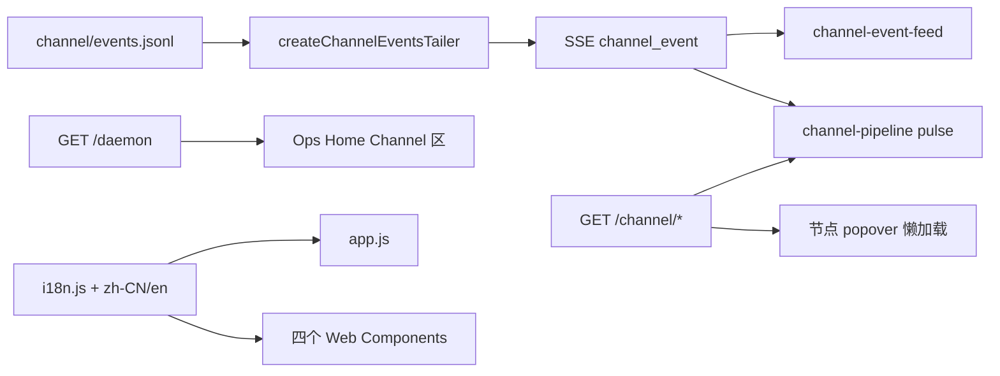

# Channel Viewer 升级：把 channel loop 画出来，而不是只报几个数字

> 日期：2026-06-04  
> 项目：js-evolution-agent  
> 类型：功能实现（Evolution Viewer 前端 + live API）  
> 来源：Cursor Agent 对话（思路 → 实施计划 → 六阶段落地）

---

## 目录

1. [背景与动机](#1-背景与动机)
2. [分析过程](#2-分析过程)
3. [方案设计](#3-方案设计)
4. [实现要点](#4-实现要点)
5. [验证与测试](#5-验证与测试)
6. [后续演化](#6-后续演化)
7. [附：本轮对话问题—思考—方案—执行对照](#附本轮对话问题思考方案执行对照)

---

## 1. 背景与动机

[`2026-06-01` 的 channel 面板日记](../2026-06-01/evolution-viewer-channel-panel.md) 已经把 channel 健康、入站/出站计数和最近事件接进了 Viewer。但操作者仍很难回答一个更直观的问题：**消息在 channel loop 里走到哪一步了？**

具体痛点有三类：

| 痛点 | 表现 |
| --- | --- |
| 观测粒度粗 | Ops Home 只有 KPI pill、role chips、可折叠 details，没有流水线视角 |
| 刷新成本高 | SSE 主要靠 `runtime_updated` 间接触发全量拉 `/daemon`，channel 事件不能增量驱动 UI |
| 前端可维护性差 | `app.js` 单文件 `innerHTML` 拼接，中文以 `\uXXXX` 转义，不利于 i18n 与组件演进 |

用户后续明确要求：**更丰富的交互、更好看的前端、中文不乱码、为 i18n 做准备**，并按附带的六阶段实施计划完整落地。

---

## 2. 分析过程

### 2.1 现有 Viewer 架构

阅读 [`tools/evolution-viewer/public/app.js`](../../tools/evolution-viewer/public/app.js) 与 [`viewer-api.mjs`](../../src/intelligence/evolution-viewer/viewer-api.mjs) 后确认：

- UI 仍是 vanilla JS + `innerHTML`，[`2026-06-03` UI 重设计](../2026-06-03/viewer-ui-redesign.md) 已拆出 `ops` / `reading` 双模式，Channel 区块在 Ops Home 网格内。
- `CHANNEL_EVENT_LABELS`、`formatChannelEventLabel()`、`.channel-event-feed` 等 CSS 类已预留，**事件时间线未真正挂载**。
- 后端 `daemon.channel` 来自 [`buildChannelProjection()`](../../src/channel/projection.mjs)，但 **无专用 `/channel/*` 路由**，inbound/outbox 文件详情需新 API 才能做节点 popover。

### 2.2 计划与运行环境的张力

实施计划原案选用 **Lit + importmap CDN**，并约定语言包为 `zh-CN.json` / `en.json`。

落地时发现两条硬约束：

1. **`jea intel viewer serve` 常在本地/内网跑**，离线 `dist` 通过 `cpSync(publicDir)` 递归复制静态资源，**不应依赖外网 CDN**。
2. **`t()` 需在首屏渲染时同步可用**，若 `fetch` JSON 语言包会引入异步竞态，且 `file://` 直开也不友好。

因此组件层与 i18n 加载方式在实现阶段做了有记录的偏离（见下文关键决策）。

### 2.3 Channel 数据形状

`buildChannelProjection()` 已提供流水线所需字段：`inbound/outbox.pending_count`、`tasks.running/failed`、`presence.reactor`、`presence.event_queue`、`workers.roles`、`classifier`、`feishu.listener`、`recent_events`。  
专用 API 只需薄封装读盘 + 摘要，SSE tailer 只需 tail `data/channel/events.jsonl`。

---

## 3. 方案设计

### 3.1 目标架构



### 关键决策

| 决策 | 计划原文 | 实际选择 | 理由 |
| --- | --- | --- | --- |
| 组件框架 | Lit（CDN importmap） | **原生 Custom Elements** | 零依赖、离线 dist 与本地 serve 均可用；计划中的「组件化」目标不变 |
| 语言包形态 | `zh-CN.json` / `en.json` | **`i18n/zh-CN.js`、`i18n/en.js` ES module** | `t()` 同步、无 fetch、build 复制目录即包含 |
| Channel API | 新增 `/channel` 等 | **按计划新增** | 与 6 月初「复用 daemon 即可」不同；popover 与事件流需要独立端点 |
| SSE | `channel_event` tailer | **`createChannelEventsTailer`** | 与 `daemon_event` 平级，驱动事件流插入与流水线脉冲 |
| 流水线绘制 | 内联 SVG | **CSS 节点 + 连接器 + 脉冲 class** | 满足零构建、少依赖；节点可点击、状态色与 badge 齐全 |
| 增量重绘 | `channelPanelFingerprint` | **已接入 `updateChannelComponents`** | 避免 SSE 高频下整段 Channel DOM 重刷 |

### 3.2 六阶段与交付物

| 阶段 | 交付 |
| --- | --- |
| Phase 1 | `i18n.js`、双语包、`app.js` 文案 i18n、topbar 语言切换 |
| Phase 2 | `/api/subjects/:subject/channel{,/events,/inbound,/outbox}` + legacy `/api/channel*` + SSE tailer |
| Phase 3 | `<channel-event-feed>`：着色、过滤 chip、新行高亮 |
| Phase 4 | `<channel-pipeline>`：横向流水线、积压 badge、脉冲、节点详情 |
| Phase 5 | `<presence-reactor>` + `<channel-workers>` |
| Phase 6 | 组件 CSS、暗色变量、`prefers-color-scheme`、移动端 `channel-grid` 单列 |

---

## 4. 实现要点

### 4.1 后端

[`src/intelligence/evolution-viewer/viewer-api.mjs`](../../src/intelligence/evolution-viewer/viewer-api.mjs)：

- **`createChannelEventsTailer`**：tail `runtime/data/channel/events.jsonl`，`formatChannelEventForApi()` 规范化字段，`sse.broadcast('channel_event', …)`。
- **Subject context** 新增：`getChannel()`、`getChannelEvents()`、`listChannelInbound()`、`listChannelOutbox()`（inbound/outbox 文件摘要含 `understanding` 标签）。
- **路由**：`GET …/channel`、`…/channel/events?limit=`、`…/channel/inbound?status=`、`…/channel/outbox?status=`；默认 subject 保留 `/api/channel*` 兼容。
- **生命周期**：每个 subject 注册 channel tailer，`close()` 时与 evolution tailer 一并 `stop()`。

### 4.2 前端

```
tools/evolution-viewer/public/
├── i18n.js
├── i18n/zh-CN.js
├── i18n/en.js
├── app.js                    # i18n、SSE channel_event、Channel 区组件挂载
├── live-state.js             # channelPanelFingerprint（增量更新）
├── index.html                # data-i18n*、locale-switch
├── styles.css                # cpl-/cev-/pr-/cw- 前缀 + 暗色变量
└── components/
    ├── util.js
    ├── channel-event-feed.js
    ├── channel-pipeline.js
    ├── presence-reactor.js
    └── channel-workers.js
```

| 模块 | 职责 |
| --- | --- |
| `i18n.js` | `t` / `tDynamic` / `setLocale` / `onLocaleChange`，localStorage + `navigator.language` |
| `channel-event-feed` | 事件流、按 inbound/presence/outbound/error 着色、过滤、SSE `pushEvent` |
| `channel-pipeline` | 八段流水线、状态色、点击 popover（inbound/outbox 调 API）、`pulse(ev)` |
| `presence-reactor` | 状态机高亮、event_queue 堆叠条、pending speech 列表 |
| `channel-workers` | 六 role 卡片、心跳呼吸动画、classifier 模式展示 |
| `app.js` | `renderChannelSectionHtml()` 嵌入四组件；`updateChannelComponents({ force })` 配合 fingerprint |

SSE 处理：`handleSsePayload` 增加 `channel_event` → `prependChannelEvent` + `pushChannelEventToFeed` + `pulseChannelPipeline`。

---

## 5. 验证与测试

### 自动化

```powershell
node --preserve-symlinks ./node_modules/vitest/vitest.mjs run test/evolution-viewer-live.test.mjs test/evolution-viewer-live-state.test.mjs test/evolution-viewer-manifest.test.mjs
```

- **45 tests passed**（viewer live / live-state / manifest）。

### 后端与静态资源

```powershell
npm run jea -- intel viewer serve --port 7799 --subject agentank-tank
```

探针（节选）均 **HTTP 200**：

- `/api/subjects/agentank-tank/channel`
- `/api/subjects/agentank-tank/channel/events?limit=5`
- `/api/subjects/agentank-tank/channel/inbound`、`/outbox`
- `/i18n.js`、`/i18n/zh-CN.js`、`/components/channel-pipeline.js` 等

`node --check viewer-api.mjs` 与 ESM import 冒烟通过。

### 浏览器

- Ops Home Channel 区：流水线、Presence reactor、Role workers、事件流均挂载且有内容。
- SSE：`Live connected`；`channel_classifier_tick` 等事件出现在事件流。
- 语言切换：点击「中文」后 `document.documentElement.lang=zh-CN`，流水线标题等即时变为中文。

### 未单独补测

- 多 subject 并行下各 subject 的 `channel_event` SSE 隔离（逻辑上经 `subjectMeta` 区分，未写专项用例）。
- 离线 `npm run viewer:build` 后仅用静态服务器打开 dist（复制递归应包含新目录，未在本轮重复跑）。

---

## 6. 后续演化

| 项 | 说明 |
| --- | --- |
| `last_plan` 决策分布 | 计划中的 no_op/speak/silence/act 比例条/饼图；i18n key 已预留，`<presence-reactor>` 尚未接 `presence.state.last_plan` |
| 流水线 SVG | 若需更复杂的分支拓扑，可在现有节点上叠 inline SVG，仍保持零构建 |
| Lit 可选引入 | 若未来接受构建步骤，可逐步把 Web Components 迁到 Lit，接口（`channel` / `events` property）可保持不变 |
| Viewer 单测 | 可为 `formatChannelEventForApi`、`channelPanelFingerprint`、channel API 路由增加 vitest |
| Role worker 任务详情 | 卡片目前展示心跳与 classifier 配置；「当前 task / 累计处理数」可接 `tasks.running` 与审计计数 |
| 主题切换 UI | 暗色变量与 `prefers-color-scheme` 已预留；可加显式 `[data-theme]` 切换按钮 |

---

## 附：本轮对话问题—思考—方案—执行对照

| 阶段 | 内容 |
| --- | --- |
| **问题** | Viewer 难以直观观察 channel loop；前端中文转义难读；需要 i18n 与更丰富交互。 |
| **思考** | 数据在 `daemon.channel` 已有，但缺专用 API 与 channel 级 SSE；单文件 innerHTML 难扩展；CDN Lit/JSON i18n 与本地/离线约束冲突。 |
| **方案** | 六阶段：i18n → channel API/SSE → 四块可视化组件 → CSS/指纹/响应式；组件用原生 CE，语言包用 ES module。 |
| **执行** | 改 `viewer-api.mjs`、重写/扩展 `public/`（i18n + 4 组件 + app/styles/index）；vitest 45 通过；本地 serve + 浏览器验收语言切换与 Channel 区渲染。 |
