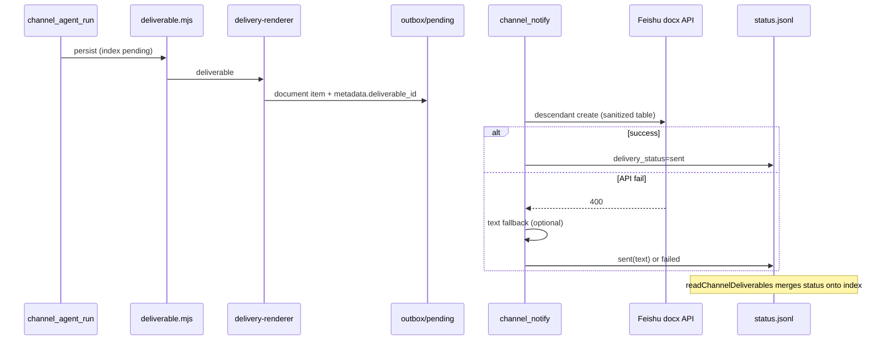

# 飞书交付物发不出去？从 400 到可观测：表格文档修复与投递闭环补强

> 日期：2026-06-05  
> 项目：js-evolution-agent（Channel / Feishu / 交付物管线）  
> 类型：问题排查 / 功能实现  
> 来源：Cursor Agent 对话（延续 [`journal/2026-06-04/channel-deliverable-pipeline.md`](../2026-06-04/channel-deliverable-pipeline.md) 第二轮交付物契约改造）

---

## 目录

1. [背景与动机](#1-背景与动机)
2. [分析过程](#2-分析过程)
3. [方案设计](#3-方案设计)
4. [实现要点](#4-实现要点)
5. [验证与测试](#5-验证与测试)
6. [后续演化](#6-后续演化)
7. [附：本轮对话问题—思考—方案—执行对照](#附本轮对话问题思考方案执行对照)

---

## 1. 背景与动机

操作者在飞书里说：「最近那轮进化的结果，完整内容到飞书里发我看看。」

系统按设计走了 channel agent run → 持久化交付物 → `delivery-renderer` 路由成飞书文档 → notify worker 出站。审计事件里甚至已经写了 `channel_deliverable_dispatched fmt=document`——看起来一切正常。

但操作者没收到云文档。追问「怎么没用飞书文档」时，机器人回的是闲聊式话术，还**幻觉式声称「无权限创建飞书文档」**——与事实完全相反。

真正的问题不是「没走文档通道」，而是：

1. **飞书 docx API 在含表格的 Markdown 上返回 HTTP 400**，消息进了 `outbox/failed`，操作者静默丢内容。
2. **交付物索引永远显示 `delivery_status: pending`**，排障只能靠翻 events 和 failed outbox。
3. **presence 没有真实投递状态**，只能编借口。

本轮工作要把「能发」和「发失败能查、话术不瞎编」一起补上。

---

## 2. 分析过程

### 2.1 从 channel events 还原时间线

对 `agentank-tank` 拉 `jea channel events` 与 `events.jsonl` 过滤，关键链路如下：

| 时间 (UTC) | 事件 | 含义 |
| --- | --- | --- |
| 16:43 | 入站 + classifier `needs_immediate_action=true` | 正确触发 `start_agent_async` |
| 16:48:28 | `channel_deliverable_persisted` | 交付物 `delivery-20260604-164828-d2d3` 落盘 |
| 16:48:29 | `channel_deliverable_dispatched fmt=document` | 新管线**已正确**路由为文档 |
| 16:48:35 | `channel_message_send_failed` HTTP 400 | **发送失败**，进 `outbox/failed` |
| 17:02+ | presence 对追问只回 `speech_intent` 文本 | 未复查失败交付物 |

结论：**路由没错，失败在飞书 API 层。**

### 2.2 第一层假设：嵌套块插入方式错误（部分正确）

旧代码对 `docx.document.convert` 的结果：

- 只保留 `first_level_block_ids`，丢掉表格的 cell 子块；
- `stripConvertedBlock` 删除每个块的 `children` 字段；
- 用扁平的 `documentBlockChildren.create` 插入。

含表格时，table 容器块变成「没有子节点的孤儿块」，飞书拒绝 → 400。这是合理的第一层根因。

### 2.3 第二层根因：表格只读字段（真凶）

改用 `documentBlockDescendant.create` 并 BFS 收集完整子树后，**仍然 400**。

逐步隔离（脚本 `debug-feishu-doc-steps` 思路）：

| 步骤 | API | 结果 |
| --- | --- | --- |
| 建文档 | `docx.document.create` | ✅ |
| 转 Markdown | `docx.document.convert` | ✅ |
| 插入非表格块 | descendant create | ✅ |
| 插入含表格块 | descendant create | ❌ `1770001 invalid param` |

对比 convert 返回的 table block：带有 `table.property.column_width` 与 `merge_info`。飞书创建接口把这些当作**只读/自动分配**字段，携带它们会触发 `invalid param`。剥离后同 payload 真机创建成功。

Markdown 表格没有合并单元格，剥离 `merge_info` 与 `column_width` 安全。

### 2.4 次要问题（本轮一并处理）

| 现象 | 根因 |
| --- | --- |
| agent 标 `type=message` 但内容很长带表格 | agent 自评偏保守；靠 `hasRichFormatting` 升级才走 document |
| `deliverables show` 永远 pending | 索引 append-only，notify 成败不写回 |
| 「无权限」话术 | presence 无 `recent_deliverables` / 能力事实，LLM 臆测 |

---

## 3. 方案设计

### 3.1 飞书文档创建（问题 A：400）

| 决策 | 选择 | 理由 |
| --- | --- | --- |
| 插入 API | `documentBlockDescendant.create` | 表格/引用等必须带子树，扁平 children API 不够 |
| 子树收集 | `planDocumentInsertions` BFS + 分批（默认 40 顶层块/批） | 可单测；长文档不超限 |
| 表格 property | `sanitizeTableProperty` 剥离 `column_width`、`merge_info` | 真机验证：携带即 400 |
| convert 失败 | 回退 `plainMarkdownBlock` 单文本块 | 文档不为空 |
| 发送仍失败 | `sendOutboundMessage` 兜底发 `title + markdown` 文本 | 不静默丢内容；返回 `document_fallback: 'text'` |

### 3.2 投递状态可观测（问题 B）

| 决策 | 选择 | 理由 |
| --- | --- | --- |
| 是否原地改 index JSONL | **否** | append-only 有并发与审计要求 |
| 状态存放 | 新源 `channel_deliverable_status`（`status.jsonl`） | 与 index 同目录，职责分离 |
| 读取合并 | `mergeDeliverableDeliveryStatus` last-write-wins | 按 `deliverable_id` + `item_index`；聚合 `sent`/`failed`/`partial` |
| 写入点 | notify worker 成功/失败分支 | `metadata.deliverable_id` 已存在；记录**实际**介质（含 text fallback） |

### 3.3 类型仲裁与 presence 事实（问题 C）

| 决策 | 选择 | 理由 |
| --- | --- | --- |
| 类型权威 | renderer 裁决；agent 仅声明意图 | 内容与契约解耦 |
| 升级审计 | `type_overridden` + dispatched 事件字段 | 观察 agent 判断质量，不静默纠偏 |
| 追问「怎么没文档」 | 注入 `recent_deliverables` + `delivery_capabilities` | 事实约束生成，非关键词硬堵 |
| classifier `recheck_last_delivery` | **本轮未做** | 依赖状态回写；自动重发误触风险大，另案评估 |

---

## 4. 实现要点

### 4.1 飞书 docx 客户端

[`src/channel/adapters/feishu/client.mjs`](../../src/channel/adapters/feishu/client.mjs)

- 导出 `planDocumentInsertions(converted, { batchSize })`：纯函数，供单测。
- `toDescendantBlock` + `sanitizeTableProperty`：插入前清洗 table。
- `createDocumentFromMarkdown`：convert → plan → 循环 descendant create；无 insertion 时回退单文本 children。

[`src/channel/adapters/feishu/index.mjs`](../../src/channel/adapters/feishu/index.mjs)

- `sendOutboundMessage`：document 路径 try/catch，失败则 `sendText(title + markdown)`。

### 4.2 交付物状态回写

| 文件 | 职责 |
| --- | --- |
| [`src/intelligence/specs.mjs`](../../src/intelligence/specs.mjs) | 注册 `channel_deliverable_status` |
| [`src/intelligence/store.mjs`](../../src/intelligence/store.mjs) | `recordChannelDeliverableStatus`、`mergeDeliverableDeliveryStatus`、`readChannelDeliverables({ mergeStatus })` |
| [`src/channel/deliverable.mjs`](../../src/channel/deliverable.mjs) | `recordDeliveryOutcome`、`createDeliverableStore` |
| [`src/channel/tasks.mjs`](../../src/channel/tasks.mjs) | notify 成功/失败写状态 |
| [`src/cli/commands/channel.mjs`](../../src/cli/commands/channel.mjs) | list 显示 `delivery=sent/failed/...` |

状态记录字段示例：`deliverable_id`、`item_index`、`medium`、`delivery_status`、`delivery_format`、`delivery_message_id`、`error`。

### 4.3 类型仲裁与 presence 上下文

| 文件 | 职责 |
| --- | --- |
| [`src/channel/delivery-renderer.mjs`](../../src/channel/delivery-renderer.mjs) | 返回 `declared_type`、`resolved_medium`、`type_overridden` |
| [`src/channel/agent-runner.mjs`](../../src/channel/agent-runner.mjs) | 契约判据加强；dispatched 事件带 override 字段 |
| [`src/channel/presence-context.mjs`](../../src/channel/presence-context.mjs) | `recent_deliverables`、`delivery_capabilities` |
| [`src/channel/presence-affordances.mjs`](../../src/channel/presence-affordances.mjs) | 写明支持 document 投递；禁止声称「无权限」 |

### 4.4 数据流（修复后）



---

## 5. 验证与测试

### 5.1 单元与集成测试

```bash
npx vitest run test/channel.test.mjs
# 117 passed（含 planDocumentInsertions、mergeDeliverable、notify 回写、type_overridden）

npx vitest run
# 663 passed（含 intelligence.specs 新增 channel_deliverable_status）
```

新增/更新要点：

- `planDocumentInsertions`：表格子树完整、`column_width`/`merge_info` 已剥离、分批顺序。
- `mergeDeliverableDeliveryStatus`：sent / failed / partial、per-item last-write-wins。
- `runChannelNotifyTask`：mock 发送后 index 合并为 `delivery_status=sent`。
- `renderDeliveryToOutbox`：长 `message` → `type_overridden: true`。

### 5.2 真机验证（agentank-tank）

用原失败 payload（`outbox/failed` 中 `delivery-20260604-164828-d2d3`，含两个 Markdown 表格）经修复后代码路径重发：

- 成功创建飞书云文档（`documentId` 如 `Hh5zdzOw2oRbfOxFgFccpwWNnJg`）。
- 向操作者私聊发送文档链接（`channel_message_sent`，无 `document_fallback`）。

排查命令（后续读者可复用）：

```powershell
npm run jea -- channel events --subject agentank-tank --limit 40 --json
npm run jea -- channel deliverables list --subject agentank-tank --limit 10
npm run jea -- channel deliverables show delivery-20260604-164828-d2d3 --subject agentank-tank --json
```

失败时查：`runtime/subjects/<ns>/data/channel/outbox/failed/` 与 `events.jsonl` 中 `channel_message_send_failed`。

---

## 6. 后续演化

| 项 | 说明 | 优先级 |
| --- | --- | --- |
| 追问自动复查/重发 | classifier `recheck_last_delivery` + presence 对 `delivery_status=failed` 重排队 | 中；需防误重发 |
| agent `type` 质量 | 用 `type_overridden` 事件统计，迭代 `DELIVERABLE_CONTRACT` 示例 | 低 |
| 合并单元格表格 | 若 agent 产出含 rowspan/colspan，需保留合法 `merge_info` 而非一律剥离 | 低 |
| 其他介质 | image/PDF 等扩展 `resolveDeliveryItems` + adapter | 见 06-04 journal §8.5 |
| daemon 热加载 | 修改后需重启 channel daemon 才加载新代码 | 操作注意 |

---

## 附：本轮对话问题—思考—方案—执行对照

| 阶段 | 内容 |
| --- | --- |
| **问题** | 操作者要飞书文档看进化结果；系统显示已 dispatch document，实际未收到；追问被当成闲聊且声称「无权限」。 |
| **思考** | 路由正确 → 查 notify 与 outbox/failed → 400 来自 docx API；先修嵌套插入再发现表格只读字段才是真凶；索引 pending 与 presence 无事实为次要但影响排障与话术。 |
| **方案** | descendant 插入 + 表格 property 清洗 + 发送文本兜底；状态事件 append + 读时合并；renderer 权威类型 + presence 注入 `recent_deliverables` 与能力边界。 |
| **执行** | 改 `client.mjs`/`index.mjs`、`specs`/`store`、`deliverable`/`tasks`/CLI、`delivery-renderer`/`agent-runner`/`presence-context`/`presence-affordances`；测试 663 passed；真机重发原失败表格交付物成功。 |

---

*关联日记：[`channel-deliverable-pipeline.md`](../2026-06-04/channel-deliverable-pipeline.md)（§8 契约改造、§9 400 简要记录）；规约 [`CONVERSATION_TO_JOURNAL_GUIDE.md`](../CONVERSATION_TO_JOURNAL_GUIDE.md)。*
