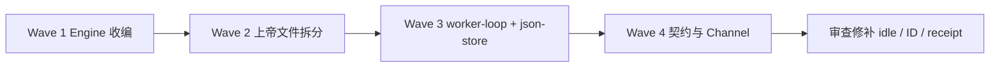
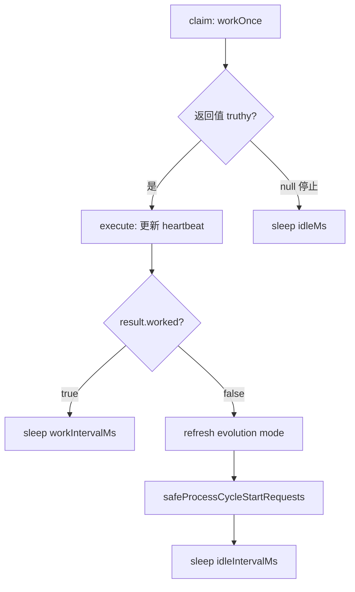

# JEA 重构续推：收编 Engine、统一队列与 Worker Loop 空闲补偿

> 日期：2026-06-13  
> 项目：js-evolution-agent  
> 类型：架构设计 / 升级迁移 / 问题排查  
> 来源：Cursor Agent 对话  
> 完整思路与计划存档：[`jea-refactor-plan-archive.md`](./jea-refactor-plan-archive.md)

---

## 目录

1. [背景与动机](#1-背景与动机)
2. [分析过程](#2-分析过程)
3. [方案设计](#3-方案设计)
4. [实现要点](#4-实现要点)
5. [验证与测试](#5-验证与测试)
6. [后续演化](#6-后续演化)
7. [附：本轮对话问题—思考—方案—执行对照](#附本轮对话问题思考方案执行对照)

---

## 1. 背景与动机

真正的问题不是「`js-evolution-engine` 有没有被改写」。

真正的问题是：**宿主与引擎长期通过 npm 包耦合，决策队列、cycle_id、daemon/channel 循环各自演化，边界越来越糊**——同一轮演化里 intel 的 `cycle_id` 与 exec 的 `exec-*` 可能分裂；`LocalDecisionQueue` 与 engine 内 `DecisionQueue` 能力重复；daemon 从手写 `for(;;)` 迁到抽象 worker loop 后，空闲路径悄悄失效。

| 痛点 | 表现 |
| --- | --- |
| npm 依赖边界 | 改 engine 需跨仓库；`node_modules/js-evolution-engine` 与宿主 `src/` 双轨维护 |
| 队列双实现 | fingerprint、archive、summarize 只在宿主 `LocalDecisionQueue`，engine 侧缺能力 |
| cycle_id 分裂 | exec 默认 `exec-*`，与 intel/decision 的 `cycle-*` 不一致，verify/receipt 对账困难 |
| 上帝文件 | `handlers.mjs`、`agent-adapter.mjs`、`cli/commands/daemon.mjs` 等单文件过大 |
| worker loop 回归 | `workOnce` 返回 `{ worked: false }` 仍为 truthy，`onIdle` 永不执行，continuous 开轮补偿丢失 |

用户先确认 engine 未被改写（当时仅 `src/engine/index.mjs` 门面 re-export），随后选择 **收编进 `src/engine/`（vendor，移除 npm 依赖）** 并按四波计划完整落地；收尾阶段做逻辑审查、全量测试，并修补 Decision ID、契约校验与 lockfile 残留。

---

## 2. 分析过程

### 2.1 Engine 与宿主边界

- 运行时入口：`oada.config.mjs` → [`src/engine/index.mjs`](../../src/engine/index.mjs) 门面。
- 决策入队：[`src/intelligence/conversational-intel-pipeline.mjs`](../../src/intelligence/conversational-intel-pipeline.mjs) 经 `createHostDecisionQueue` 写 `pending_decisions.json`。
- 执行消费：[`src/engine/pipelines/exec.mjs`](../../src/engine/pipelines/exec.mjs) `ExecutionPipeline` claim 同一文件。
- 单轮编排：[`src/evolution/cycle-steps.mjs`](../../src/evolution/cycle-steps.mjs) 串联 intel / exec / verify / belief / goals / diary。

收编后上述链路不变，只是 engine 源码落在仓库内，npm 依赖可删。

### 2.2 Worker loop 空闲路径根因

[`src/infra/worker-loop.mjs`](../../src/infra/worker-loop.mjs) 中：

```text
const task = await claim();
if (task) { execute(task); afterExecute(task); continue; }
onIdle();
```

[`workOnce`](../../src/daemon/daemon-core.mjs) / [`channelWorkOnce`](../../src/channel/domain-worker.mjs) 无任务时返回 `{ worked: false, task: null }`——**对象恒为 truthy**。旧 `for(;;)` 用 `result.worked` 分支 sleep 并调用 `safeProcessCycleStartRequests`；迁移后这些逻辑误放到 `onIdle`，而 `onIdle` 永远不会被调用。同时 `afterExecute` 在空闲时返回 `0`，导致 CPU 空转。

### 2.3 Decision ID 碰撞

[`addDecisionsDetailed`](../../src/engine/decide/decision-queue.mjs) 原用 `${cycleId}:${idx}`，`idx` 为**批内**下标。同 cycle 多次入队（或 completed 项仍在 pending 时追加）可能重复 `:0`、`:1`。指纹去重只能挡相同 action，不能挡不同 action 的 ID 撞车。

### 2.4 契约校验与 strict 模式

[`verifyReceiptContract`](../../src/actions/handlers/builtin.mjs) 在 verify 阶段合成 receipt 做 shape 检查。测试与部分路径传入 `action=null`，在 `JEA_CONTRACT_MODE=strict` 下触发 `receipt.action must be an object`。

### 2.5 被否定的方案

| 方案 | 结论 |
| --- | --- |
| 继续 npm 依赖 + 仅 facade | 不解决跨仓库与双队列问题 |
| 保留 `LocalDecisionQueue` 为权威实现 | 与 exec pipeline 读写的 engine 队列继续分裂 |
| 空闲逻辑仍放 `onIdle` | 与 `{ worked: false }` truthy 语义冲突，无法触达 |
| Decision ID 加时间戳替代序号 | 可读性差；单调序号 + 可选 archive 扫描更合适 |

---

## 3. 方案设计

四波实施，互不推翻：



### 关键决策

| 决策 | 选择 | 理由 |
| --- | --- | --- |
| Engine 形态 | vendor 至 `src/engine/`，删 npm 依赖 | 单仓库可改可测；保留 `VENDORED.md` 追溯上游 |
| 决策队列 | 合并 `LocalDecisionQueue` 能力进 engine `DecisionQueue` | 单一读写 `pending_decisions.json` |
| cycle_id | `EvolutionEngine.setCycleId` + exec 传入 intel cycle_id | 消除 `exec-*` 与 `cycle-*` 分裂 |
| Daemon 内核 | 迁入 [`src/daemon/daemon-core.mjs`](../../src/daemon/daemon-core.mjs) | CLI 仅 re-export |
| Worker 抽象 | [`runDomainWorkerLoop`](../../src/infra/worker-loop.mjs) + `afterExecute` | 统一 cycle/channel；空闲补偿放在 `afterExecute` |
| 空闲补偿 | `!worked` 时 `safeProcessCycleStartRequests` + `idleIntervalMs` | 对齐旧 `for(;;)` 语义 |
| Decision ID | 按 cycle 扫描已有 ID 取 `max(seq)+1` | 同 cycle 多批单调递增 |
| Receipt verify | `resolveReceiptAction` 合成最小 action | strict 下 tolerate `verify(null, result)` |

---

## 4. 实现要点

### 4.1 Wave 1 — Engine 真收编

| 文件 | 职责 |
| --- | --- |
| [`src/engine/`](../../src/engine/) | vendored OADA 运行时（自 `js-evolution-engine` v0.2.0） |
| [`src/engine/VENDORED.md`](../../src/engine/VENDORED.md) | 上游版本与路径说明 |
| [`src/engine/decide/decision-queue.mjs`](../../src/engine/decide/decision-queue.mjs) | 统一队列：fingerprint、archive、summarize、`addDecisionsDetailed` |
| [`src/intelligence/decision-queue.mjs`](../../src/intelligence/decision-queue.mjs) | `createHostDecisionQueue`；`LocalDecisionQueue` deprecated |
| [`src/evolution/cycle-steps.mjs`](../../src/evolution/cycle-steps.mjs) | `runExecStep` 传入 intel `cycle_id` |
| [`oada.config.mjs`](../../oada.config.mjs) | 指向 `./src/engine/index.mjs` |
| `package.json` | 移除 `js-evolution-engine` 依赖 |

### 4.2 Wave 2 — 上帝文件拆分

| 区域 | 路径 |
| --- | --- |
| Handlers | [`src/actions/handlers/builtin.mjs`](../../src/actions/handlers/builtin.mjs) + [`index.mjs`](../../src/actions/handlers/index.mjs) |
| Agent adapter | [`src/actions/agent-adapter/runner.mjs`](../../src/actions/agent-adapter/runner.mjs) |
| Daemon 内核 | [`src/daemon/daemon-core.mjs`](../../src/daemon/daemon-core.mjs) |
| Report / Viewer | [`src/intelligence/report-builder/core.mjs`](../../src/intelligence/report-builder/core.mjs)、[`evolution-viewer/api-core.mjs`](../../src/intelligence/evolution-viewer/api-core.mjs) |

旧路径保留 barrel / re-export 兼容。

### 4.3 Wave 3 — 基础设施

| 文件 | 职责 |
| --- | --- |
| [`src/infra/worker-loop.mjs`](../../src/infra/worker-loop.mjs) | `runDomainWorkerLoop`、`afterExecute`、`shouldStop` |
| [`src/daemon/daemon-core.mjs`](../../src/daemon/daemon-core.mjs) | cycle worker 接入 loop；idle 时 cycle start 补偿 |
| [`src/channel/domain-worker.mjs`](../../src/channel/domain-worker.mjs) | channel role worker 接入 loop |
| [`src/infra/json-store.mjs`](../../src/infra/json-store.mjs) | daemon projection 原子读写 |
| [`src/evolution/runner.mjs`](../../src/evolution/runner.mjs) | `runSingleCycle` / `runSingleStep` 归位 |

### 4.4 Wave 4 — 契约与 Channel

- 新契约：`verify-report.mjs`、`belief-goal-events.mjs`、`channel-envelope.mjs`
- Channel：启动 `cancelDeprecatedChannelTasks`；notify 失败 enqueue `channel_retry`；`writeOutboxMessage` 校验 envelope

### 4.5 审查阶段修补

**Daemon idle（[`daemon-core.mjs`](../../src/daemon/daemon-core.mjs)）**

```javascript
afterExecute: async (result) => {
  if (result?.worked) return workIntervalMs;
  // refresh evolution mode + safeProcessCycleStartRequests
  return idleIntervalMs;
},
```

**claim 路径**：刷新 evolution mode 后写回 `lastEvolutionMode`，避免重复 `evolution_mode_changed`。

**Decision ID（[`decision-queue.mjs`](../../src/engine/decide/decision-queue.mjs)）**

- `nextCycleDecisionSequence(decisions, cycleId)` → `${cycleId}:${seq}` 单调递增。

**Receipt 契约（[`builtin.mjs`](../../src/actions/handlers/builtin.mjs)）**

- `resolveReceiptAction(action, result)`：action 缺失时从 result 合成 `{ type }`。

**其他**

- 删除 `package-lock.json` 中 stale `../js-evolution-engine` 条目
- [`oada.config.mjs`](../../oada.config.mjs) bootstrap mock 文案改为 `src/engine/`

**例外路径**：`jea daemon start --domain channel --channel-role all` 仍走 `runChannelDomainWorkerSingle` 原生 `for(;;)`，空闲 sleep 独立实现，行为与 loop 一致。

### 4.6 Worker loop 数据流（daemon 空闲）



> **API 注意**：`afterExecute` 第一参数是 **claim 返回值**（含 `worked`），不是 `execute` 的返回值。当前 daemon/channel 依赖此语义。

---

## 5. 验证与测试

### 5.1 全量测试

```powershell
npm test
```

| 轮次 | 结果 |
| --- | --- |
| 收编 + worker loop 修复后 | 55 文件 / **698** 用例通过 |
| Decision ID + receipt 修补后 | 55 文件 / **699** 用例通过（+1 worker-loop 用例） |

### 5.2 Strict 契约子集

```powershell
$env:JEA_CONTRACT_MODE='strict'
npm test -- test/cycle-e2e.test.mjs test/e2e-mock-cycle.test.mjs test/contracts.test.mjs test/decision-queue-unified.test.mjs test/cycle-id-unified.test.mjs
```

5 文件 / 11 用例通过；mock 全流程 intel → exec → verify → belief/goals → diary 无契约失败。

### 5.3 专项

```powershell
npm test -- test/daemon-domain.test.mjs test/worker-loop.test.mjs test/decision-queue-unified.test.mjs
```

### 5.4 已知 flake（未阻塞）

- `test/evolution-viewer-live.test.mjs` 偶发 `ECONNRESET`（本地 HTTP server），与本次重构无直接因果
- `test/actions.test.mjs` lane 初始化偶发 15s 超时，单独重跑通常通过

---

## 6. 后续演化

| 项 | 优先级 | 说明 |
| --- | --- | --- |
| Decision ID + archive | 中 | `nextCycleDecisionSequence` 同时扫描 `archived_decisions.json`，防人工复用 `JEA_CYCLE_ID` 后 `:0` 与历史 receipt 冲突 |
| `runVerifyStep` cycle 兜底 | 低 | semantic verify 用 `intelResult?.cycle_id ?? execResult?.cycle_id` |
| worker-loop 文档 | 低 | 明确 `afterExecute(claimResult, ctx)` 参数语义 |
| viewer-live 稳定性 | 低 | 减少 ECONNRESET flake（重试或 server 生命周期） |
| 上游 sync | 按需 | 对照 [`src/engine/VENDORED.md`](../../src/engine/VENDORED.md) 合并 js-evolution-engine 新版本 |

---

## 附：本轮对话问题—思考—方案—执行对照

| 阶段 | 内容 |
| --- | --- |
| **问题** | Engine 是否被改写？如何续推 JEA 重构（收编 engine、统一队列/cycle_id、拆上帝文件、worker 抽象）？迁移后逻辑是否正确？ |
| **思考** | npm 包边界导致双队列与 cycle 分裂；worker loop 的 truthy idle 对象使 `onIdle` 失效；Decision ID 批内 idx 可撞车；verify 阶段 action 可为 null。 |
| **方案** | 四波：vendor `src/engine/` → 合并 DecisionQueue + 统一 cycle_id → 拆分 daemon/handlers/viewer → 契约与 channel；idle 补偿迁入 `afterExecute`；单调 seq ID；`resolveReceiptAction`。 |
| **执行** | 完成四波实现；修复 daemon/channel idle；补测试；清理 lockfile；全量 699 绿 + strict 子集通过；本文 journal。 |
