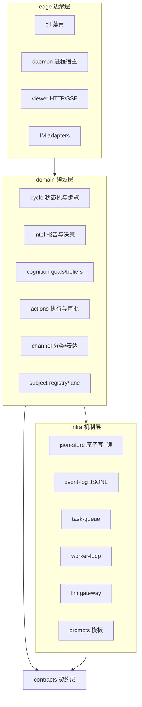
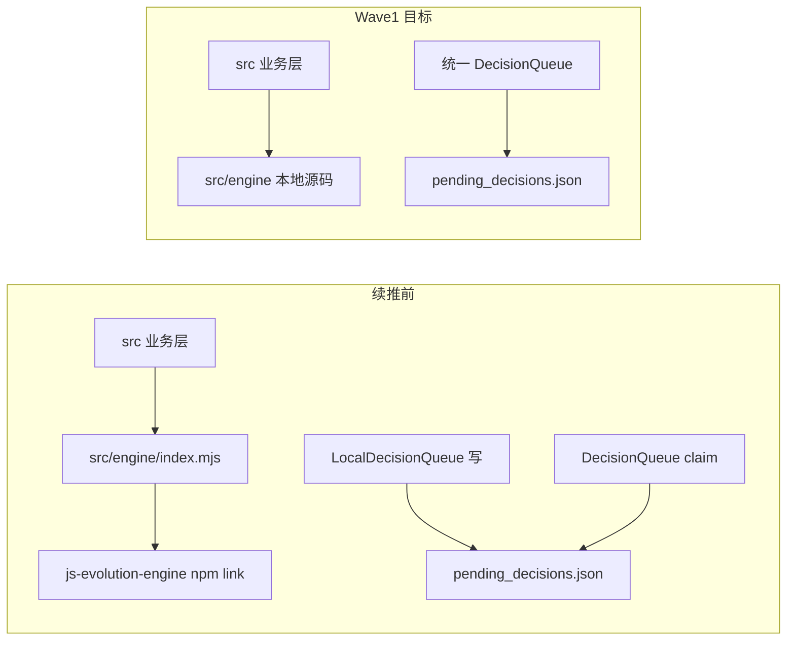
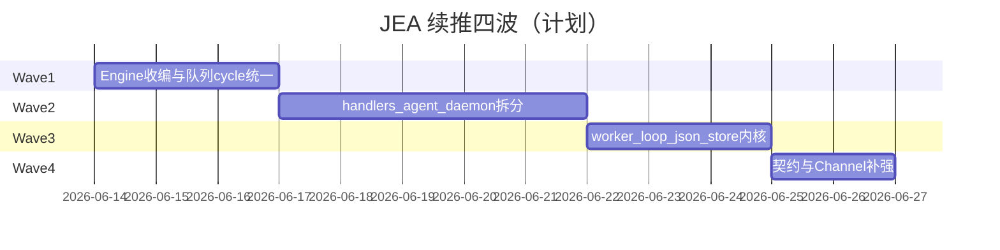

# JEA 重构：完整思路与计划存档

> 日期：2026-06-13  
> 项目：js-evolution-agent  
> 类型：架构设计 / 升级迁移（规划文档存档）  
> 来源：Cursor Agent 对话（[1dedbd6c-0f59-488b-9a43-e47019cbe659](agent-transcripts)）  
> 实施复盘日记：[`jea-engine-vendor-refactor.md`](./jea-engine-vendor-refactor.md)

---

## 存档说明

本文档保存对话中**完整重构思路**与**两份实施计划**，供后续维护者对照「当时为什么这样设计」与「计划 vs 落地」：

| 部分 | 内容 |
| --- | --- |
| [一、系统分析与目标架构](#一系统分析与目标架构) | 五路并行调研 + 八项结构性问题 + 四层目标形态 + 六步绞杀者路线 |
| [二、Phase 0–6 总计划](#二phase-06-总计划) | 绞杀者七阶段：测试安全网 → 契约 → infra → domain 迁出 → 上帝文件 → engine 收编 → channel |
| [三、续推 Wave 1–4 计划](#三续推-wave-14-计划) | Phase 5 真收编后的四波落地清单（用户确认 **vendor 进 `src/engine/`**） |
| [四、执行状态索引](#四执行状态索引) | 四波 + 审查修补的完成项与遗留项 |

Cursor 原始 plan 文件（含 YAML frontmatter / todos）仍位于用户本机：

- `~/.cursor/plans/jea_系统重构实施计划_e073f23f.plan.md`
- `~/.cursor/plans/jea_重构续推_8cc6c837.plan.md`

---

## 一、系统分析与目标架构

> 来源：对话中五路并行调研（主流程与引擎耦合、actions、daemon/CLI、channel、智能层与测试）+ 对 CONSTITUTION、`oada.config.mjs`、`cycle-steps.mjs`、运行时数据布局的阅读。

### 1.1 系统要实现的目标

从 CONSTITUTION/GUIDE、README、AGENTS.md 和代码事实看，JEA 的本质是：

> **一个受控的多主体自演化宿主**：每个 subject 在 OADA 闭环（情报→决策→执行→验证→信念→目标→日记）中长期自主演化，所有行动受审批与边界约束，所有认知（goal/belief/fact/memory）可审计、可追溯，操作者通过 channel 与系统对话，通过 viewer 观测系统。

**必须保留的核心资产（本质复杂度）**：

1. **认知资产模型** — goals/beliefs/standing memory/operator 四分级（Constraint/Intent/Fact/Evidence）
2. **单轮演化状态机** — 8 step、checkpoint 可恢复、daemon 事件驱动
3. **行动安全边界** — 审批策略、lane/worktree、resource scope、authority contract
4. **通信闭环** — classifier → presence → speech 三阶段表达
5. **运行时数据即接口** — `runtime/subjects/<ns>/` 即数据库 + UI + 审计日志

当前大量是**偶然复杂度**：双引擎双轨、上帝文件、三套 JSON 写、两套 worker loop、重复工具函数、内嵌 prompt 巨串。

**总原则：保领域模型，换实现骨架。**

### 1.2 八个结构性问题

#### （1）host/engine 边界倒挂

- 宿主 `src/` 约 **37,000 行**；`js-evolution-engine` 约 **4,000 行**。
- Phase 1 已被 `ConversationalIntelligencePipeline` 整体替代；DecisionQueue **双实现**（宿主写、引擎 claim）。
- 深路径 import、`engine._cycleId` 私有篡改、intel `cycle-*` vs exec `exec-*` 双 cycle_id。
- **结论**：「engine + host adapter」叙事已失效，代码仍在付双轨税。

#### （2）分层缺失：领域逻辑住在 CLI 里

- `cli/commands/daemon.mjs`（1800+ 行）含 worker 主循环、watchdog、诊断。
- `assessActiveGoals` / `autoCalibrateGoals` 在 `cli/commands/goals.mjs`，被 `cycle-steps.mjs` **反向 import**。
- `cli/utils/` 实为半个内核（cycle 状态机、任务队列、subject registry）。

#### （3）数据契约全隐式

decision、receipt、run_spec、checkpoint、task、envelope 等几十种 JSON 形状无 schema 层，全靠字段约定 + 手写 `parse*`。

#### （4）机制重复发明

| 机制 | 重复情况 |
| --- | --- |
| 原子 JSON 写 | `atomic-json-write` / `files.writeJsonFile` / `cycle-state` 内联，3 套 |
| worker 循环 | cycle `runDaemonWorker` 与 channel 平行，未抽象 |
| 唤醒模型 | event-queue + task-queue 双轨（`wake.mjs`） |
| LLM 客户端 | 主链工厂 vs channel 各自 `new DeepSeekOpenAIClient` |
| 工具函数 | `getField`×6、`flattenGoals`×4、双 runtime 入口、`parseSubjectList`×2 |
| 分类 | `ingest` 规则 vs `classifier` LLM 并存 |

#### （5）七个上帝文件

`handlers.mjs`（2194）、`agent-adapter.mjs`（2237）、`report-builder.mjs`（2000+）、`daemon.mjs`（1826）、`subjects.mjs`（1400）、`conversation-prompts.mjs`、`viewer-api.mjs`（1287）。

#### （6）prompt 与代码深度耦合

report/decide/assessor/belief/diary/speech 模板硬编码在 `.mjs`；stable/dynamic 缓存拆分被埋在代码里。

#### （7）并发一致性参差不齐

task 队列有锁；channel event-queue / presence-state / dedup **6 role 并行无锁**；cycle-state 锁打在数据文件上；channel 不取 subject 锁而 cycle 取。

#### （8）错误语义与测试形状不对

同链上 throw / 软失败 / 吞错并存；**无 mock-LLM 全 8 步闭环 e2e**；`intelligence.test.mjs` 单文件 2266 行混测。

### 1.3 目标形态

**承认现实：这是一个产品，不是一个 adapter。**

- 把 `js-evolution-engine` **收编进仓库**（vendor 实际使用面）；`js-intel-store` 可保留 npm（体量小、边界清）。
- 消灭：双 Phase 1、双 DecisionQueue、双 cycle_id、深 import、私有字段篡改。

**四层重组：契约 → 机制 → 域 → 边缘**

```text
src/
├── contracts/     # JSON 形状唯一定义点
├── infra/         # json-store、event-log、task-queue、worker-loop、llm、prompts
├── domain/        # cycle、intel、cognition、actions、channel、subject
└── edge/          # cli、daemon、viewer、adapters
```

**三个统一模式**：

1. **状态 = 事件日志 + 投影**（goal/belief/cycle/channel 已有近似实现，应统一）
2. **机制与策略分离**（队列/锁/worker 一份；OADA/审批/presence 纯函数注入）
3. **LLM 输出一律过 contracts**（decide、belief、goal patches、classifier、receipt）

**类型策略**：运行时 schema + JSDoc，不强制全仓 TS；风险在运行时形状，不在编译期。

### 1.4 六步绞杀者路线（总览）

| Phase | 主题 | 要点 |
| --- | --- | --- |
| **0** | 测试安全网 | mock-LLM 全 8 步 e2e + daemon step；形状断言；拆 `intelligence.test.mjs` |
| **1** | 契约显式化 | `src/contracts/` 五核心 + warn/strict |
| **2** | 机制统一 | json-store、worker-loop、LLM gateway、prompt 外置、并发修复 |
| **3** | 依赖方向矫正 | daemon/goals/evolve 内核迁出 CLI；subjects 三分 |
| **4** | 上帝文件解剖 | handlers、agent-adapter、report-builder、viewer-api、channel 大文件 |
| **5** | 引擎收编 | 结束双轨；DecisionQueue/cycle_id 合一 |
| **6** | channel 补强 | 入站 adapter、唤醒统一、废弃 task 清除、retry |

**顺序逻辑**：先护栏（0/1）→ 地基（2）→ 骨架（3）→ 器官（4/5/6）。P0–P2 停下已获大部分稳定性收益。

### 1.5 明确不建议做的事

- 大爆炸重写（破坏 runtime 审计与历史 subject 数据）
- 重写 viewer 前端
- 为假想多 IM 过度设计 transport（入站 adapter 抽象除外）
- 改动 Cyber-Taoist 权威文档语义
- 先全仓 TypeScript（先 schema 后类型）

### 1.6 一句话总结

领域设计（认知分级、OADA、审批、三阶段表达）是真资产；病在**宿主长成产品而架构叙事未跟上**。最佳路径：**收编引擎、显式契约、统一机制、矫正依赖、按域解剖上帝文件**，六步绞杀者在测试护栏下渐进完成。

---

## 二、Phase 0–6 总计划

> 来源：`jea_系统重构实施计划_e073f23f.plan.md`（对话中 CreatePlan 生成）。  
> 状态：对话内 todos 均已标 **completed**；Phase 5 在续推前仅为门面 re-export，真收编见 [第三节](#三续推-wave-14-计划)。

### 2.1 总原则与硬约束

- **保领域模型，换实现骨架**
- **绞杀者模式**：每阶段 `npm test`、`jea run --mock`、`jea daemon work --once --mock` 全绿
- **runtime 数据兼容**：`runtime/subjects/<ns>/` 向后兼容
- **不做**：重写 viewer 前端、动 authority 语义、全仓 TS、重依赖
- 拆分保留 deprecated re-export 门面

### 2.2 目标架构（四层）



### 2.3 各 Phase 要点

#### Phase 0 — 测试安全网

- `test/e2e-mock-cycle.test.mjs`：MockAI 驱动全 8 step（含 belief/goals）
- daemon step e2e 补齐 belief/goals
- 形状断言：pending_decisions、receipt、checkpoint、verify report
- 拆分 `intelligence.test.mjs`

#### Phase 1 — 契约层

- `src/contracts/` 自写轻量校验
- 第一批：decision、action-receipt、agent-run-spec、step-checkpoint、daemon-task
- `JEA_CONTRACT_MODE=warn|strict`
- 第二批（Phase 6 前）：verify report、belief/goal event、channel envelope

#### Phase 2 — 机制统一

- `infra/json-store.mjs` 合一；channel 无锁文件补锁；cycle-state 锁移独立 `.lock`
- `infra/worker-loop.mjs`：`runDomainWorkerLoop`
- LLM gateway 唯一入口；prompt 外置 `src/prompts/`

#### Phase 3 — 依赖方向矫正

- daemon 内核迁 `src/daemon/`
- goals/beliefs → `src/domain/cognition/`
- `runSingleStep`/`runSingleCycle` → `src/evolution/`
- `subjects.mjs` 三分

#### Phase 4 — 上帝文件解剖

- handlers 按 taxonomy 拆目录 + ApprovalGate
- agent-adapter 按 provider 拆 + 公共 verify loop
- report-builder 三分；viewer-api 拆路由
- channel state / presence-decision-executor 缩体

#### Phase 5 — 引擎收编

- 默认 **vendor 进本仓库**（备选：保留 npm 仅修边界）
- 消灭双 Phase 1、双 DecisionQueue、双 cycle_id
- 移除 `js-evolution-engine` 依赖与 intel/exec/decisions 旧脚本

#### Phase 6 — channel 一致性

- 入站 adapter registry；listener 下沉
- 唤醒模型统一；废弃 task 清除
- notify retry；分类归 classifier 单入口

### 2.4 执行与风险控制

- 每 Phase 一分支/PR；P2 并发、P5 队列合一需 daemon 长跑观察
- 工作量参考：P0 10%、P1 15%、P2 20%、P3 15%、P4 25%、P5 10%、P6 5%
- 任意阶段可暂停；P0–P2 稳定性收益最大

---

## 三、续推 Wave 1–4 计划

> 来源：`jea_重构续推_8cc6c837.plan.md`。  
> 背景：Phase 0–4 门面与测试安全网已就绪；用户确认 **收编进 `src/engine/`（vendor，移除 npm 依赖）**。  
> 用户指令：**Implement the plan — Do NOT edit the plan file itself.**

### 3.1 续推前现状快照

| 区域 | 已完成 | 仍为过渡态 |
| --- | --- | --- |
| 测试/契约 | mock 8 步 e2e、5 核心 contract、692 绿 | 第二批契约未建 |
| Engine | `src/engine/index.mjs` 门面 | 仍 npm link `../js-evolution-engine` |
| 队列 | LocalDecisionQueue 写 + engine claim | 双实现 |
| cycle_id | intel `cycle-*`，exec `exec-*` | `_cycleId` 直写 |
| 大文件 | 目录门面已有 | 实现体仍在单文件 |
| infra | json-store、worker-loop 已建 | daemon/channel **未**接入 loop |



### 3.2 Wave 1 — Phase 5 真收编（2–3 天）

**目标**：本仓库自包含 engine；消除 npm、双队列、双 cycle_id；不破坏 runtime JSON。

| 步骤 | 内容 |
| --- | --- |
| **1.1** | 复制 `../js-evolution-engine/src` → `src/engine/`；重写 `index.mjs`；`VENDORED.md` |
| **1.2** | 合并 LocalDecisionQueue 能力进 `decision-queue.mjs`；deprecated 旧类 |
| **1.3** | `EvolutionEngine.setCycleId`；ExecutionPipeline 接受 intel cycle_id |
| **1.4** | 移除 package.json 依赖；更新 oada.config.mjs；废弃 intel/exec/decisions 脚本 |
| **1.5** | `decision-queue-unified` + `cycle-id-unified` 测试；strict e2e |

**Wave 1 完成标准**：`rg js-evolution-engine` 在 `src/`、`package.json`、`oada.config.mjs` 零命中；`npm test` 全绿。

### 3.3 Wave 2 — 上帝文件真拆分（3–5 天）

- **2.1** handlers → `handlers/{approval-gate,agent-run,lane,record,core,index}.mjs`；agent-adapter → `runner.mjs` + providers
- **2.2** daemon 内核 → `src/daemon/daemon-core.mjs`；CLI ≤500 行
- **2.3** report-builder / evolution-viewer 实现体迁入 split 目录

### 3.4 Wave 3 — 基础设施落地（2–3 天）

- worker-loop 接入 cycle daemon + channel domain-worker
- json-store 扩展至 daemon-worker-state、daemon-projection
- `runSingleStep`/`runSingleCycle` 归位 `src/evolution/runner.mjs`
- （计划项）cycle-state API 抽到 `src/evolution/cycle-state.mjs` — 部分仍留 cli/utils

### 3.5 Wave 4 — 契约 + Channel（2 天）

- 第二批契约：verify-report、belief/goal events、channel-envelope
- actionVerifiers 与 validateActionReceipt 同源
- channel：启动 purge 废弃 task；notify retry；control 与 adapter 解耦

### 3.6 风险与约束

- runtime 兼容：pending_decisions、receipt、checkpoint 只做加法或同值填充
- 上游 `../js-evolution-engine` 仍可独立演进；重大修复 cherry-pick 到 `src/engine/`
- **不收编** js-intel-store
- 每 Wave 结束：全量 `npm test` + `jea run --mock`

### 3.7 建议时间线（原计划）



---

## 四、执行状态索引

> 详细复盘见 [`jea-engine-vendor-refactor.md`](./jea-engine-vendor-refactor.md)。

### 4.1 四波计划 todos（对话内均为 completed）

| ID | 内容 |
| --- | --- |
| w1-vendor-engine | 复制 engine → `src/engine/`，VENDORED.md |
| w1-unify-queue | DecisionQueue 合一 |
| w1-unify-cycle-id | setCycleId + exec 统一 cycle_id |
| w1-deps-cleanup | 移除 npm 依赖、oada、旧脚本 |
| w1-tests | queue/cycle-id 测试 + e2e |
| w2-handlers-adapter | handlers / agent-adapter 迁入子目录 |
| w2-daemon-extract | daemon-core 迁出 CLI |
| w2-report-viewer | report-builder / viewer 拆分 |
| w3-worker-json-evolution | worker-loop 接入 + json-store + runner 归位 |
| w4-contracts-channel | 第二批契约 + channel purge/retry |

### 4.2 审查阶段额外修补（计划外、对话内完成）

| 项 | 说明 |
| --- | --- |
| Worker loop idle 回归 | `afterExecute` 处理 `worked:false`；`safeProcessCycleStartRequests` + idle sleep |
| `lastEvolutionMode` | claim 路径写回，避免重复 `evolution_mode_changed` |
| Decision ID | `nextCycleDecisionSequence` 单调 seq |
| `verifyReceiptContract` | `resolveReceiptAction`  tolerate `action=null` |
| package-lock | 移除 stale `../js-evolution-engine` |
| oada.config mock 文案 | 改为 `src/engine/` |

### 4.3 测试（截至 2026-06-13）

- 全量：**699** 用例通过
- Strict 子集：11 用例通过（mock 全流程）
- 已知 flake：`evolution-viewer-live` 偶发 `ECONNRESET`；`actions.test` lane 偶发超时

### 4.4 计划 vs 落地差异（诚实记录）

| 计划项 | 落地情况 |
| --- | --- |
| handlers 按 taxonomy 多文件（agent-run/lane/record/core） | 实现体收敛为 `handlers/builtin.mjs` + index barrel |
| cycle-state 抽到 `src/evolution/cycle-state.mjs` | 仍主要用 `cli/utils/cycle-state.mjs` |
| Phase 6 入站 adapter registry 完整化 | Wave 4 做了 purge/retry/envelope；入站 registry 仍为后续项 |
| worker-loop `onIdle` 承载空闲逻辑 | 改为 `afterExecute(claimResult)`，因 `{ worked:false }` truthy |

### 4.5 后续演化（计划 + 审查合并）

- Decision ID 扫描 `archived_decisions.json`
- `runVerifyStep` cycle_id 兜底
- worker-loop API 文档化
- viewer-live 稳定性
- 按需 cherry-pick 上游 engine

---

## 附：文档关系

```text
journal/2026-06-13/
├── jea-refactor-plan-archive.md    ← 本文（思路 + 双计划存档）
└── jea-engine-vendor-refactor.md   ← 实施复盘日记
```
