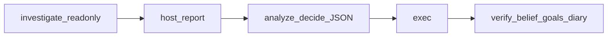

# 报告中心 agent_loop：查证可以循环，报告与执行必须分开

> 日期：2026-07-27  
> 项目：js-evolution-agent  
> 类型：架构设计 / 功能实现  
> 来源：Cursor Agent 对话  
> 相关提交：`7899b4e`（2026-07-25）、`17da9ea`（2026-07-26）、`0ee2a57`（2026-07-27）

---

## 目录

1. [背景与动机](#1-背景与动机)
2. [分析过程](#2-分析过程)
3. [方案设计](#3-方案设计)
4. [实现要点](#4-实现要点)
5. [验证与测试](#5-验证与测试)
6. [后续演化](#6-后续演化)
7. [附：本轮对话问题—思考—方案—执行对照](#附本轮对话问题思考方案执行对照)

---

## 1. 背景与动机

真正的问题不是「Phase 1 能不能再多写一点 prompt」。

真正的问题是：经典 `phases` 管线把观察、写报告、Decide 压成固定三段，模型没有机会在写报告前用工具补证据；一旦预算耗尽或工具调用卡住，轮次还可能以模板收尾——**有 cycle、没有真实情报报告**。

用户希望引入可选的 tool-calling 循环，让系统在入队决策前先只读查证。同时不能破坏 OADA 闭环：Decide 入队、Phase 2 exec、verify / belief / goals / diary 的固定收尾必须保留。

默认管道仍然是 `phases`。`agent_loop` 是 opt-in，不是替换整条演化哲学。

## 2. 分析过程

### 2.1 早期形态与收尾事故

`7899b4e` 先把可选 `agent_loop` 接进 OADA cycle：解析优先级仿 `evolution.mode`（registry → CLI → env → 默认 `phases`），并引入 `chatMessagesWithTools`。

但首版收尾路径不稳：墙钟耗尽时常走强制模板，`finish_cycle` 一类出口容易留下「伪完成」。`17da9ea` 针对这件事加了软截止、closing turn、carryover、mechanical guards 和预算反馈，目标是：**宁可宿主强制收束查证，也不要用模板冒充报告**。

### 2.2 报告中心收敛

`0ee2a57` 把架构收成今天文档里的形态：

- 查证阶段只注册只读工具 + `finish_investigation`。
- **不在 loop 内写完整 Intel 报告，也不在 loop 内入队业务 action。**
- 宿主单次定稿报告判断章节，再走经典 Analyze+Decide JSON 入队。
- Phase 2 `exec` **重新独立**——早期「fuse intel + exec」的说法被刻意收回，以免绕过 Decide 队列语义。

与 `phases` 的对照很清楚：

| 维度 | phases | agent_loop |
| --- | --- | --- |
| Phase 1 | observe → report → analyze+decide | 机械 Seen → 只读查证 → 宿主报告 → Decide |
| 查证 | 无多轮工具循环 | `runInvestigationLoop` |
| Phase 2 | 独立 exec | 同样独立 exec |
| 收尾 | verify / belief / goals / diary | 相同 |

### 2.3 被否定的方案

| 方案 | 结论 |
| --- | --- |
| 在 loop 内直接执行 action | 破坏 Decide 入队与审批边界 |
| 继续用 `finish_cycle` 写盘报告 | 与报告中心职责冲突；已废弃 |
| 默认切到 agent_loop | 行为面过大；默认保持 phases |

## 3. 方案设计

内部阶段：

```text
机械 Seen 底板
  → 只读查证（tool loop，可交 verified_facts）
  → 宿主组装最终 Seen（后续对齐到诚实层）
  → 模型单次定稿判断章节
  → 经典 Analyze+Decide JSON 批入队
  → Phase 2 exec → verify → belief → goals → diary
```



### 关键决策

| 决策 | 选择 | 理由 |
| --- | --- | --- |
| 替代范围 | 只替代 Phase 1（intel / intel_report） | 固定收尾与审批语义不能动 |
| 查证工具 | 只读 + `finish_investigation` | 查证者不许写报告、不许入队 |
| 预算模型 | 整步墙钟 − report/decide 预留 | 给宿主定稿留时间，避免查证吃光预算 |
| 管道默认 | `phases` | 渐进采用；registry / `--loop` / env 可切 |
| Guards | exec 前机械节奏动作 | 不占 Decide 入队预算，与 LLM 查证解耦 |

### 相关环境变量

| 变量 | 默认 | 含义 |
| --- | --- | --- |
| `JEA_CYCLE_PIPELINE` | `phases` | `phases` 或 `agent_loop` |
| `JEA_LOOP_MAX_READONLY_TURNS` | `6` | 只读查证最大 LLM 轮数 |
| `JEA_LOOP_MAX_WALLCLOCK_MS` | `1200000` | 整步墙钟 |
| `JEA_LOOP_FINISH_RESERVE_MS` | `120000` | 留给报告 + Decide |
| `JEA_LOOP_CLOSING_TIMEOUT_SEC` | `240` | closing turn 超时 |
| `JEA_LOOP_TOOL_RESULT_MAX_CHARS` | `6000` | 工具结果截断 |
| `JEA_EXEC_LIMIT` | `5` | Decide 批入队与 Phase 2 消费上限 |

## 4. 实现要点

### 项目结构

```text
src/
├── evolution/
│   ├── cycle-steps.mjs              # runAgentLoopStep 主编排
│   └── agent-loop/
│       ├── loop-runner.mjs          # runInvestigationLoop
│       ├── tool-registry.mjs        # 只读工具 + finish_investigation
│       └── guard-runner.mjs         # mechanical guards
├── prompts/agent-loop.mjs
├── intelligence/phase1-shared.mjs   # 与经典 Phase 1 共用入队/会话辅助
└── cli/utils/
    ├── cycle-pipeline-mode.mjs
    └── cycle-reducer.mjs            # agent_loop → exec → …
```

### 关键模块

| 文件 | 职责 |
| --- | --- |
| [`src/evolution/cycle-steps.mjs`](../../src/evolution/cycle-steps.mjs) | `runAgentLoopStep`：查证 → 报告 → Decide → carryover / checkpoint |
| [`src/evolution/agent-loop/loop-runner.mjs`](../../src/evolution/agent-loop/loop-runner.mjs) | 多轮工具循环、软截止、closing turn、forced investigation |
| [`src/evolution/agent-loop/tool-registry.mjs`](../../src/evolution/agent-loop/tool-registry.mjs) | `intel_query` 等只读工具；`verified_facts` 校验 |
| [`src/prompts/agent-loop.mjs`](../../src/prompts/agent-loop.mjs) | 查证 / 报告 prompt parts |
| [`src/cli/utils/cycle-pipeline-mode.mjs`](../../src/cli/utils/cycle-pipeline-mode.mjs) | 管道解析 |
| [`src/ai/mock-tools-client.mjs`](../../src/ai/mock-tools-client.mjs) | mock 下的 tool-calling 客户端 |

### 产物路径

```text
data/evolution/cycle-state/<cycleId>/agent_loop.json
data/evolution/cycle-state/<cycleId>/intel.json          # Phase 1 兼容
data/evolution/records/<cycleId>/agent_loop_turns.jsonl
data/evolution/records/<cycleId>/conversation_context.json
data/evolution/agent_loop_carryover.json
data/evolution/agent_loop_guard_state.json
```

Carryover 由查证 `open_gaps`、Decide `deferred` / goal suggestions 合并覆写；下一轮查证 initial prompt 注入 `## Carryover from previous cycle`。

## 5. 验证与测试

本地冒烟：

```powershell
npm run jea -- run --mock --loop --subject js-evolution-agent
```

相关测试：

- `test/cycle-pipeline-mode.test.mjs`
- `test/cycle-reducer.test.mjs`
- `test/agent-loop-tools.test.mjs` / `agent-loop-runner.test.mjs` / `agent-loop-step.test.mjs`
- `test/agent-loop-guards.test.mjs`
- `test/agent-loop-e2e.test.mjs`
- `test/intel-report-deliverable-e2e.test.mjs`（phases 与 agent_loop 同一交付契约）

全量 `npm test` 在落地时保持全绿；opt-in live DeepSeek 另见诚实层日记。

## 6. 后续演化

1. **Seen 诚实**：模型写机械 Seen 仍易失败——后续用宿主组装 Seen（见 `2026-07-28/host-assembled-seen.md`）。
2. **prompt 不对称**：agent_loop 报告 prompt 更瘦，phases 仍带 observe + Machine Context JSON；这是有意取舍，不是疏漏。
3. **会话链同 profile**：查证 turn 间、report → decide 依赖前缀复用，不宜单独把 decide 抬到更贵档。

---

## 附：本轮对话问题—思考—方案—执行对照

| 阶段 | 内容 |
| --- | --- |
| 问题 | phases 无法在写报告前多轮补证；早期 loop 又容易模板收尾。 |
| 思考 | 查证可以循环，但报告落盘与 action 入队必须回到宿主与 Decide 边界。 |
| 方案 | 报告中心 agent_loop：只读查证 → 宿主报告 → 经典 Decide → 独立 exec + 固定收尾。 |
| 执行 | 三连提交落地管道、closing/guards、report-centric 重构；mock e2e 覆盖全链。 |
