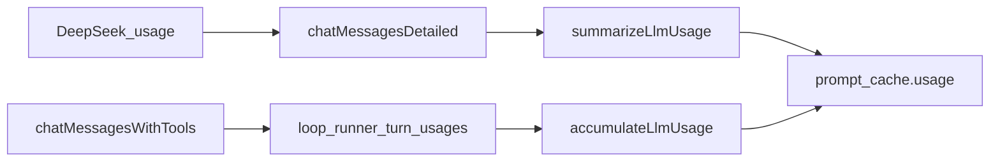

# DeepSeek KV 缓存续篇：从 hash 观测走到真实 hit，并按稳定度重排动态载荷

> 日期：2026-07-28  
> 项目：js-evolution-agent  
> 类型：架构设计 / 功能实现 / 调研分析  
> 来源：Cursor Agent 对话  
> 相关提交：`2cff1c2`  
> 前置日记：[`../2026-06-01/deepseek-prompt-cache-stability.md`](../2026-06-01/deepseek-prompt-cache-stability.md)

---

## 目录

1. [背景与动机](#1-背景与动机)
2. [分析过程](#2-分析过程)
3. [方案设计](#3-方案设计)
4. [实现要点](#4-实现要点)
5. [验证与测试](#5-验证与测试)
6. [后续演化](#6-后续演化)
7. [附：本轮对话问题—思考—方案—执行对照](#附本轮对话问题思考方案执行对照)

---

## 1. 背景与动机

六月那篇日记已经把 Phase 1 prompt 拆成 `stablePrefix` / `dynamicPayload`，并用本地 hash 监测前缀漂移。它在「后续演化」里写得很清楚：还缺 **API 真实 cache hit/miss**。

这次对话从另一个入口撞上同一主题：用户问「推理模型是不是不写 system prompt 更好」。分析后结论是——**对 DeepSeek context caching 而言，system/user 角色透明；重要的是序列化后从位置 0 开始的 token 前缀是否稳定**。现有 system 承重（权威文献、阶段人格、工具纪律、缓存前缀）不应拆掉。

真正该做的，正是六月留下的缺口：计量真实命中，并修正动态载荷内部「稳定段被 cycleId 挡在后面」的排序。

## 2. 分析过程

### 2.1 缓存只认连续前缀

DeepSeek 按约 64-token 块、从请求开头做前缀匹配；中间一变，其后全 miss。由此：

1. 去掉 system prompt **不增加**命中。
2. 设计准则只有一条：**消息流按稳定度降序排布**。

项目已有三层命中机会：跨 cycle 的 system 稳定前缀、cycle 内 report→decide 会话复用、查证 turn 间追加命中。缺的是 usage 观测。

### 2.2 动态载荷排序问题

三条会话首条 user 消息都以 `## Cycle`（每轮必变）开头，后面的 Rules / Operator Guidance / Goals 即使跨轮不变也永远进不了可命中前缀。

### 2.3 被否定的方案

| 方案 | 结论 |
| --- | --- |
| 去掉 system prompt | 对缓存零收益，还破坏人格 / 宪制 / 工具纪律 |
| 为「阅读顺序」改写 stablePrefix | 会让最大缓存块跨部署失效；阅读优先级 ≠ 物理顺序 |
| 先大改 belief/diary 调用点 | 收益低；本轮只接 Phase 1 / agent_loop 主链 |

## 3. 方案设计

分三步，先测量再重排：

1. **透出 usage**：`chatMessagesDetailed` 返回 `{ text, usage }`；工具循环用已有 `resp.usage`。
2. **归一化写入**现有 `prompt_cache` 结构：`cache_hit_tokens` / `cache_miss_tokens` / `cache_hit_ratio`。
3. **重排动态载荷**：`Rules → Operator Guidance → Goals → Cycle → 其余每轮变化段`。`stablePrefix` 不动。



### 关键决策

| 决策 | 选择 | 理由 |
| --- | --- | --- |
| 观测落点 | 并入既有 `prompt_cache` | 不另起一套 telemetry |
| mock 行为 | `usage: null` | 不破坏本地测试 |
| 段序 | 稳定段靠前，Cycle 靠后 | 延长跨轮可命中前缀 |
| 会话链 profile | 保持同档 | 换 model/thinking 可能切断会话复用 |

## 4. 实现要点

### 关键模块

| 文件 | 职责 |
| --- | --- |
| [`src/ai/deepseek-client.mjs`](../../src/ai/deepseek-client.mjs) | `chatMessagesDetailed`；`chatMessages` 委托它 |
| [`src/ai/messages.mjs`](../../src/ai/messages.mjs) | 包装层 + mock/chat 回退 |
| [`src/ai/prompt-cache-metadata.mjs`](../../src/ai/prompt-cache-metadata.mjs) | `summarizeLlmUsage`、`accumulateLlmUsage`、`formatLlmUsageSummary` |
| [`src/intelligence/conversational-intel-pipeline.mjs`](../../src/intelligence/conversational-intel-pipeline.mjs) | phases report/decide usage |
| [`src/evolution/cycle-steps.mjs`](../../src/evolution/cycle-steps.mjs) | agent_loop report/decide/investigate usage 对象复用 |
| [`src/evolution/agent-loop/loop-runner.mjs`](../../src/evolution/agent-loop/loop-runner.mjs) | 每 turn 记 usage，返回 `usage_totals` |
| [`src/prompts/agent-loop.mjs`](../../src/prompts/agent-loop.mjs) / [`phase1-conversation.mjs`](../../src/prompts/phase1-conversation.mjs) | 动态载荷稳定度降序 |

### 观测字段

| 字段 | 含义 |
| --- | --- |
| `usage.prompt_tokens` | API prompt token |
| `usage.cache_hit_tokens` | 前缀命中 |
| `usage.cache_miss_tokens` | 前缀未命中 |
| `usage.cache_hit_ratio` | hit / prompt（或 hit/(hit+miss)） |
| `usage.call_count` | 查证多 turn 累加时存在 |

真实调用日志可见 `[prompt-cache …]` 摘要行。

## 5. 验证与测试

单元：

```powershell
npx vitest run test/llm-usage.test.mjs test/prompt-payload-order.test.mjs
```

全量 mock：

```powershell
npm test
```

结果：77 文件 / 818 用例通过（live 档跳过）。

Live 旁证（同日 honesty / matrix 路径触发真实调用时）：

```text
[prompt-cache agent_loop_report] ... cache_hit=... hit_ratio=...
[prompt-cache agent_loop_decide] ... hit_ratio≈0.44   # 会话前缀复用
[prompt-cache agent_loop_investigate] ... hit_ratio≈0.68 calls=3
```

intel-matrix 默认 5 格最终闸全绿。

## 6. 后续演化

1. 用 daemon continuous 多轮数据做 hit_ratio 基线看板（不仅是单测日志）。
2. 评估是否对 belief / diary 等长调用同样挂 usage（收益次之）。
3. 文档约定已写入 [`AGENTS.md`](../../AGENTS.md)「DeepSeek KV 缓存」：改 prompt 时审查稳定度降序；会话链内勿单独换更贵 profile。
4. thinking on/off 是否共享缓存家族仍按保守假设处理——未验证前不要指望 `fast` 与 `balanced` 互相暖缓存。

六月日记里的「接入真实 DeepSeek 用量观测」这一条，本轮闭合。

---

## 附：本轮对话问题—思考—方案—执行对照

| 阶段 | 内容 |
| --- | --- |
| 问题 | 推理模型是否该去掉 system？本质是想吃透 KV 缓存。 |
| 思考 | 角色无关；缺真实 hit 计量；动态载荷把稳定段挡在 Cycle 后。 |
| 方案 | detailed usage → prompt_cache；Rules/Guidance/Goals 前移；文档固化约定。 |
| 执行 | `2cff1c2`；单测 + 全量 mock 绿；live 日志已见非零 hit。 |
