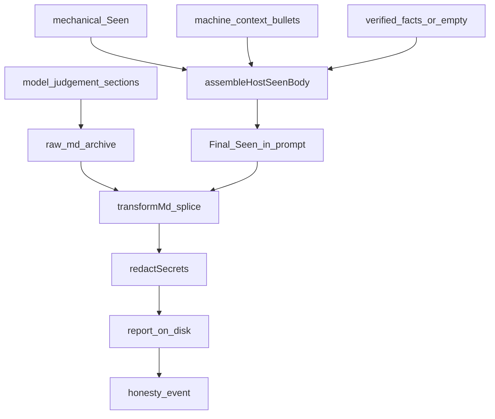

# 宿主组装 Seen：诚实不靠模型自觉，靠落盘前硬替换

> 日期：2026-07-28  
> 项目：js-evolution-agent  
> 类型：架构设计 / 功能实现 / 问题排查  
> 来源：Cursor Agent 对话  
> 相关提交：`ecfdf5b`、`75b7312`、`542dd81`

---

## 目录

1. [背景与动机](#1-背景与动机)
2. [分析过程](#2-分析过程)
3. [方案设计](#3-方案设计)
4. [实现要点](#4-实现要点)
5. [验证与测试](#5-验证与测试)
6. [后续演化](#6-后续演化)
7. [附：本轮对话问题—思考—方案—执行对照](#附本轮对话问题思考方案执行对照)

---

## 1. 背景与动机

前一天诚实矩阵把问题钉死了：flash 等低档模型写 `## Seen` 时，经常缺 ref、写悬空 id、或把 operator brief 毒句写进 Seen。

真正的问题不是「再写几条更凶的 prompt」。

真正的问题是：**机械准确性不该交给生成模型**。Seen 是 citation palette——宿主已经知道机械底板、`machine_context` bullets、查证校验过的 `verified_facts`。模型的工作应是 Inferred / Cyber-Taoist / 下一轮建议。

用户明确选择 **路线 A：phases 也宿主组装 Seen**，与 agent_loop 共用最终产物标尺。

## 2. 分析过程

### 2.1 先修 agent_loop，再对齐 phases

`ecfdf5b` 先在 agent_loop 落地：

- `finish_investigation` 可交 `verified_facts[{ref,statement}]`，宿主校验后并入 Seen。
- 报告 prompt 标明 `## Seen` 是宿主占位；`## Final Seen` 作为引用调色板。
- 模型脏 Seen 在落盘时被整段替换。

矩阵复跑后 agent_loop 最终闸变绿，但 phases 仍因 `machine_context` 悬空引用等失败——证明「只修一条管线」不够。

### 2.2 落盘次序事故

首版 agent_loop 曾「先 persist，再 splice 重写文件」。这带来两个风险：

1. splice 后的正文可能绕过 `redactSecrets`。
2. index / tldr 与磁盘最终内容不一致。

`75b7312` 把 splice 收进 `persistIntelReport` 的 `transformMd` 回调，顺序固定为：

```text
raw markdown → transformMd(splice) → redactSecrets → 单次写盘
```

### 2.3 共享模块，避免环依赖

phases 也要用同一套 assemble / splice / audit。逻辑从 `cycle-steps` 抽到 [`src/intelligence/host-seen.mjs`](../../src/intelligence/host-seen.mjs)，避免 conversational pipeline 与 cycle-steps 互相 import。

## 3. 方案设计



### 关键决策

| 决策 | 选择 | 理由 |
| --- | --- | --- |
| Seen 归属 | 宿主组装 | 诚实 by construction |
| phases verifiedFacts | 空数组 | phases 无查证阶段 |
| 脱敏时机 | splice 之后、写盘之前 | 防止重写绕过 redact |
| 模型裸写 | `*_report_raw.md` 存档 | 矩阵可计量纪律差距，不挡硬闸 |
| 事件类型 | `agent_loop_report_honesty` / `phases_report_honesty` | 便于分管线观测 |

两条管线最终标尺相同：宿主 Seen + 脱敏后报告。差异只在：agent_loop 可并入 `verified_facts`；phases 报告 prompt 仍更「胖」（observe + Machine Context JSON）。

## 4. 实现要点

### 关键模块

| 文件 | 职责 |
| --- | --- |
| [`src/intelligence/host-seen.mjs`](../../src/intelligence/host-seen.mjs) | `assembleHostSeenBody`、`spliceHostSeen`、`auditHostSeenReport` |
| [`src/intelligence/report-builder/core.mjs`](../../src/intelligence/report-builder/core.mjs) | `persistIntelReport({ transformMd })` |
| [`src/evolution/cycle-steps.mjs`](../../src/evolution/cycle-steps.mjs) | agent_loop：raw 存档 → persist splice → 诚实事件 |
| [`src/intelligence/conversational-intel-pipeline.mjs`](../../src/intelligence/conversational-intel-pipeline.mjs) | phases 同等接线 |
| [`src/prompts/agent-loop.mjs`](../../src/prompts/agent-loop.mjs) / [`phase1-conversation.mjs`](../../src/prompts/phase1-conversation.mjs) | Final Seen 占位规则 |

### 产物

```text
data/evolution/records/<cycleId>/agent_loop_report_raw.md
data/evolution/records/<cycleId>/phases_report_raw.md
```

每轮恰好一条对应 honesty 事件；agent_loop 若有 `rejected_facts`，另发 `agent_loop_rejected_facts`（不进 carryover）。

## 5. 验证与测试

```powershell
npm test
```

诚实 e2e 注入脏 Seen canned 报告，断言最终落盘已被宿主覆盖，且含脱敏（含 operator_fact 中的 secret-shaped 内容）。

```powershell
$env:JEA_LIVE_DEEPSEEK='1'; npm run test:live-deepseek:intel-matrix
```

Route A 落地后默认 5 格最终产物硬闸全绿。失败语义更新为：

- 最终闸失败 → 宿主组装 / splice 回归。
- `raw` / `raw_sanitized` 列 → 模型裸写纪律信息，不挡硬闸。

## 6. 后续演化

1. phases 与 agent_loop 的 prompt 不对称可继续瘦身，但不应再让模型重写 Seen。
2. `verified_facts` 质量仍依赖查证阶段；可加强 ref 校验与数量上限。
3. KV 缓存侧：Seen 改由宿主后，报告 prompt 结构更稳定，适合继续做真实 hit 计量（见同日 KV 日记）。

---

## 附：本轮对话问题—思考—方案—执行对照

| 阶段 | 内容 |
| --- | --- |
| 问题 | 低档模型写 Seen 过不了诚实闸；phases 与 agent_loop 标尺分裂。 |
| 思考 | 机械事实应 by construction；prompt 只管判断质量。 |
| 方案 | 宿主组装 + persist 内 splice + 两管线共享 host-seen。 |
| 执行 | 三连提交；mock e2e 与 intel-matrix 最终闸全绿。 |
